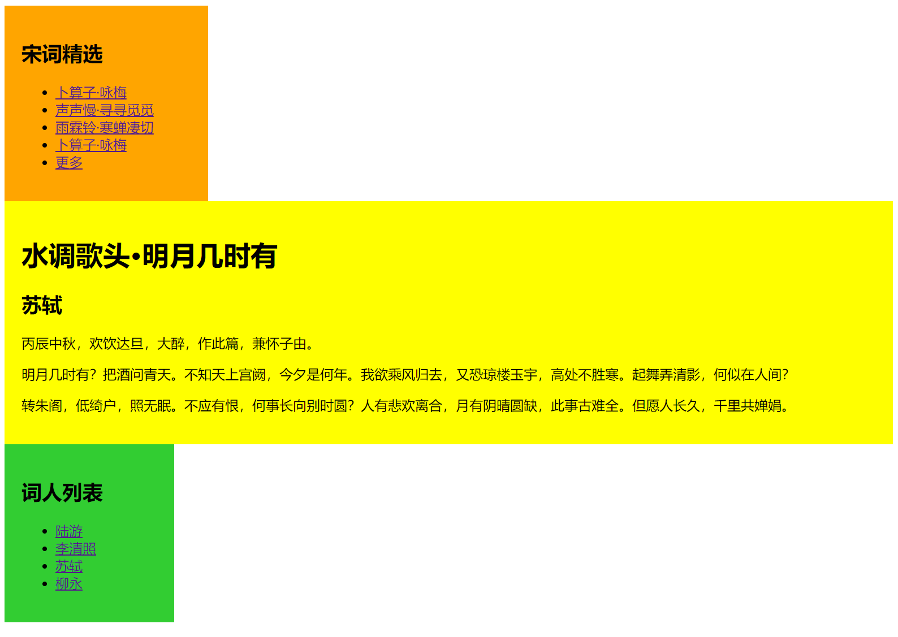

[toc]

### 1. 启动伸缩盒

在旧版本中启动伸缩盒模型，只需设置容器的 `display` 属性值为 `box` 或 `inline-box`，用法如下：

```css
display: box;
display: inline-box;
```

伸缩盒模型由两部分构成：父容器和子容器。父容器通过 `display:box;` 或者 `display:inline-box;` 启动伸缩盒布局功能。子容器通过 `box-flex` 属性定义布局宽度和如何对父容器的宽度进行分配。

父容器又通过如下属性定义包含容器的显示属性，简单说明如下：

+ `box-orient`：定义父容器里子容器的排列方式是水平还是垂直。　

+ `box-direction`：定义父容器里子容器的排列顺序。　

+ `box-align`：定义子容器的垂直对齐方式。　

+ `box-pack`：定义子容器的水平对齐方式。

> 注意：使用旧版本伸缩盒模型，需要用到各浏览器的私有属性，Webkit 引擎支持 `-webkit-` 前缀的私有属性，Mozilla Gecko引擎支持 `-moz-` 前缀的私有属性，Presto引擎（包括Opera浏览器等）支持标准属性，IE暂不支持旧版本伸缩盒模型。

### 2. 设置宽度

在默认情况下，盒子没有弹性，它将尽可能宽地使其内容可见，且没有溢出，其大小由 `width`、`height`、`min-height`、`min-width`、`max-width` 或者 `max-height` 属性值来决定。
使用 `box-flex` 属性可以把默认布局变为盒布局。如果 `box-flex` 的属性值为 1，则元素变得富有弹性，其大小将按下面的方式计算：　声明的大小（`width`、`height`、`min-width`、`min-height`、`max-width`、`max-height`）。　父容器的大小和所有余下的可利用的内部空间。

如果盒子没有声明大小，那么其大小将完全取决于父容器的大小，即盒子的大小等于父容器的大小乘以其 `box-flex` 在所有盒子 `box-flex`总和中的百分比，用公式表示：

```
盒子的大小 = 父容器的大小 × 盒子的 box-flex ÷ 所有盒子的 box-flex 值的和
```


余下的盒子将按照上面的原则分享剩下的可用空间。

**示例代码：**

```html
<!doctype html>
<html>
<head>
<meta charset="utf-8">
<title></title>
<style type="text/css">
#container {
    /*定义弹性盒布局样式*/
    display: -moz-box;
    display: -webkit-box;
    display: box;
}
#left-sidebar {
    width: 240px;
    padding: 20px;
    background-color: orange;
}
#contents {
    /*定义中间列宽度为自适应显示*/
    -moz-box-flex: 1;
    -webkit-box-flex: 1;
    flex: 1;
    padding: 20px;
    background-color: yellow;
}
#right-sidebar {
    width: 200px;
    padding: 20px;
    background-color: limegreen;
}
#left-sidebar, #contents, #right-sidebar {
    /*定义盒样式*/
    -moz-box-sizing: border-box;
    -webkit-box-sizing: border-box;
    box-sizing: border-box;
}
</style>
</head>
<body>
<div id="container">
    <div id="left-sidebar">
        <h2>宋词精选</h2>
        <ul>
            <li><a href="">卜算子·咏梅</a></li>
            <li><a href=""> 声声慢·寻寻觅觅</a></li>
            <li><a href=""> 雨霖铃·寒蝉凄切</a></li>
            <li><a href="">卜算子·咏梅</a></li>
            <li><a href="">更多</a></li>
        </ul>
    </div>
    <div id="contents">
        <h1>水调歌头·明月几时有</h1>
        <h2>苏轼</h2>
        <p>丙辰中秋，欢饮达旦，大醉，作此篇，兼怀子由。</p>
        <p>明月几时有？把酒问青天。不知天上宫阙，今夕是何年。我欲乘风归去，又恐琼楼玉宇，高处不胜寒。起舞弄清影，何似在人间？</p>
        <p>转朱阁，低绮户，照无眠。不应有恨，何事长向别时圆？人有悲欢离合，月有阴晴圆缺，此事古难全。但愿人长久，千里共婵娟。</p>
    </div>
    <div id="right-sidebar">
        <h2>词人列表</h2>
        <ul>
            <li><a href="">陆游</a></li>
            <li><a href="">李清照</a></li>
            <li><a href="">苏轼</a></li>
            <li><a href="">柳永</a></li>
        </ul>
    </div>
</div>
</body>
</html>
```

运行效果如下：


### 3. 设置顺序

使用 `box-ordinal-group` 属性可以改变子元素的显示顺序，语法格式如下：

```css
box-ordinal-group: <integer>
```

其中，`<integer>` 用整数值来定义伸缩盒对象的子元素显示顺序，默认值为 1。浏览器在显示时，将根据该值从小到大来显示这些元素。

**示例代码：**

```html
<!doctype html>
<html>
<head>
<meta charset="utf-8">
<title></title>
<style type="text/css">
#container {
    /*定义弹性盒布局样式*/
    display: -moz-box;
    display: -webkit-box;
    display: box;
}
#left-sidebar {
    width: 240px;
    padding: 20px;
    background-color: orange;
    -moz-box-ordinal-group: 3;
    -webkit-box-ordinal-group: 3;
    box-ordinal-group: 3;
}
#contents {
    /*定义中间列宽度为自适应显示*/
    -moz-box-flex: 1;
    -webkit-box-flex: 1;
    flex: 1;
    padding: 20px;
    background-color: yellow;
    -moz-box-ordinal-group: 1;
    -webkit-box-ordinal-group: 1;
    box-ordinal-group: 1;    
}
#right-sidebar {
    width: 200px;
    padding: 20px;
    background-color: limegreen;
    -moz-box-ordinal-group: 2;
    -webkit-box-ordinal-group: 2;
    box-ordinal-group: 2;    
}
#left-sidebar, #contents, #right-sidebar {
    /*定义盒样式*/
    -moz-box-sizing: border-box;
    -webkit-box-sizing: border-box;
    box-sizing: border-box;
}
</style>
</head>
<body>
<div id="container">
    <div id="left-sidebar">
        <h2>宋词精选</h2>
        <ul>
            <li><a href="">卜算子·咏梅</a></li>
            <li><a href=""> 声声慢·寻寻觅觅</a></li>
            <li><a href=""> 雨霖铃·寒蝉凄切</a></li>
            <li><a href="">卜算子·咏梅</a></li>
            <li><a href="">更多</a></li>
        </ul>
    </div>
    <div id="contents">
        <h1>水调歌头·明月几时有</h1>
        <h2>苏轼</h2>
        <p>丙辰中秋，欢饮达旦，大醉，作此篇，兼怀子由。</p>
        <p>明月几时有？把酒问青天。不知天上宫阙，今夕是何年。我欲乘风归去，又恐琼楼玉宇，高处不胜寒。起舞弄清影，何似在人间？</p>
        <p>转朱阁，低绮户，照无眠。不应有恨，何事长向别时圆？人有悲欢离合，月有阴晴圆缺，此事古难全。但愿人长久，千里共婵娟。</p>
    </div>
    <div id="right-sidebar">
        <h2>词人列表</h2>
        <ul>
            <li><a href="">陆游</a></li>
            <li><a href="">李清照</a></li>
            <li><a href="">苏轼</a></li>
            <li><a href="">柳永</a></li>
        </ul>
    </div>
</div>
</body>
</html>
```

运行效果如下：


### 4. 设置方向

使用 `box-orient` 可以定义元素的排列方向，语法格式如下：

```css
box-orient: horizontal | vertical | inline-axis | block-axis
```

取值简单说明如下：

+ `horizontal`：设置伸缩盒对象的子元素从左到右水平排列。　

+ `vertical`：设置伸缩盒对象的子元素从上到下纵向排列。　

+ `inline-axis`：设置伸缩盒对象的子元素沿行轴排列。　

+ `block-axis`：设置伸缩盒对象的子元素沿块轴排列。

**示例代码：**

```html
<!doctype html>
<html>
<head>
<meta charset="utf-8">
<title></title>
<style type="text/css">
#container {
    /*定义弹性盒布局样式*/
    display: -moz-box;
    display: -webkit-box;
    display: box;
    -moz-box-orient: vertical;
    -webkit-box-orient: vertical;
    box-orient: vertical;
}
#left-sidebar {
    width: 240px;
    padding: 20px;
    background-color: orange;
}
#contents {
    /*定义中间列宽度为自适应显示*/
    -moz-box-flex: 1;
    -webkit-box-flex: 1;
    flex: 1;
    padding: 20px;
    background-color: yellow;
  
}
#right-sidebar {
    width: 200px;
    padding: 20px;
    background-color: limegreen;
 
}
#left-sidebar, #contents, #right-sidebar {
    /*定义盒样式*/
    -moz-box-sizing: border-box;
    -webkit-box-sizing: border-box;
    box-sizing: border-box;
}
</style>
</head>
<body>
<div id="container">
    <div id="left-sidebar">
        <h2>宋词精选</h2>
        <ul>
            <li><a href="">卜算子·咏梅</a></li>
            <li><a href=""> 声声慢·寻寻觅觅</a></li>
            <li><a href=""> 雨霖铃·寒蝉凄切</a></li>
            <li><a href="">卜算子·咏梅</a></li>
            <li><a href="">更多</a></li>
        </ul>
    </div>
    <div id="contents">
        <h1>水调歌头·明月几时有</h1>
        <h2>苏轼</h2>
        <p>丙辰中秋，欢饮达旦，大醉，作此篇，兼怀子由。</p>
        <p>明月几时有？把酒问青天。不知天上宫阙，今夕是何年。我欲乘风归去，又恐琼楼玉宇，高处不胜寒。起舞弄清影，何似在人间？</p>
        <p>转朱阁，低绮户，照无眠。不应有恨，何事长向别时圆？人有悲欢离合，月有阴晴圆缺，此事古难全。但愿人长久，千里共婵娟。</p>
    </div>
    <div id="right-sidebar">
        <h2>词人列表</h2>
        <ul>
            <li><a href="">陆游</a></li>
            <li><a href="">李清照</a></li>
            <li><a href="">苏轼</a></li>
            <li><a href="">柳永</a></li>
        </ul>
    </div>
</div>
</body>
</html>
```

运行效果如下：



### 5. 设置排序顺序

使用 `box-direction` 属性可以让各个子元素反向排序，语法格式如下：

```css
box-direction: normal | reverse
```

取值简单说明如下。　

+ `normal`：设置伸缩盒对象的子元素按正常顺序排列。　

+ `reverse`：反转伸缩盒对象的子元素的排列顺序。

### 6. 设置对齐方式

使用 `box-pack` 可以设置子元素水平方向对齐方式，语法格式如下：

```css
box-pack: start | center | end | justify
```

取值简单说明如下。　

+ `start`：设置伸缩盒对象的子元素从开始位置对齐，为默认值。　

+ `center`：设置伸缩盒对象的子元素居中对齐。　

+ `end`：设置伸缩盒对象的子元素从结束位置对齐。　

+ `justify`：设置伸缩盒对象的子元素两端对齐。

使用 `box-align` 可以设置子元素垂直方向对齐方式，语法格式如下：

```css
box-align: start | end | center | baseline | stretch
```

取值简单说明如下。　

+ `start`：设置伸缩盒对象的子元素从开始位置对齐。　

+ `center`：设置伸缩盒对象的子元素居中对齐。　

+ `end`：设置伸缩盒对象的子元素从结束位置对齐。　

+ `baseline`：设置伸缩盒对象的子元素基线对齐。　

+ `stretch`：设置伸缩盒对象的子元素自适应父元素尺寸。

**示例代码：**

```html
<!doctype html>
<html>
<head>
<meta charset="utf-8">
<title></title>
<style type="text/css">
body {
    margin: 0;
    padding: 0;
}
div { position: absolute; }
.bg {
    width: 100%;
    height: 100%;
    background: #000;
    opacity: 0.7;
    filter: alpha(opacity=70);
}
.login {
    width:100%;
    height:100%;

    display: -moz-box;
    display: -webkit-box;
    display: box;
    -moz-box-align: center;
    -webkit-box-align: center;
    box-align: center;
    -moz-box-pack: center;
    -webkit-box-pack: center;
    box-pack: center;
}

</style>
</head>
<body>
<div class="web"></div>
<div class="bg"></div>
<div class="login"></div>
</body>
</body>
</html>
```

运行效果如下：

