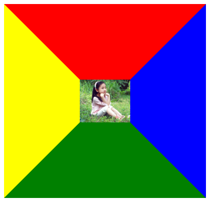

图像在默认状态下不会显示边框，但在为图像定义超链接时会自动显示 2px ~ 3px 宽的蓝色粗边框。使用 `border` 属性可以清楚这个边框，代码如下：

```html
<a href="#"></a>
```

不推荐上述用法，建议使用 CSS 的 `border` 属性定义。CSS 的 `border` 属性不仅可以为图形定义边框，还提供了丰富的边框样式，支持定义边框的粗细、颜色和样式。

下面分别讲解图像边框样式、颜色和宽度的详细用法：

+ 边框样式

  CSS 为元素边框定义了众多样式，边框样式可以使用 `border-style` 属性来定义。边框样式包括两种：虚线框和实现框。

  + 虚线框包括 `dotted`（点）和 `dashed`（虚线）

    ```html
    <!DOCTYPE html>
    <html>
    	<head> 
    		<meta charset="utf-8"> 
    		<title>定义图像边框</title> 
    		<style type="text/css">
    			img {
    				width: 250px;
    				margin: 12px;
    			}
    			.dotted {
    				border-style: dotted;
    			}
    			.dashed {
    				border-style: dashed;
    			}
    		</style>
    	</head>
    	<body>
    		
    		
    	</body>
    </html>
    ```

    效果如下所示：

    

  + 实线边框包括实线框（`solid`）、双线框（`double`）、立体凹槽（`groove`）、立体凸槽（`ridge`）、立体凹边（`inset`）、立体凸边（`outset`）。

    > 提示：双线框由两条单线和中间的空隙组成，三者宽度之和等于边框的宽度。但是双线框的值分配也会存在一些矛盾，无法做到平均分配。如果边框宽度为 3px，则两条单线与其间空隙分别为 1 px；如果边框宽度为 4px，则外侧单线为 2px，内测和中间空隙分别为 1px；如果边框宽度为 5px，则两条单线宽度为 2px，中间空隙为 1px。

    ```html
    <!DOCTYPE html>
    <html>
    	<head> 
    		<meta charset="utf-8"> 
    		<title>定义图像边框</title> 
    		<style type="text/css">
    			img {
    				width: 100px;	/* 宽度 */
    				border: solid red 150px;	/* 顶边实线、右边虚线、底边点线、左边双线 */
    				border-color: red blue green yellow;	/* 顶边红色、右边蓝色、底边绿色、左边黄色 */
    			}
    		</style>
    	</head>
    	<body>
    		
    	</body>
    </html>
    ```

    效果如下所示：

    

  + 边框颜色和宽度

    使用 CSS 的 `border-color` 属性可以定义边框的颜色；使用 `border-width` 属性可以定义边框的宽度。当元素的边框样式为 `none` 时，所定义的边框颜色和边框宽度都会同时无效。在默认状态下，元素的边框样式为 `none`，而元素的边框宽度默认为 2 ~ 3px。

    ```html
    <!DOCTYPE html>
    <html>
    	<head> 
    		<meta charset="utf-8"> 
    		<title>定义图像边框</title> 
    		<style type="text/css">
    			img {
    				width: 300px;	/* 宽度 */
    				border-style: solid dashed dotted double;	/* 顶边实线、右边虚线、底边点线、左边双线 */
    				border-width: 10px 20px 30px 40px;	/* 顶边 10px、右边 20px、底边 30px、左边 40px */
    				border-color: red blue green yellow;	/* 顶边红色、右边蓝色、底边绿色、左边黄色 */
    			}
    		</style>
    	</head>
    	<body>
    		
    	</body>
    </html>
    ```

    

如果各边样式相同，使用 `border` 会更方便设计：

```html
<!DOCTYPE html>
<html>
	<head> 
		<meta charset="utf-8"> 
		<title>定义图像边框</title> 
		<style type="text/css">
			img {
				width: 400px;	/* 宽度 */
				height: 200px;	/* 高度 */
				border: solid 20px red;	/* 边框样式 */
			}
		</style>
	</head>
	<body>
		
	</body>
</html>
```

效果如下所示：

