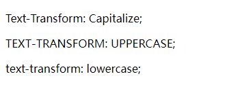

使用 `CSS3` 的 `text-transform` 属性可以定义字体大小写效果。用法如下：

```css
text-transform: none | capitalize | uppercase | lowercase
```

其中 `none` 为默认值，表示无转换发生；`capitalize` 表示将每个单词的第一个字母转换成大写，其余无转换发生；`uppercase` 表示把所有字母都转换成大写；`lowercase` 表示把字母都转换成小写。

> 提示：比较发现，IE 认为只要是单词就把首字母转换为大写，而 Firefox 认为只有单词通过空格间隔之后，才能够成为独立意义上的单词，所以几个单词连在一起时就算作一个词。

例如：

```html
<!DOCTYPE html>
<html>
	<head> 
		<meta charset="utf-8"> 
		<title>艺术字体</title> 
		<style type="text/css">
			.capitalize { text-transform: capitalize; }	/* 首字母大小写样式类 */
			.uppercase { text-transform: uppercase; }	/* 大写样式类 */
			.lowercase { text-transform: lowercase; }	/* 小写样式类 */
		</style>
	</head>
	<body>
		<p class="capitalize">text-transform: capitalize;</p>
		<p class="uppercase">text-transform: uppercase;</p>
		<p class="lowercase">text-transform: lowercase;</p>
	</body>
</html>
```

效果如下：

