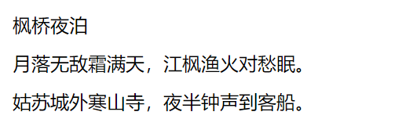

使用 `CSS3` 的 `font-size` 属性可以定义字体大小，用法如下：

```css
font-size: xx-small | x-small | small | medium | large | x-large | xx-large | larger | smaller | length
```

其中 `xx-small`（最小）、`x-small`（较小）、`small`（小）、`medium`（正常）、`large`（大）、`x-large`（较大）、`xx-large`（最大）表示绝对字体尺寸，这些特殊值将根据对象字体进行调整；`larger`（增大）和 `smaller`（减小）这对特殊值能够根据父对象中字体尺寸进行相对增大或者缩小处理，使用成比例的 `em` 单位进行计算；`length` 可以是百分数，或者是浮点数字和单位标识符组成的长度值，但不可为负值，其百分比取值基于父对象中字体的尺寸来计算，与 `em` 单位计算相同。

例如：

```html
<!DOCTYPE html>
<html>
	<head> 
		<meta charset="utf-8"> 
		<title>字体大小</title> 
		<style type="text/css">
			body {
				font-size: 12px;	/* 以像素为单位设置字体大小 */
			}
			
			p {
				font-size: 0.75em;	/* 以父对象字体大小为参考设置大小 */
			}
			
			div {
				font: 9pt Arial, Helvetica, suns-serif;	/* 以点为单位设置字体大小 */
			}
		</style>
	</head>
	<body>
		<span>枫桥夜泊</span>
		<p>月落无敌霜满天，江枫渔火对愁眠。</p>
		<div>姑苏城外寒山寺，夜半钟声到客船。</div>
	</body>
</html>
```

效果如下：

