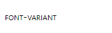

使用 `CSS3` 的 `font-variant` 属性可以定义字体的变体效果，用法如下：

```css
font-variant: normal | small-caps
```

其中 `normal` 为默认值，表示正常的字体；`small-caps` 表示小型的大写字母字体。

> 注意：`font-variant` 仅支持拉丁字体，中文字体没有大小写效果区分。如果设置了小型大写字体，但是该字体没有找到原始小型大写字体，则浏览器会模拟一个。例如，可通过使用一个常规字体，并将其小写字母替换为缩小过的大写字母。

例如：

```html
<!DOCTYPE html>
<html>
	<head> 
		<meta charset="utf-8"> 
		<title>艺术字体</title> 
		<style type="text/css">
			.small-caps {	/* 小型字母样式类 */
				font-variant: small-caps;
			}
		</style>
	</head>
	<body>
		<p class="small-caps">font-variant</p>
	</body>
</html>
```

效果如下：

