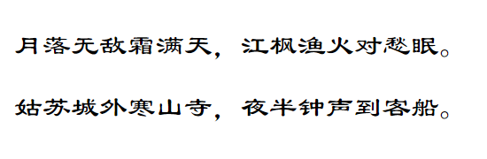

使用 `font-family` 属性可以定义字体类型，用法如下：

```css
font-family: name
```

其中 `name` 表示字体名称，可以设置字体列表，多个字体按优先顺序排序，以逗号隔开。

如果字体名称包含空格，则应使用引号括起。第二种声明方式使用所列出的字体序列名称，如果使用 fantasy 序列，将提供默认字体序列。

> 注意：在网页设计中，没有中文通用字体类型，中文字体的表现力比较弱，即使存在各种艺术字体，但是考虑到用户系统的支持率，很少被广泛使用。一般中文网页字体默认为宋体，对于标题或特殊提示信息，如果需要特殊字体，则建议采用图像形式间接实现。拉丁字体类型比较丰富，通用字体的选择余地大、艺术表现力强，在浏览外文网站时，用户会发现页面选用的字体类丰富很多。习惯上，标题都使用无衬线字体、艺术字体或手写体等，而网页正文则多使用衬线字体等。

例如：

```html
<!DOCTYPE html>
<html>
	<head> 
		<meta charset="utf-8"> 
		<title>字体类型</title> 
		<style type="text/css">
			p {	/* 段落样式 */
				font-family: "隶书";	/* 隶书字体 */
			}
		</style>
	</head>
	<body>
		<p>月落无敌霜满天，江枫渔火对愁眠。</p>
		<p>姑苏城外寒山寺，夜半钟声到客船。</p>
	</body>
</html>
```

效果如下：


