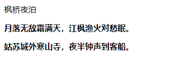

使用 `CSS3` 的 `font-weight` 属性可以定义字体粗细，用法如下：

```css
font-weight: normal | bold | bolder | lighter | 100 | 200 | 300 | 400 | 500 | 600 | 700 | 800 | 900
```

其中 `normal` 为默认值，表示正常的字体，相当于取值为 400；`bold` 表示粗体，相当于取值为 700，或者使用 `<b>` 标签定义的字体效果；`bolder`（较粗）和 `lighter`（较细）是相对于 `normal` 字体粗细而言。另外也可以设置值为 100、200、300、400、500、600、700、800、900，它们分别表示字体的粗细，是对字体粗细的一种量化方式，值越大就表示越粗，相反就表示越细。

> 注意：设置字体粗细也可以称为定义字体的重量。对于中文网页设计来说，一般仅用到 `bold`（加粗）、`normal` （普通）两个属性值。

例如：

```html
<!DOCTYPE html>
<html>
	<head> 
		<meta charset="utf-8"> 
		<title>字体颜色</title> 
		<style type="text/css">
			h1 {
				font-weight: normal;	/* 等于 400 */
			}
			
			p {
				font-weight: 700;	/* 等于 bold */
			}
			
			div {
				font-weight: bolder;	/* 可能为 500 */
			}
			
			.bold {
				font-weight: bold;	/* 粗体样式类 */
			}
		</style>
	</head>
	<body>
		<span>枫桥夜泊</span>
		<p>月落无敌霜满天，江枫渔火对愁眠。</p>
		<div>姑苏城外寒山寺，夜半钟声到客船。</div>
	</body>
</html>
```

效果如下：

