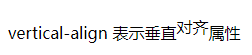

使用 `CSS3` 的 `vertical-align` 属性可以定义文本垂直对齐，用法如下：

```css
vertical-align: auto | baseline | sub | super | top | text-top | middle | bottom | text-bottom | length 
```

取值说明如下：

+ `auto` 将根据 `layout-flow` 属性的值对齐对象内容。
+ `baseline` 为默认值，表示将支持 `valign` 特性的对象内容与基线对齐。
+ `sub` 表示垂直对齐文本的下标。
+ `super` 表示垂直对齐文本的上标。
+ `top` 表示将支持 `valign` 特性的对象的内容对象顶端对齐。
+ `text-top` 表示将支持 `valign` 特性的对象的文本域对象顶端对齐。
+ `middle` 表示将支持 `valign` 特性的对象的内容与对象中部对齐。
+ `bottom` 表示将支持 `valign` 特性的对象的内容与对象低端对齐。
+ `text-bottom` 表示将支持 `valign` 特性的对象的文本与对象低端对齐。
+ `length` 表示由浮点数字和单位标识符组成的长度值或者百分数，可为负数，定义由基线算起的偏移量，基线对于数值来说为 0，对于百分数来说就是 0%。

> 扩展：`vertical-align` 属性仅对行内对象有效，如文本、图像、超链接等。

**示例代码：**

```xml
<!DOCTYPE html>
<html>
	<head> 
		<meta charset="utf-8"> 
		<title>文本垂直对齐</title> 
		<style type="text/css">
			.super { vertical-align: super; }
		</style>
	</head>
	<body>
		<p>vertical-align 表示垂直<span class="super">对齐</span>属性</p>
	</body>
</html>
```

效果如下：

