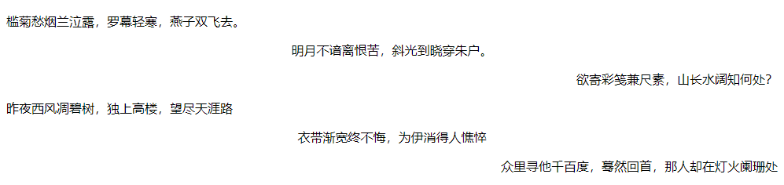

使用 CSS3 的 `text-align` 属性可以定义文本的水平对齐方式，用法如下：

```css
text-align: left | right | center | justify
```

其中 `left` 为默认值，表示左对齐；`right` 为右对齐；`center` 为居中对齐；`justify` 为两端对齐。

> 提示：CSS3 为 `text-align` 属性新增多个属性值，简单说明如下：
>
> + `justify`：内容两端对齐。
> + `start`： 内容对齐开始边界。
> + `end`：内容对齐结束边界。
> + `match-parent`：与 `inherit` （继承）表现一致。
> + `justify-all`：效果等同于 `justify`，但还会让最后一行也两端对齐。

> 扩展：`text-align` 属性仅对行内对象有效，如文本、图像、超链接等。

**示例代码：**

```html
<!DOCTYPE html>
<html>
	<head> 
		<meta charset="utf-8"> 
		<title>文本对齐</title> 
		<style type="text/css">
			.left { text-align: left; }
			.center { text-align: center; }
			.right { text-align: right; }
		</style>
	</head>
	<body>
		<p class="left">槛菊愁烟兰泣露，罗幕轻寒，燕子双飞去。</p>
		<p class="center">明月不谙离恨苦，斜光到晓穿朱户。</p>
		<p class="right">欲寄彩笺兼尺素，山长水阔知何处？</p>
		<p align="left">昨夜西风凋碧树，独上高楼，望尽天涯路</p>
		<p align="center">衣带渐宽终不悔，为伊消得人憔悴</p>
		<p align="right">众里寻他千百度，蓦然回首，那人却在灯火阑珊处</p>
	</body>
</html>
```

效果如下：


