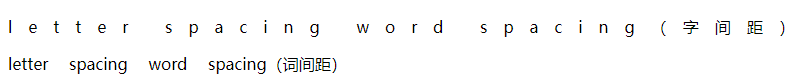

使用 `CSS3` 的 `letter-spacing` 属性可以定义字距，使用 `CSS3` 的  `word-spacing` 属性可以定义词距。这两个属性的取值都是长度值，由浮点数字和单位标识符组成，默认值为 `normal`，表示默认间隔。

定义词距时，以空格为基准进行调节，如果多个单词被连在一起，则被 `word-spacing` 视为一个单词；如果汉字被空格分隔，则分隔的多个汉字就被视为不同的单词，`word-spacing` 属性此时有效。

> 注意：字距和词距一般很少使用，使用时应慎重考虑用户的阅读体验和感受。对于中文用户来说，`letter-spacing` 属性有效，而 `word-spacing` 属性无效。

**示例代码：**

```xml
<!DOCTYPE html>
<html>
	<head> 
		<meta charset="utf-8"> 
		<title>定义文本间距</title> 
		<style type="text/css">
			.lspacing { letter-spacing: 1em; }
			.wspacing { word-spacing: 1em; }
		</style>
	</head>
	<body>
		<p class="lspacing">letter spacing word spacing（字间距）</p>
		<p class="wspacing">letter spacing word spacing（词间距）</p>
	</body>
</html>
```

效果如下：



