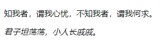

使用 `CSS3` 的 `font-style` 属性可以定义字体倾斜效果，用法如下：

```css
font-style: normal | italic | oblique
```

其中 `normal` 为默认值，表示正常的字体；`italic` 表示斜体；`oblique` 表示倾斜的字体。`italic` 和 `oblique` 两个取值只能在英文等西方文字中有效。

例如：

```html
<!DOCTYPE html>
<html>
	<head> 
		<meta charset="utf-8"> 
		<title>艺术字体</title> 
		<style type="text/css">
			.italic {	/* 斜体样式类 */
				font-style: italic;
			}
		</style>
	</head>
	<body>
		<p>知我者，谓我心忧，不知我者，谓我何求。</p>
		<p class="italic">君子坦荡荡，小人长戚戚。</p>
	</body>
</html>
```

效果如下：

