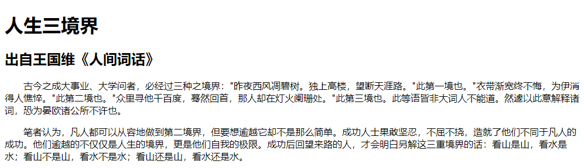
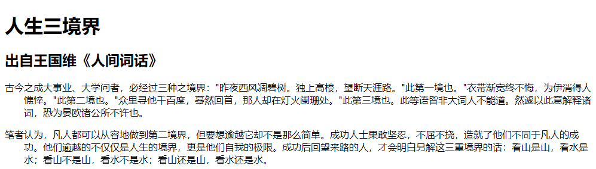

使用 CSS3 的 `text-indent` 属性可以定义文本首行缩进，用法如下：

```css
text-indent: length
```

`length` 表示百分比数字或者由浮点数字和单位标识符组成的长度值，允许为负值。建议在设置缩进单位时，以 `em` 为设置单位，`em` 表示一个字距，这样可以比较精确地确定首行缩进效果。

**示例代码：**

```html
<!DOCTYPE html>
<html>
	<head> 
		<meta charset="utf-8"> 
		<title>定义首行缩进</title> 
		<style type="text/css">
			p { text-indent: 2em; }	/* 首行缩进 2 个字距 */
		</style>
	</head>
	<body>
		<h1>人生三境界</h1>
		<h2>出自王国维《人间词话》</h2>
		<p>古今之成大事业、大学问者，必经过三种之境界："昨夜西风凋碧树。独上高楼，望断天涯路。"此第一境也。"衣带渐宽终不悔，为伊消得人憔悴。"此第二境也。"众里寻他千百度，蓦然回首，那人却在灯火阑珊处。"此第三境也。此等语皆非大词人不能道。然遽以此意解释诸词，恐为晏欧诸公所不许也。</p>
		<p>笔者认为，凡人都可以从容地做到第二境界，但要想逾越它却不是那么简单。成功人士果敢坚忍，不屈不挠，造就了他们不同于凡人的成功。他们逾越的不仅仅是人生的境界，更是他们自我的极限。成功后回望来路的人，才会明白另解这三重境界的话：看山是山，看水是水；看山不是山，看水不是水；看山还是山，看水还是水。</p>
	</body>
</html>
```

效果如下所示：



`text-indent` 属性可以取负值，定义左侧补白，防止取负值缩进导致行首文本伸到段落的边界外边。

**示例代码：**

```html
<!DOCTYPE html>
<html>
	<head> 
		<meta charset="utf-8"> 
		<title>定义首行缩进</title> 
		<style type="text/css">
			p { 
				text-indent: -2em;	/* 首行缩进 2 个字距 */
				padding-left: 2em;	/* 左侧补白 */
			}	
		</style>
	</head>
	<body>
		<h1>人生三境界</h1>
		<h2>出自王国维《人间词话》</h2>
		<p>古今之成大事业、大学问者，必经过三种之境界："昨夜西风凋碧树。独上高楼，望断天涯路。"此第一境也。"衣带渐宽终不悔，为伊消得人憔悴。"此第二境也。"众里寻他千百度，蓦然回首，那人却在灯火阑珊处。"此第三境也。此等语皆非大词人不能道。然遽以此意解释诸词，恐为晏欧诸公所不许也。</p>
		<p>笔者认为，凡人都可以从容地做到第二境界，但要想逾越它却不是那么简单。成功人士果敢坚忍，不屈不挠，造就了他们不同于凡人的成功。他们逾越的不仅仅是人生的境界，更是他们自我的极限。成功后回望来路的人，才会明白另解这三重境界的话：看山是山，看水是水；看山不是山，看水不是水；看山还是山，看水还是水。</p>
	</body>
</html>
```

效果如下：

