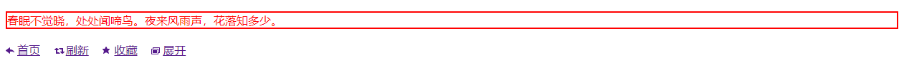

在 CSS 中，`border-color`、`box-shadow` 和 `text-decoration-color` 属性的默认值是 `color` 属性的值。

在 CSS1 和 CSS2 中，却没有为此定义一个相应的关键字。为此 CSS3 扩展了颜色值，包含 `currentColor` 关键字，并用于所有接受颜色的属性上。`currentColor` 表示 `color` 属性的值。

```html
<!doctype html>
<html>
	<head>
		<meta charset="utf-8">
		<style type="text/css">
			p {
				border:solid 2px;
				color:red;
			}
			.icon {
				display: inline-block;
				width: 16px; height: 20px;
				background-image: url(images/sprite_icons.png);
				background-color: currentColor; /* 使用当前颜色控制图标的颜色 */
			}
			.icon1 { background-position: 0 0; }
			.icon2 { background-position: -20px 0; }
			.icon3 { background-position: -40px 0; }
			.icon4 { background-position: -60px 0; }
			.link { margin-right: 15px; }
			.link:hover { color: red; }/* 虽然改变的是文字颜色，但是图标颜色也一起变化了 */
		</style>
	</head>
	<body>
		<p>春眠不觉晓，处处闻啼鸟。夜来风雨声，花落知多少。</p>
		<a href="##" class="link"><i class="icon icon1"></i>首页</a>
		<a href="##" class="link"><i class="icon icon2"></i>刷新</a>
		<a href="##" class="link"><i class="icon icon3"></i>收藏</a>
		<a href="##" class="link"><i class="icon icon4"></i>展开</a>
	</body>
</html>
```

运行效果如下：

