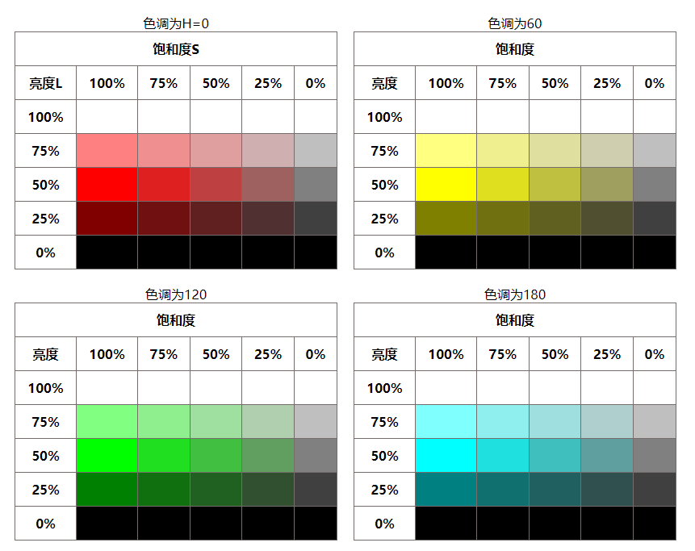

HSL 是一种标准的色彩模式，包括了人类视力所能感知的所有颜色，在屏幕上可以重现 16777216 种颜色，是目前运用最广泛的颜色系统。它通过色调（H）、饱和度（S）和亮度（L）3 个颜色通道的叠加来获取各种颜色。其语法格式如下：

```css
hsl(<length>, <percentage>, <percentage>)
```

参数说明如下：

+ `<length>`：表示色调（Hue）。可以为任意数值，用以确定不同的颜色。其中 0 （或 360、-360）表示红色，60 表示黄色、120 表示绿色、180 表示青色、240 表示蓝色、300 表示洋红。
+ `<percentage>`（第一个）：表示饱和度（Saturation），取值范围为 0% ~ 100%。其中 0% 表示灰度，即没有使用该颜色；100% 饱和度最高，即颜色最艳。
+ `<percentage>`（第二个）：表示亮度（Lightness），取值范围为 0 ~ 100%。其中 0% 最暗，显示为黑色；50% 表示均值；100% 最亮，显示为白色。

```html
<!doctype html>
<html>
<head>
<meta charset="utf-8">
<title>HSL制作配色表</title>
<style>
.table-wrap {
    width: 400px;
    margin: 10px;
    float: left;
}
table { 
    width: 100%;
    border: 1px solid #756c6c;
    border-left: none;
    border-collapse: collapse;
    border-spacing: 0;
}
th, td {
    border-top: 1px solid #756c6c;
    border-left: 1px solid #756c6c;
    padding: 10px;
    text-align: center;
    vertical-align: middle;
}
/*色调为0*/
.table-wrap:nth-child(1) tbody tr:nth-child(1) td:nth-of-type(1) { background: hsl(0,100%,100%); }
.table-wrap:nth-child(1) tbody tr:nth-child(1) td:nth-of-type(2) { background: hsl(0,75%,100%); }
.table-wrap:nth-child(1) tbody tr:nth-child(1) td:nth-of-type(3) { background: hsl(0,50%,100%); }
.table-wrap:nth-child(1) tbody tr:nth-child(1) td:nth-of-type(4) { background: hsl(0,25%,100%); }
.table-wrap:nth-child(1) tbody tr:nth-child(1) td:nth-of-type(5) { background: hsl(0,0%,100%); }
.table-wrap:nth-child(1) tbody tr:nth-child(2) td:nth-of-type(1) { background: hsl(0,100%,75%); }
.table-wrap:nth-child(1) tbody tr:nth-child(2) td:nth-of-type(2) { background: hsl(0,75%,75%); }
.table-wrap:nth-child(1) tbody tr:nth-child(2) td:nth-of-type(3) { background: hsl(0,50%,75%); }
.table-wrap:nth-child(1) tbody tr:nth-child(2) td:nth-of-type(4) { background: hsl(0,25%,75%); }
.table-wrap:nth-child(1) tbody tr:nth-child(2) td:nth-of-type(5) { background: hsl(0,0%,75%); }
.table-wrap:nth-child(1) tbody tr:nth-child(3) td:nth-of-type(1) { background: hsl(0,100%,50%); }
.table-wrap:nth-child(1) tbody tr:nth-child(3) td:nth-of-type(2) { background: hsl(0,75%,50%); }
.table-wrap:nth-child(1) tbody tr:nth-child(3) td:nth-of-type(3) { background: hsl(0,50%,50%); }
.table-wrap:nth-child(1) tbody tr:nth-child(3) td:nth-of-type(4) { background: hsl(0,25%,50%); }
.table-wrap:nth-child(1) tbody tr:nth-child(3) td:nth-of-type(5) { background: hsl(0,0%,50%); }
.table-wrap:nth-child(1) tbody tr:nth-child(4) td:nth-of-type(1) { background: hsl(0,100%,25%); }
.table-wrap:nth-child(1) tbody tr:nth-child(4) td:nth-of-type(2) { background: hsl(0,75%,25%); }
.table-wrap:nth-child(1) tbody tr:nth-child(4) td:nth-of-type(3) { background: hsl(0,50%,25%); }
.table-wrap:nth-child(1) tbody tr:nth-child(4) td:nth-of-type(4) { background: hsl(0,25%,25%); }
.table-wrap:nth-child(1) tbody tr:nth-child(4) td:nth-of-type(5) { background: hsl(0,0%,25%); }
.table-wrap:nth-child(1) tbody tr:nth-child(5) td:nth-of-type(1) { background: hsl(0,100%,0%); }
.table-wrap:nth-child(1) tbody tr:nth-child(5) td:nth-of-type(2) { background: hsl(0,75%,0%); }
.table-wrap:nth-child(1) tbody tr:nth-child(5) td:nth-of-type(3) { background: hsl(0,50%,0%); }
.table-wrap:nth-child(1) tbody tr:nth-child(5) td:nth-of-type(4) { background: hsl(0,25%,0%); }
.table-wrap:nth-child(1) tbody tr:nth-child(5) td:nth-of-type(5) { background: hsl(0,0%,0%); }
/*色调为60*/
.table-wrap:nth-child(2) tbody tr:nth-child(1) td:nth-of-type(1) { background: hsl(60,100%,100%); }
.table-wrap:nth-child(2) tbody tr:nth-child(1) td:nth-of-type(2) { background: hsl(60,75%,100%); }
.table-wrap:nth-child(2) tbody tr:nth-child(1) td:nth-of-type(3) { background: hsl(60,50%,100%); }
.table-wrap:nth-child(2) tbody tr:nth-child(1) td:nth-of-type(4) { background: hsl(60,25%,100%); }
.table-wrap:nth-child(2) tbody tr:nth-child(1) td:nth-of-type(5) { background: hsl(60,0%,100%); }
.table-wrap:nth-child(2) tbody tr:nth-child(2) td:nth-of-type(1) { background: hsl(60,100%,75%); }
.table-wrap:nth-child(2) tbody tr:nth-child(2) td:nth-of-type(2) { background: hsl(60,75%,75%); }
.table-wrap:nth-child(2) tbody tr:nth-child(2) td:nth-of-type(3) { background: hsl(60,50%,75%); }
.table-wrap:nth-child(2) tbody tr:nth-child(2) td:nth-of-type(4) { background: hsl(60,25%,75%); }
.table-wrap:nth-child(2) tbody tr:nth-child(2) td:nth-of-type(5) { background: hsl(60,0%,75%); }
.table-wrap:nth-child(2) tbody tr:nth-child(3) td:nth-of-type(1) { background: hsl(60,100%,50%); }
.table-wrap:nth-child(2) tbody tr:nth-child(3) td:nth-of-type(2) { background: hsl(60,75%,50%); }
.table-wrap:nth-child(2) tbody tr:nth-child(3) td:nth-of-type(3) { background: hsl(60,50%,50%); }
.table-wrap:nth-child(2) tbody tr:nth-child(3) td:nth-of-type(4) { background: hsl(60,25%,50%); }
.table-wrap:nth-child(2) tbody tr:nth-child(3) td:nth-of-type(5) { background: hsl(60,0%,50%); }
.table-wrap:nth-child(2) tbody tr:nth-child(4) td:nth-of-type(1) { background: hsl(60,100%,25%); }
.table-wrap:nth-child(2) tbody tr:nth-child(4) td:nth-of-type(2) { background: hsl(60,75%,25%); }
.table-wrap:nth-child(2) tbody tr:nth-child(4) td:nth-of-type(3) { background: hsl(60,50%,25%); }
.table-wrap:nth-child(2) tbody tr:nth-child(4) td:nth-of-type(4) { background: hsl(60,25%,25%); }
.table-wrap:nth-child(2) tbody tr:nth-child(4) td:nth-of-type(5) { background: hsl(60,0%,25%); }
.table-wrap:nth-child(2) tbody tr:nth-child(5) td:nth-of-type(1) { background: hsl(60,100%,0%); }
.table-wrap:nth-child(2) tbody tr:nth-child(5) td:nth-of-type(2) { background: hsl(60,75%,0%); }
.table-wrap:nth-child(2) tbody tr:nth-child(5) td:nth-of-type(3) { background: hsl(60,50%,0%); }
.table-wrap:nth-child(2) tbody tr:nth-child(5) td:nth-of-type(4) { background: hsl(60,25%,0%); }
.table-wrap:nth-child(2) tbody tr:nth-child(5) td:nth-of-type(5) { background: hsl(60,0%,0%); }
/*色调为120*/
.table-wrap:nth-child(3) tbody tr:nth-child(1) td:nth-of-type(1) { background: hsl(120,100%,100%); }
.table-wrap:nth-child(3) tbody tr:nth-child(1) td:nth-of-type(2) { background: hsl(120,75%,100%); }
.table-wrap:nth-child(3) tbody tr:nth-child(1) td:nth-of-type(3) { background: hsl(120,50%,100%); }
.table-wrap:nth-child(3) tbody tr:nth-child(1) td:nth-of-type(4) { background: hsl(120,25%,100%); }
.table-wrap:nth-child(3) tbody tr:nth-child(1) td:nth-of-type(5) { background: hsl(120,0%,100%); }
.table-wrap:nth-child(3) tbody tr:nth-child(2) td:nth-of-type(1) { background: hsl(120,100%,75%); }
.table-wrap:nth-child(3) tbody tr:nth-child(2) td:nth-of-type(2) { background: hsl(120,75%,75%); }
.table-wrap:nth-child(3) tbody tr:nth-child(2) td:nth-of-type(3) { background: hsl(120,50%,75%); }
.table-wrap:nth-child(3) tbody tr:nth-child(2) td:nth-of-type(4) { background: hsl(120,25%,75%); }
.table-wrap:nth-child(3) tbody tr:nth-child(2) td:nth-of-type(5) { background: hsl(120,0%,75%); }
.table-wrap:nth-child(3) tbody tr:nth-child(3) td:nth-of-type(1) { background: hsl(120,100%,50%); }
.table-wrap:nth-child(3) tbody tr:nth-child(3) td:nth-of-type(2) { background: hsl(120,75%,50%); }
.table-wrap:nth-child(3) tbody tr:nth-child(3) td:nth-of-type(3) { background: hsl(120,50%,50%); }
.table-wrap:nth-child(3) tbody tr:nth-child(3) td:nth-of-type(4) { background: hsl(120,25%,50%); }
.table-wrap:nth-child(3) tbody tr:nth-child(3) td:nth-of-type(5) { background: hsl(120,0%,50%); }
.table-wrap:nth-child(3) tbody tr:nth-child(4) td:nth-of-type(1) { background: hsl(120,100%,25%); }
.table-wrap:nth-child(3) tbody tr:nth-child(4) td:nth-of-type(2) { background: hsl(120,75%,25%); }
.table-wrap:nth-child(3) tbody tr:nth-child(4) td:nth-of-type(3) { background: hsl(120,50%,25%); }
.table-wrap:nth-child(3) tbody tr:nth-child(4) td:nth-of-type(4) { background: hsl(120,25%,25%); }
.table-wrap:nth-child(3) tbody tr:nth-child(4) td:nth-of-type(5) { background: hsl(120,0%,25%); }
.table-wrap:nth-child(3) tbody tr:nth-child(5) td:nth-of-type(1) { background: hsl(120,100%,0%); }
.table-wrap:nth-child(3) tbody tr:nth-child(5) td:nth-of-type(2) { background: hsl(120,75%,0%); }
.table-wrap:nth-child(3) tbody tr:nth-child(5) td:nth-of-type(3) { background: hsl(120,50%,0%); }
.table-wrap:nth-child(3) tbody tr:nth-child(5) td:nth-of-type(4) { background: hsl(120,25%,0%); }
.table-wrap:nth-child(3) tbody tr:nth-child(5) td:nth-of-type(5) { background: hsl(120,0%,0%); }
/*色调为180*/
.table-wrap:nth-child(4) tbody tr:nth-child(1) td:nth-of-type(1) { background: hsl(180,100%,100%); }
.table-wrap:nth-child(4) tbody tr:nth-child(1) td:nth-of-type(2) { background: hsl(180,75%,100%); }
.table-wrap:nth-child(4) tbody tr:nth-child(1) td:nth-of-type(3) { background: hsl(180,50%,100%); }
.table-wrap:nth-child(4) tbody tr:nth-child(1) td:nth-of-type(4) { background: hsl(180,25%,100%); }
.table-wrap:nth-child(4) tbody tr:nth-child(1) td:nth-of-type(5) { background: hsl(180,0%,100%); }
.table-wrap:nth-child(4) tbody tr:nth-child(2) td:nth-of-type(1) { background: hsl(180,100%,75%); }
.table-wrap:nth-child(4) tbody tr:nth-child(2) td:nth-of-type(2) { background: hsl(180,75%,75%); }
.table-wrap:nth-child(4) tbody tr:nth-child(2) td:nth-of-type(3) { background: hsl(180,50%,75%); }
.table-wrap:nth-child(4) tbody tr:nth-child(2) td:nth-of-type(4) { background: hsl(180,25%,75%); }
.table-wrap:nth-child(4) tbody tr:nth-child(2) td:nth-of-type(5) { background: hsl(180,0%,75%); }
.table-wrap:nth-child(4) tbody tr:nth-child(3) td:nth-of-type(1) { background: hsl(180,100%,50%); }
.table-wrap:nth-child(4) tbody tr:nth-child(3) td:nth-of-type(2) { background: hsl(180,75%,50%); }
.table-wrap:nth-child(4) tbody tr:nth-child(3) td:nth-of-type(3) { background: hsl(180,50%,50%); }
.table-wrap:nth-child(4) tbody tr:nth-child(3) td:nth-of-type(4) { background: hsl(180,25%,50%); }
.table-wrap:nth-child(4) tbody tr:nth-child(3) td:nth-of-type(5) { background: hsl(180,0%,50%); }
.table-wrap:nth-child(4) tbody tr:nth-child(4) td:nth-of-type(1) { background: hsl(180,100%,25%); }
.table-wrap:nth-child(4) tbody tr:nth-child(4) td:nth-of-type(2) { background: hsl(180,75%,25%); }
.table-wrap:nth-child(4) tbody tr:nth-child(4) td:nth-of-type(3) { background: hsl(180,50%,25%); }
.table-wrap:nth-child(4) tbody tr:nth-child(4) td:nth-of-type(4) { background: hsl(180,25%,25%); }
.table-wrap:nth-child(4) tbody tr:nth-child(4) td:nth-of-type(5) { background: hsl(180,0%,25%); }
.table-wrap:nth-child(4) tbody tr:nth-child(5) td:nth-of-type(1) { background: hsl(180,100%,0%); }
.table-wrap:nth-child(4) tbody tr:nth-child(5) td:nth-of-type(2) { background: hsl(180,75%,0%); }
.table-wrap:nth-child(4) tbody tr:nth-child(5) td:nth-of-type(3) { background: hsl(180,50%,0%); }
.table-wrap:nth-child(4) tbody tr:nth-child(5) td:nth-of-type(4) { background: hsl(180,25%,0%); }
.table-wrap:nth-child(4) tbody tr:nth-child(5) td:nth-of-type(5) { background: hsl(180,0%,0%); }
/*色调为240*/
.table-wrap:nth-child(5) tbody tr:nth-child(1) td:nth-of-type(1) { background: hsl(240,100%,100%); }
.table-wrap:nth-child(5) tbody tr:nth-child(1) td:nth-of-type(2) { background: hsl(240,75%,100%); }
.table-wrap:nth-child(5) tbody tr:nth-child(1) td:nth-of-type(3) { background: hsl(240,50%,100%); }
.table-wrap:nth-child(5) tbody tr:nth-child(1) td:nth-of-type(4) { background: hsl(240,25%,100%); }
.table-wrap:nth-child(5) tbody tr:nth-child(1) td:nth-of-type(5) { background: hsl(240,0%,100%); }
.table-wrap:nth-child(5) tbody tr:nth-child(2) td:nth-of-type(1) { background: hsl(240,100%,75%); }
.table-wrap:nth-child(5) tbody tr:nth-child(2) td:nth-of-type(2) { background: hsl(240,75%,75%); }
.table-wrap:nth-child(5) tbody tr:nth-child(2) td:nth-of-type(3) { background: hsl(240,50%,75%); }
.table-wrap:nth-child(5) tbody tr:nth-child(2) td:nth-of-type(4) { background: hsl(240,25%,75%); }
.table-wrap:nth-child(5) tbody tr:nth-child(2) td:nth-of-type(5) { background: hsl(240,0%,75%); }
.table-wrap:nth-child(5) tbody tr:nth-child(3) td:nth-of-type(1) { background: hsl(240,100%,50%); }
.table-wrap:nth-child(5) tbody tr:nth-child(3) td:nth-of-type(2) { background: hsl(240,75%,50%); }
.table-wrap:nth-child(5) tbody tr:nth-child(3) td:nth-of-type(3) { background: hsl(240,50%,50%); }
.table-wrap:nth-child(5) tbody tr:nth-child(3) td:nth-of-type(4) { background: hsl(240,25%,50%); }
.table-wrap:nth-child(5) tbody tr:nth-child(3) td:nth-of-type(5) { background: hsl(240,0%,50%); }
.table-wrap:nth-child(5) tbody tr:nth-child(4) td:nth-of-type(1) { background: hsl(240,100%,25%); }
.table-wrap:nth-child(5) tbody tr:nth-child(4) td:nth-of-type(2) { background: hsl(240,75%,25%); }
.table-wrap:nth-child(5) tbody tr:nth-child(4) td:nth-of-type(3) { background: hsl(240,50%,25%); }
.table-wrap:nth-child(5) tbody tr:nth-child(4) td:nth-of-type(4) { background: hsl(240,25%,25%); }
.table-wrap:nth-child(5) tbody tr:nth-child(4) td:nth-of-type(5) { background: hsl(240,0%,25%); }
.table-wrap:nth-child(5) tbody tr:nth-child(5) td:nth-of-type(1) { background: hsl(240,100%,0%); }
.table-wrap:nth-child(5) tbody tr:nth-child(5) td:nth-of-type(2) { background: hsl(240,75%,0%); }
.table-wrap:nth-child(5) tbody tr:nth-child(5) td:nth-of-type(3) { background: hsl(240,50%,0%); }
.table-wrap:nth-child(5) tbody tr:nth-child(5) td:nth-of-type(4) { background: hsl(240,25%,0%); }
.table-wrap:nth-child(5) tbody tr:nth-child(5) td:nth-of-type(5) { background: hsl(240,0%,0%); }
/*色调为300*/
.table-wrap:nth-child(6) tbody tr:nth-child(1) td:nth-of-type(1) { background: hsl(300,100%,100%); }
.table-wrap:nth-child(6) tbody tr:nth-child(1) td:nth-of-type(2) { background: hsl(300,75%,100%); }
.table-wrap:nth-child(6) tbody tr:nth-child(1) td:nth-of-type(3) { background: hsl(300,50%,100%); }
.table-wrap:nth-child(6) tbody tr:nth-child(1) td:nth-of-type(4) { background: hsl(300,25%,100%); }
.table-wrap:nth-child(6) tbody tr:nth-child(1) td:nth-of-type(5) { background: hsl(300,0%,100%); }
.table-wrap:nth-child(6) tbody tr:nth-child(2) td:nth-of-type(1) { background: hsl(300,100%,75%); }
.table-wrap:nth-child(6) tbody tr:nth-child(2) td:nth-of-type(2) { background: hsl(300,75%,75%); }
.table-wrap:nth-child(6) tbody tr:nth-child(2) td:nth-of-type(3) { background: hsl(300,50%,75%); }
.table-wrap:nth-child(6) tbody tr:nth-child(2) td:nth-of-type(4) { background: hsl(300,25%,75%); }
.table-wrap:nth-child(6) tbody tr:nth-child(2) td:nth-of-type(5) { background: hsl(300,0%,75%); }
.table-wrap:nth-child(6) tbody tr:nth-child(3) td:nth-of-type(1) { background: hsl(300,100%,50%); }
.table-wrap:nth-child(6) tbody tr:nth-child(3) td:nth-of-type(2) { background: hsl(300,75%,50%); }
.table-wrap:nth-child(6) tbody tr:nth-child(3) td:nth-of-type(3) { background: hsl(300,50%,50%); }
.table-wrap:nth-child(6) tbody tr:nth-child(3) td:nth-of-type(4) { background: hsl(300,25%,50%); }
.table-wrap:nth-child(6) tbody tr:nth-child(3) td:nth-of-type(5) { background: hsl(300,0%,50%); }
.table-wrap:nth-child(6) tbody tr:nth-child(4) td:nth-of-type(1) { background: hsl(300,100%,25%); }
.table-wrap:nth-child(6) tbody tr:nth-child(4) td:nth-of-type(2) { background: hsl(300,75%,25%); }
.table-wrap:nth-child(6) tbody tr:nth-child(4) td:nth-of-type(3) { background: hsl(300,50%,25%); }
.table-wrap:nth-child(6) tbody tr:nth-child(4) td:nth-of-type(4) { background: hsl(300,25%,25%); }
.table-wrap:nth-child(6) tbody tr:nth-child(4) td:nth-of-type(5) { background: hsl(300,0%,25%); }
.table-wrap:nth-child(6) tbody tr:nth-child(5) td:nth-of-type(1) { background: hsl(300,100%,0%); }
.table-wrap:nth-child(6) tbody tr:nth-child(5) td:nth-of-type(2) { background: hsl(300,75%,0%); }
.table-wrap:nth-child(6) tbody tr:nth-child(5) td:nth-of-type(3) { background: hsl(300,50%,0%); }
.table-wrap:nth-child(6) tbody tr:nth-child(5) td:nth-of-type(4) { background: hsl(300,25%,0%); }
.table-wrap:nth-child(6) tbody tr:nth-child(5) td:nth-of-type(5) { background: hsl(300,0%,0%); }
/*色调为360*/
.table-wrap:nth-child(7) tbody tr:nth-child(1) td:nth-of-type(1) { background: hsl(360,100%,100%); }
.table-wrap:nth-child(7) tbody tr:nth-child(1) td:nth-of-type(2) { background: hsl(360,75%,100%); }
.table-wrap:nth-child(7) tbody tr:nth-child(1) td:nth-of-type(3) { background: hsl(360,50%,100%); }
.table-wrap:nth-child(7) tbody tr:nth-child(1) td:nth-of-type(4) { background: hsl(360,25%,100%); }
.table-wrap:nth-child(7) tbody tr:nth-child(1) td:nth-of-type(5) { background: hsl(360,0%,100%); }
.table-wrap:nth-child(7) tbody tr:nth-child(2) td:nth-of-type(1) { background: hsl(360,100%,75%); }
.table-wrap:nth-child(7) tbody tr:nth-child(2) td:nth-of-type(2) { background: hsl(360,75%,75%); }
.table-wrap:nth-child(7) tbody tr:nth-child(2) td:nth-of-type(3) { background: hsl(360,50%,75%); }
.table-wrap:nth-child(7) tbody tr:nth-child(2) td:nth-of-type(4) { background: hsl(360,25%,75%); }
.table-wrap:nth-child(7) tbody tr:nth-child(2) td:nth-of-type(5) { background: hsl(360,0%,75%); }
.table-wrap:nth-child(7) tbody tr:nth-child(3) td:nth-of-type(1) { background: hsl(360,100%,50%); }
.table-wrap:nth-child(7) tbody tr:nth-child(3) td:nth-of-type(2) { background: hsl(360,75%,50%); }
.table-wrap:nth-child(7) tbody tr:nth-child(3) td:nth-of-type(3) { background: hsl(360,50%,50%); }
.table-wrap:nth-child(7) tbody tr:nth-child(3) td:nth-of-type(4) { background: hsl(360,25%,50%); }
.table-wrap:nth-child(7) tbody tr:nth-child(3) td:nth-of-type(5) { background: hsl(360,0%,50%); }
.table-wrap:nth-child(7) tbody tr:nth-child(4) td:nth-of-type(1) { background: hsl(360,100%,25%); }
.table-wrap:nth-child(7) tbody tr:nth-child(4) td:nth-of-type(2) { background: hsl(360,75%,25%); }
.table-wrap:nth-child(7) tbody tr:nth-child(4) td:nth-of-type(3) { background: hsl(360,50%,25%); }
.table-wrap:nth-child(7) tbody tr:nth-child(4) td:nth-of-type(4) { background: hsl(360,25%,25%); }
.table-wrap:nth-child(7) tbody tr:nth-child(4) td:nth-of-type(5) { background: hsl(360,0%,25%); }
.table-wrap:nth-child(7) tbody tr:nth-child(5) td:nth-of-type(1) { background: hsl(360,100%,0%); }
.table-wrap:nth-child(7) tbody tr:nth-child(5) td:nth-of-type(2) { background: hsl(360,75%,0%); }
.table-wrap:nth-child(7) tbody tr:nth-child(5) td:nth-of-type(3) { background: hsl(360,50%,0%); }
.table-wrap:nth-child(7) tbody tr:nth-child(5) td:nth-of-type(4) { background: hsl(360,25%,0%); }
.table-wrap:nth-child(7) tbody tr:nth-child(5) td:nth-of-type(5) { background: hsl(360,0%,0%); }
</style>
</head>
<body>
<div class="table-wrap">
    <table>
        <caption>
        色调为H=0
        </caption>
        <thead>
            <tr>
                <th colspan="6">饱和度S</th>
            </tr>
            <tr>
                <th>亮度L</th>
                <th>100%</th>
                <th>75%</th>
                <th>50%</th>
                <th>25%</th>
                <th>0%</th>
            </tr>
        </thead>
        <tbody>
            <tr>
                <th>100%</th>
                <td></td>
                <td></td>
                <td></td>
                <td></td>
                <td></td>
            </tr>
            <tr>
                <th>75%</th>
                <td></td>
                <td></td>
                <td></td>
                <td></td>
                <td></td>
            </tr>
            <tr>
                <th>50%</th>
                <td></td>
                <td></td>
                <td></td>
                <td></td>
                <td></td>
            </tr>
            <tr>
                <th>25%</th>
                <td></td>
                <td></td>
                <td></td>
                <td></td>
                <td></td>
            </tr>
            <tr>
                <th>0%</th>
                <td></td>
                <td></td>
                <td></td>
                <td></td>
                <td></td>
            </tr>
        </tbody>
    </table>
</div>
<div class="table-wrap">
    <table>
        <caption>
        色调为60
        </caption>
        <thead>
            <tr>
                <th colspan="6">饱和度</th>
            </tr>
            <tr>
                <th>亮度</th>
                <th>100%</th>
                <th>75%</th>
                <th>50%</th>
                <th>25%</th>
                <th>0%</th>
            </tr>
        </thead>
        <tbody>
            <tr>
                <th>100%</th>
                <td></td>
                <td></td>
                <td></td>
                <td></td>
                <td></td>
            </tr>
            <tr>
                <th>75%</th>
                <td></td>
                <td></td>
                <td></td>
                <td></td>
                <td></td>
            </tr>
            <tr>
                <th>50%</th>
                <td></td>
                <td></td>
                <td></td>
                <td></td>
                <td></td>
            </tr>
            <tr>
                <th>25%</th>
                <td></td>
                <td></td>
                <td></td>
                <td></td>
                <td></td>
            </tr>
            <tr>
                <th>0%</th>
                <td></td>
                <td></td>
                <td></td>
                <td></td>
                <td></td>
            </tr>
        </tbody>
    </table>
</div>
<div class="table-wrap">
    <table>
        <caption>
        色调为120
        </caption>
        <thead>
            <tr>
                <th colspan="6">饱和度</th>
            </tr>
            <tr>
                <th>亮度</th>
                <th>100%</th>
                <th>75%</th>
                <th>50%</th>
                <th>25%</th>
                <th>0%</th>
            </tr>
        </thead>
        <tbody>
            <tr>
                <th>100%</th>
                <td></td>
                <td></td>
                <td></td>
                <td></td>
                <td></td>
            </tr>
            <tr>
                <th>75%</th>
                <td></td>
                <td></td>
                <td></td>
                <td></td>
                <td></td>
            </tr>
            <tr>
                <th>50%</th>
                <td></td>
                <td></td>
                <td></td>
                <td></td>
                <td></td>
            </tr>
            <tr>
                <th>25%</th>
                <td></td>
                <td></td>
                <td></td>
                <td></td>
                <td></td>
            </tr>
            <tr>
                <th>0%</th>
                <td></td>
                <td></td>
                <td></td>
                <td></td>
                <td></td>
            </tr>
        </tbody>
    </table>
</div>
<div class="table-wrap">
    <table>
        <caption>
        色调为180
        </caption>
        <thead>
            <tr>
                <th colspan="6">饱和度</th>
            </tr>
            <tr>
                <th>亮度</th>
                <th>100%</th>
                <th>75%</th>
                <th>50%</th>
                <th>25%</th>
                <th>0%</th>
            </tr>
        </thead>
        <tbody>
            <tr>
                <th>100%</th>
                <td></td>
                <td></td>
                <td></td>
                <td></td>
                <td></td>
            </tr>
            <tr>
                <th>75%</th>
                <td></td>
                <td></td>
                <td></td>
                <td></td>
                <td></td>
            </tr>
            <tr>
                <th>50%</th>
                <td></td>
                <td></td>
                <td></td>
                <td></td>
                <td></td>
            </tr>
            <tr>
                <th>25%</th>
                <td></td>
                <td></td>
                <td></td>
                <td></td>
                <td></td>
            </tr>
            <tr>
                <th>0%</th>
                <td></td>
                <td></td>
                <td></td>
                <td></td>
                <td></td>
            </tr>
        </tbody>
    </table>
</div>
<div class="table-wrap">
    <table>
        <caption>
        色调为240
        </caption>
        <thead>
            <tr>
                <th colspan="6">饱和度</th>
            </tr>
            <tr>
                <th>亮度</th>
                <th>100%</th>
                <th>75%</th>
                <th>50%</th>
                <th>25%</th>
                <th>0%</th>
            </tr>
        </thead>
        <tbody>
            <tr>
                <th>100%</th>
                <td></td>
                <td></td>
                <td></td>
                <td></td>
                <td></td>
            </tr>
            <tr>
                <th>75%</th>
                <td></td>
                <td></td>
                <td></td>
                <td></td>
                <td></td>
            </tr>
            <tr>
                <th>50%</th>
                <td></td>
                <td></td>
                <td></td>
                <td></td>
                <td></td>
            </tr>
            <tr>
                <th>25%</th>
                <td></td>
                <td></td>
                <td></td>
                <td></td>
                <td></td>
            </tr>
            <tr>
                <th>0%</th>
                <td></td>
                <td></td>
                <td></td>
                <td></td>
                <td></td>
            </tr>
        </tbody>
    </table>
</div>
<div class="table-wrap">
    <table>
        <caption>
        色调为300
        </caption>
        <thead>
            <tr>
                <th colspan="6">饱和度</th>
            </tr>
            <tr>
                <th>亮度</th>
                <th>100%</th>
                <th>75%</th>
                <th>50%</th>
                <th>25%</th>
                <th>0%</th>
            </tr>
        </thead>
        <tbody>
            <tr>
                <th>100%</th>
                <td></td>
                <td></td>
                <td></td>
                <td></td>
                <td></td>
            </tr>
            <tr>
                <th>75%</th>
                <td></td>
                <td></td>
                <td></td>
                <td></td>
                <td></td>
            </tr>
            <tr>
                <th>50%</th>
                <td></td>
                <td></td>
                <td></td>
                <td></td>
                <td></td>
            </tr>
            <tr>
                <th>25%</th>
                <td></td>
                <td></td>
                <td></td>
                <td></td>
                <td></td>
            </tr>
            <tr>
                <th>0%</th>
                <td></td>
                <td></td>
                <td></td>
                <td></td>
                <td></td>
            </tr>
        </tbody>
    </table>
</div>
<div class="table-wrap">
    <table>
        <caption>
        色调为360
        </caption>
        <thead>
            <tr>
                <th colspan="6">饱和度</th>
            </tr>
            <tr>
                <th>亮度</th>
                <th>100%</th>
                <th>75%</th>
                <th>50%</th>
                <th>25%</th>
                <th>0%</th>
            </tr>
        </thead>
        <tbody>
            <tr>
                <th>100%</th>
                <td></td>
                <td></td>
                <td></td>
                <td></td>
                <td></td>
            </tr>
            <tr>
                <th>75%</th>
                <td></td>
                <td></td>
                <td></td>
                <td></td>
                <td></td>
            </tr>
            <tr>
                <th>50%</th>
                <td></td>
                <td></td>
                <td></td>
                <td></td>
                <td></td>
            </tr>
            <tr>
                <th>25%</th>
                <td></td>
                <td></td>
                <td></td>
                <td></td>
                <td></td>
            </tr>
            <tr>
                <th>0%</th>
                <td></td>
                <td></td>
                <td></td>
                <td></td>
                <td></td>
            </tr>
        </tbody>
    </table>
</div>
</body>
</html> 
```

运行效果如下：

