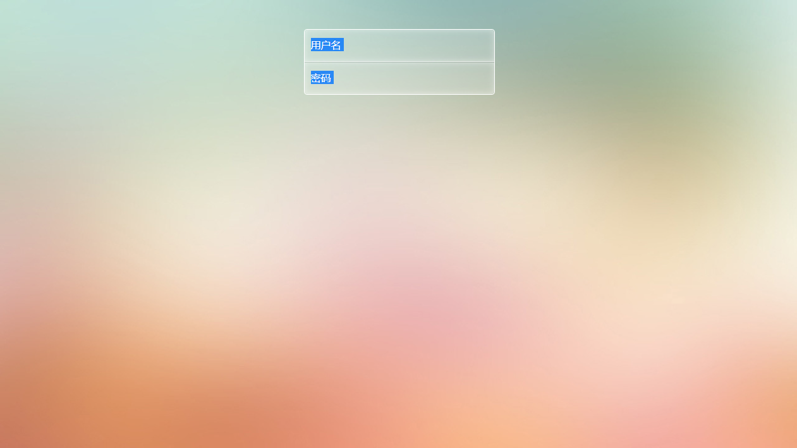

HSLA 是 HSL 色彩模式的扩展，在色相、饱和度、亮度三要素基础上增加了不透明度参数。使用 HSLA 色彩模式，可以定义不同透明度效果。其语法格式如下：

```css
hsla(<length>, <percentage>, <percentage>, <opacity>)
```

```html
<!doctype html>
<html>
<head>
<meta charset="utf-8">
<title></title>
<style  type="text/css">
body{  
    background: #eedfcc url(images/bg.jpg) no-repeat center top;
    -webkit-background-size: cover;
    -moz-background-size: cover;
    background-size: cover;
}

.form {
    width: 300px;
    margin: 30px auto;
    border-radius: 5px;
    box-shadow: 0 0 5px rgba(0,0,0,0.1), 0 3px 2px rgba(0,0,0,0.1);
}

.form p {
    width: 100%;
    float: left;
    border-radius: 5px;
    border: 1px solid #fff;
}

.form input[type=text],
.form input[type=password] {
    width: 100%;
    height: 50px;
    padding: 0;
    border: none;
    background: rgba(255,255,255,0.2);
    box-shadow: inset 0 0 10px rgba(255,255,255,0.5);
    text-indent: 10px;
    font-size: 16px;  
    color:hsla(0,0%,100%,0.9);
    text-shadow: 0 -1px 1px rgba(0,0,0,0.4);         
}

.form input[type=text] {
    border-bottom: 1px solid rgba(255,255,255,0.7);
    border-radius: 5px 5px 0 0;
}

.form input[type=password] {
    border-top: 1px solid rgba(0,0,0,0.1);
    border-radius: 0 0 5px 5px;
}
.form input[type=text]:hover,
.form input[type=password]:hover,
.form input[type=text]:focus,
.form input[type=password]:focus {
    background: rgba(255,255,255,0.4);
    outline: none;
}

</style>
</head>

<body>
<form class="form">
    <p>
        <input type="text" id="login" name="login" placeholder="用户名">
        <input type="password" name="password" id="password" placeholder="密码">
    </p>
</form>
</body>
</html>
```

运行效果如下：



