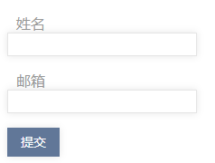

RGBA 是 RGB 色彩模式的扩展，它在红、绿、蓝三原色通道基础上增加了 Alpha 通道。其语法格式如下：

```css
rgba(r, g, b, <opacity>)
```

参数说明如下：

+ r、g、b：分别表示红色、绿色、蓝色三原色所占的比重。取值为正整数或者百分数。正整数值的取值范围为 0 ~ 255，百分数值的取值范围为 0.0% ~ 100.0%。
+ `<opacity>`：表示不透明度，取值范围为0 ~ 1。

> 提示：`rgba(0, 0, 0, 0.1)` 表示不透明为 0.1 的黑色，这里不宜直接设置为浅灰色，因为对于非白色背景来说，灰色发虚，而半透明效果可以避免这种情况

```html
<!doctype html>
<html>
    <head>
    	<meta charset="utf-8">
    	<title></title>
        <style type="text/css">
            /*统一输入域样式*/
            input, textarea {
                padding: 4px; 
                border: solid 1px #E5E5E5;
                outline: 0;
                font: normal 13px/100% Verdana, Tahoma, sans-serif;
                width: 200px;
                background: #FFFFFF;
                /*设置边框阴影效果*/
                box-shadow: rgba(0, 0, 0, 0.1) 0px 0px 8px;
                /*兼容Mozilla类型浏览器，如FF*/
                -moz-box-shadow: rgba(0, 0, 0, 0.1) 0px 0px 8px;
                /*兼容Webkit引擎，如Chorme和Safari等*/
                -webkit-box-shadow: rgba(0, 0, 0, 0.1) 0px 0px 8px;
            }
            input:hover, textarea:hover, input:focus, textarea:focus { border-color: #C9C9C9; }
            /*定义标签样式*/
            label {
                margin-left: 10px;
                color: #999999;
                display: block; /*以块状显示，实现分行显示*/
            }
            .submit input {
                width: auto;
                padding: 9px 15px;
                background: #617798;
                border: 0;
                font-size: 14px;
                color: #FFFFFF;
            }
        </style>
    </head>
    <body>
        <form>
            <p class="name">
                <label for="name">姓名</label>
                <input type="text" name="name" id="name" />
            </p>
            <p class="email">
                <label for="email">邮箱</label>
                <input type="text" name="email" id="email" />
            </p>
            <p class="submit">
                <input type="submit" value="提交" />
            </p>
        </form>
    </body>
</html> 
```

运行效果如下：

