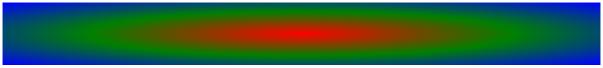

创建一个径向渐变，也至少需要定义两个颜色，同时可以指定渐变的中心点位置、形状类型（圆形或椭圆形）和半径大小。

### 1. 语法

```css
radial-gradient(shape size at position, color-stop1, color-stop2, …);
```

参数简单说明如下：

+ `shape`：用来指定渐变的类型，包括 circle（圆形）和 ellipse（椭圆）两种。　

+ `size`：如果类型为 circle，指定一个值设置圆的半径；如果类型为 ellipse，指定两个值分别设置椭圆的 x 轴和 y 轴半径。取值包括长度值、百分比、关键字。关键字说明如下。

+ `closest-side`：指定径向渐变的半径长度为从中心点到最近的边。

+ `closest-corner`：指定径向渐变的半径长度为从中心点到最近的角。

+ `farthest-side`：指定径向渐变的半径长度为从中心点到最远的边。

+ `farthest-corner`：指定径向渐变的半径长度为从中心点到最远的角。

+ `position`：用来指定中心点的位置。如果提供两个参数，第一个表示 x 轴坐标，第二个表示 y 轴坐标；如果只提供一个值，第二个值默认为 50%，即 `center`。取值可以是长度值、百分比或者关键字，关键字包括left（左侧）、center（中心）、right（右侧）、top（顶部）、center（中心）、bottom（底部）。

  > 注意：position 值位于 shape 和 size 值后面。

+ `color-stop`：用于指定渐变的色点。包括一个颜色值和一个起点位置，颜色值和起点位置以空格分隔。起点位置可以为一个具体的长度值（不可为负值），也可以是一个百分比值，如果是百分比值则参考应用渐变对象的尺寸，最终会被转换为具体的长度值。

Webkit 引擎使用 `-webkit-gradient()` 私有函数支持径向渐变样式，简明用法如下：

```html
-webkit-gradient(radial, point, radius, stop)
```

参数简单说明如下：

+ `radial`：定义渐变类型为径向渐变。

+ `point`：定义渐变中心点坐标。该参数支持数值、百分比值和关键字，如 (0 0) 或者 (left top) 等。关键字包括 top、bottom、center、left 和 right。
+ `radius`：设置径向渐变的长度，该参数为一个数值。

+ `stop` ：定义渐变色和步长。包括 3 个值，即开始的颜色，使用 `from(colorvalue)` 函数定义；结束的颜色，使用 `to(colorvalue)` 函数定义；颜色步长，使用 `color-stop(value, color value)` 函数定义。`color-stop()` 函数包含两个参数值，第一个参数值为一个数值或者百分比值，取值范围为 0～1.0（或者 0%～100%），第二个参数值表示任意颜色值。

另外，Webkit 引擎也支持 `-webkit-radial-gradient()` 私有函数来设计径向渐变。该函数用法与标准函数 `radial-gradient()` 语法格式类似。简明语法格式如下：

```html
-webkit-radial-gradient(position, shape size, color-stop1, color-stop2, …);
```

Gecko 引擎定义了 `-moz-radial-gradient()` 私有函数来设计径向渐变。该函数用法与标准函数`radial-gradient()` 语法格式也类似。简明语法格式如下：

```html
-moz-radial-gradient(position, shape size, color-stop1, color-stop2, …);
```

> 提示：上面两个私有函数的size参数值仅可设置为关键字 closest-side、closest-corner、farthestside、farthest-corner、contain 或 cover。

### 2. 示例代码

```html
<!doctype html>
<html>
    <head>
        <meta charset="utf-8">
        <title></title>
        <style type="text/css">
            #demo {
                height:200px;
                background: -webkit-radial-gradient(ellipse at center 50%, red, green, blue); 	/* Safari 5.1 - 6.0 */
                background: -o-radial-gradient(ellipse at center 50%, red, green, blue); 			/* Opera 11.6 - 12.0 */
                background: -moz-radial-gradient(ellipse at center 50%, red, green, blue);		/* Firefox 3.6 - 15 */
                background: radial-gradient(ellipse at center 50%, red, green, blue); 			/* 标准语法 */
            }
        </style>
    </head>
    <body>
    	<div id="demo"></div>
    </body>
</html>
```

运行效果如下：



