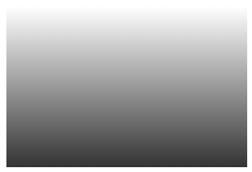

创建一个线性渐变至少需要两个颜色，也可以选择设置一个起点或一个方向。简明语法格式如下：

```xml
linear-gradient(angle, color-stop1, color-stop2, …)
```

参数简单说明如下：

+ `angle`：用来指定渐变的方向，可以使用角度或者关键字来设置。4个关键字说明如下。

  + `to left`：设置渐变从右到左，相当于 270deg。

  + `to right`：设置渐变从左到右，相当于 90deg

  + `to top`：设置渐变从下到上，相当于 0deg

  + `to bottom`：设置渐变从上到下，相当于 180deg。该值为默认值。

  > 提示：如果创建对角线渐变，可以使用 `to top left`（从右下到左上）类似组合来实现。

+ `color-stop`：用于指定渐变的色点，包括一个颜色值和一个起点位置，颜色值和起点位置以空格分隔。起点位置可以为一个具体的长度值（不可为负值），也可以是一个百分比值，如果是百分比值则参考应用渐变对象的尺寸，最终会被转换为具体的长度值。

```html
<!doctype html>
<html>
    <head>
        <meta charset="utf-8">
        <title></title>
        <style type="text/css">
            #demo {
                width:300px;
                height:200px;
                background: linear-gradient(#fff, #333);
            }
        </style>
    </head>
    <body> 
    	<div id="demo"></div>
    </body>
</html>
```

运行效果如下：

