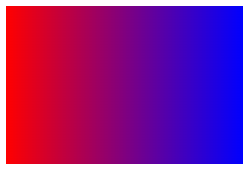
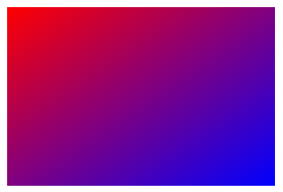

1. 从左边开始的线性渐变。起点是红色，慢慢过渡到蓝色

   ```html
   <!doctype html>
   <html>
       <head>
           <meta charset="utf-8">
           <title></title>
           <style type="text/css">
               #demo {
                   width:300px;
                   height:200px;
                   background: -webkit-linear-gradient(left, red , blue); /* Safari 5.1 - 6.0 */
                   background: -o-linear-gradient(left, red, blue); /* Opera 11.1 - 12.0 */
                   background: -moz-linear-gradient(left, red, blue); /* Firefox 3.6 - 15 */
                   background: linear-gradient(to right, red , blue); /* 标准语法 */
   
               }
           </style>
       </head>
   
       <body>
       
       <div id="demo"></div>
       </body>
   </html>
   ```

   运行效果如下：

   

2. 通过指定水平和垂直的起始位置来设计对角渐变

   ```html
   <!doctype html>
   <html>
       <head>
           <meta charset="utf-8">
           <title></title>
           <style type="text/css">
               #demo {
                   width:300px;
                   height:200px;
                   background: -webkit-linear-gradient(left top, red , blue); /* Safari 5.1 - 6.0 */
                   background: -o-linear-gradient(left top, red, blue); /* Opera 11.1 - 12.0 */
                   background: -moz-linear-gradient(left top, red, blue); /* Firefox 3.6 - 15 */
                   background: linear-gradient(to bottom right, red , blue); /* 标准语法 */
   
               }
           </style>
       </head>
       <body>
       <div id="demo"></div>
       </body>
   </html>
   ```

   运行效果如下：

   

3. 通过指定具体的角度值，可以设计更多渐变方向

   ```html
   <!doctype html>
   <html>
       <head>
           <meta charset="utf-8">
           <title></title>
           <style type="text/css">
               #demo {
                   width:300px;
                   height:200px;
                   background: -webkit-linear-gradient(-90deg, red, blue); /* Safari 5.1 - 6.0 */
                   background: -o-linear-gradient(-90deg, red, blue); /* Opera 11.1 - 12.0 */
                   background: -moz-linear-gradient(-90deg, red, blue); /* Firefox 3.6 - 15 */
                   background: linear-gradient(180deg, red, blue); /* 标准语法 */
   
               }
           </style>
       </head>
       <body>
       	<div id="demo"></div>
       </body>
   </html>
   ```

   