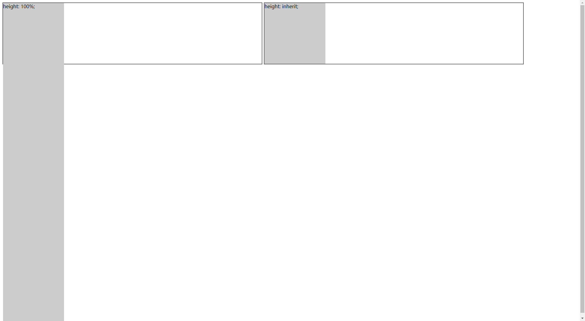

`inherit` 表示属性能够继承祖先的设置值，所有的属性都可以接受该值。

> 提示：`inherit` 表示继承属性值，一般用于字体、颜色、背景等；`auto` 表示自适应，一般用于高度、宽度、外边距和内边距等关于长度的属性。

```html
<!doctype html>
<html>
    <head>
    	<meta charset="utf-8">
    </head>
    <style type="text/css">
        .box {
            display: inline-block;
            height: 200px;
            width: 45%;
            border: 2px solid #666;
        }
        .box  div{
            width: 200px;
            background-color: #ccc; 
            position: absolute;       
        }
        .height1 {
            height: 100%;
        }
        .height2 {
            height: inherit;
        }
    </style>
    <body>
        <div class="box">
            <div class="height1">height: 100%;</div>
        </div>
        <div class="box">
            <div class="height2">height: inherit;</div>
        </div>
    </body>
</html>
```

运行效果如下：

