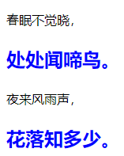

`initial` 表示初始化属性的值，所有的属性都可以接受该值。如果想重置某个属性为浏览器默认值，那么就可以使用该值，这样就可以取消用户定义的 CSS 样式。

```html
<!doctype html>
<html>
    <head>
    	<meta charset="utf-8">
    </head>
    <style type="text/css">
        p {
            color: blue;
            font-size:24px;
            font-weight:bold;
        }
        p:nth-child(odd){
            color: initial;
            font-size:initial;
            font-weight:initial;  
        }
    </style>
    <body>
        <p>春眠不觉晓，</p>
        <p>处处闻啼鸟。</p>
        <p>夜来风雨声，</p>
        <p>花落知多少。</p> 
  	</body>
</html>
```

运行效果如下：

