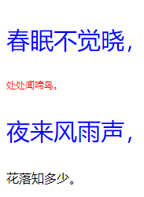

`unset` 表示擦除用户声明的属性值，所有的属性都可以接受该值。如果属性有继承的值，则该属性的值等同于 `inherit`，即继承的值不被擦除；如果属性没有继承的值，则该属性的值等同于 `initial`，即擦除用户声明的值，恢复初始值。

```html
<!doctype html>
<html>
    <head>
    	<meta charset="utf-8">
    </head>
    <style type="text/css">
        .box {
            color: red;
            font-size: 12px;
        }
        p {
            color: blue;
            font-size: 30px;
        }
        p.unset {
            color: unset;
            font-size: unset;
        }
    </style>
    <body>
        <div class="box">
            <p>春眠不觉晓，</p>
            <p class="unset">处处闻啼鸟。</p>
        </div>
        <p>夜来风雨声，</p>
        <p class="unset">花落知多少。</p>
    </body>
</html>
```

运行效果如下：

