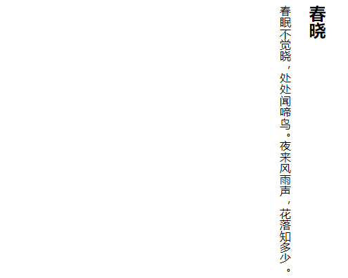

CSS3 增强了文本布局中的书写模式，在 CSS 2.1 定义的 `direction` 和 `unicode-bidi` 属性基础上，新增 `writing-mode` 属性。基本语法如下：

```css
writing-mode: horizontal-tb | vertical-lr | lr-tb | tb-lr
```

取值简单说明如下：

+ `horizontal-tb`：水平方向自上而下的书写方式，类似 IE 私有值 `lr-tb`。
+ `vertical-rl`：垂直方向自右而左的书写方式，类似 IE 私有值 `tb-rl`。
+ `vertical-lr`：垂直方向自左而右的书写方式。
+ `lr-tb`：左-右，上-下。对象中的内容在水平方向上从左向右流入，后一行在前一行的下面显示。
+ `tb-rl`：上-下，右-左。对象中的内容在垂直方向上从上向下流入，自右向左。后一竖行在前一竖行的左面。全角字符是竖直向上的，半角字符顺时针旋转 90度。

> 提示：参考 <https://www.w3.org/TR/CSS-writing-modes-3/>。

> 拓展：`direction` 设置文本流方向，取值包括 `ltr`，文本流从左到右；`rtl`，文本流从右到左。`unicode-bidi` 用于在同一个页面里定义从不同显示方向的文本，与 `direction` 属性一起使用。

```html
<!doctype html>
<html>
<head>
<meta charset="utf-8">
</head>
<style type="text/css">
#box {
    float: right;
    writing-mode: tb-rl;
    -webkit-writing-mode: vertical-rl;
    writing-mode: vertical-rl;
}
</style>
<body>
<div id="box">
    <h2>春晓</h2>
    <p>春眠不觉晓，处处闻啼鸟。夜来风雨声，花落知多少。</p>
</div>
</body>
</html>
```

运行效果如下：



配合 `margin-top: auto` 和 `margin-bottom: auto` 声明，设计栏目垂直居中效果：

```html
<style type="text/css">
.box {
    width: 400px; height: 300px;
    background-color: #f0f3f9;
    writing-mode: tb-rl;
    -webkit-writing-mode: vertical-rl;      
    writing-mode: vertical-rl;   
}
.auto {
    margin-top: auto;
    margin-bottom: auto;
    height:120px;
     
}

img { height:120px;}
</style>
<div class="box">
    <div class="auto"></div>
</div>
```

