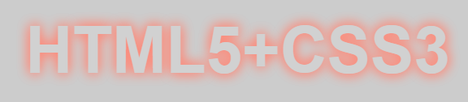

设计阴影不发生位移，同时定义阴影模糊显示，这样就可以模拟出文字外发光效果。

```html
<!doctype html>
<html>
    <head>
    	<meta charset="utf-8">
        <style type="text/css">
            body { background: #000; }
            p {
                text-align: center;
                padding:24px;
                margin:0;
                font-family: helvetica, arial, sans-serif;
                font-size: 80px;
                font-weight: bold;
                color: #D1D1D1;
                background:#CCC;    
                text-shadow: 0 0 0.2em #F87,
                    0 0 0.2em #F87;
            }
   		 </style>
    </head>
    <body>
    	<p>HTML5+CSS3</p>
    </body>
</html>

```

