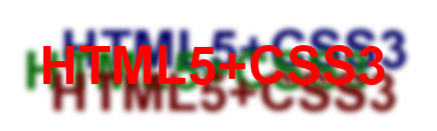

`text-shadow` 属性是在 CSS2 中定义的，在 CSS2.1 中被删除，在 CSS3 的 Text 模块中又恢复。基本语法如下：

```css
text-shadow: none | <length>{2,3} && <color>?
```

取值简单说明如下:

+ `none`：无阴影，为默认值。

+ `<length>`①：第 1 个长度值用来设置对象的阴影水平偏移值。可以为负值。

+ `<length>`②：第 2 个长度值用来设置对象的阴影垂直偏移值。可以为负值。

+ `<length>`③：如果提供了第 3 个长度值则用来设置对象的阴影模糊值。不允许为负值。

+ `<color>`：设置对象阴影的颜色。

> 提示：在 `text-shadow` 属性的第一个值和第二个值中，正值偏右或偏下，负值偏左或偏上。在阴影偏移之后，可以指定一个模糊半径。模糊半径是个长度值，指出模糊效果的范围。如何计算模糊效果的具体算法并没有指定。在阴影效果的长度值之前或之后还可以选择指定一个颜色值。颜色值会被用作阴影效果的基础。如果没有指定颜色，那么将使用 `color` 属性值来替代。

```html
<!doctype html>
<html>
    <head>
    	<meta charset="utf-8">
        <style type="text/css">
            p {
                text-align: center;
                font: bold 60px helvetica, arial, sans-serif;
                color: #999;
                text-shadow: 0.1em 0.1em #333;
            }
            p {text-shadow: -0.1em -0.1em #333;}
            p {text-shadow: -0.1em 0.1em #333;}
            p{ text-shadow: 0.1em 0.1em 0.3em #333; }
            p{ text-shadow: 0.1em 0.1em 0.2em black; }
        </style>
    </head>
    <body>
    	<p>HTML5+CSS3</p>
    </body>
</html>
```

运行效果如下：


当使用 `text-shadow` 属性定义多色阴影时，每个阴影效果必须指定阴影偏移，而模糊半径、阴影颜色是可选参数。

> 提示：`text-shadow` 属性可以接受以逗号分隔的阴影效果列表，并应用到该元素的文本上。阴影效果按照给定的顺序应用，因此可能出现互相覆盖，但是它们永远不会覆盖文本本身。阴影效果不会改变框的尺寸，但可能延伸到它的边界之外。阴影效果的堆叠层次和元素本身的层次是一样的。

```html
<!doctype html>
<html>
    <head>
    	<meta charset="utf-8">
        <style type="text/css">
            p {
                text-align: center;
                font: bold 60px helvetica, arial, sans-serif;
                color: red;
                text-shadow: 0.2em 0.5em 0.1em #600,
                    -0.3em 0.1em 0.1em #060,
                    0.4em -0.3em 0.1em #006;
            }
        </style>
    </head>
    <body>
    	<p>HTML5+CSS3</p>
    </body>
</html>
```

