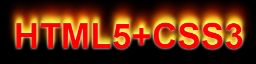

下面示例借助阴影效果列表机制，使用阴影叠加出燃烧的文字特效。

```html
<!doctype html>
<html>
    <head>
    	<meta charset="utf-8">
        <style type="text/css">
            body {background:#000;}
            p {
                text-align: center;
                font:bold 60px helvetica, arial, sans-serif;
                color: red;
                text-shadow: 0 0 4px white, 
                    0 -5px 4px #ff3, 
                    2px -10px 6px #fd3, 
                    -2px -15px 11px #f80, 
                    2px -25px 18px #f20;
            }
        </style>
    </head>
    <body>
    	<p>HTML5+CSS3</p>
    </body>
</html>
```

运行效果如下：

