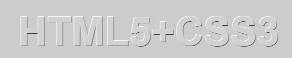
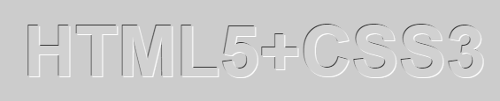

`text-shadow` 属性可以使用在 `:first-letter` 和 `:first-line` 伪元素上。同时，还可以利用该属性设计立体文本。使用阴影叠加出的立体文本特效代码如下：

```html
<!doctype html>
<html>
    <head>
    	<meta charset="utf-8">
        <style type="text/css">
            body { background: #000; }
            p {
                text-align: center;
                padding: 24px;
                margin: 0;
                font-family: helvetica, arial, sans-serif;
                font-size: 80px;
                font-weight: bold;
                color: #D1D1D1;
                background: #CCC;
                text-shadow: -1px -1px white,  
                    1px 1px #333;
            }
    	</style>
    </head>
    <body>
    	<p>HTML5+CSS3</p>
    </body>
</html>
```

运行效果如下：



反向思维，也可以设计一种凹体效果：

```html
<!doctype html>
<html>
    <head>
    	<meta charset="utf-8">
        <style type="text/css">
            body { background: #000; }
            p {
                text-align: center;
                padding: 24px;
                margin: 0;
                font-family: helvetica, arial, sans-serif;
                font-size: 80px;
                font-weight: bold;
                color: #D1D1D1;
                background: #CCC;
                text-shadow: 1px 1px white,  
                    -1px -1px #333;
            }
		</style>
    </head>
    <body>
    	<p>HTML5+CSS3</p>
    </body>
</html>
```

运行效果如下：

