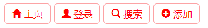

通过 `@font-face` 规则引入外部字体文件 `glyphicons-halflings-regular.eot`，然后定义几个字体图标，嵌入导航菜单项目中，代码如下所示：

```html
<!doctype html>
<html>
    <head>
        <meta charset="utf-8">
        <style type="text/css">
        @font-face {
            font-family: 'Glyphicons Halflings';
            src: url('fonts/glyphicons-halflings-regular.eot');
            src: url('fonts/glyphicons-halflings-regular.eot?#iefix') format('embedded-opentype'),  url('fonts/glyphicons-halflings-regular.woff2') format('woff2'),  url('fonts/glyphicons-halflings-regular.woff') format('woff'),  url('fonts/glyphicons-halflings-regular.ttf') format('truetype'),  url('fonts/glyphicons-halflings-regular.svg#glyphicons_halflingsregular') format('svg');
        }
        .glyphicon {
            position: relative;
            top: 1px;
            display: inline-block;
            font-family: 'Glyphicons Halflings';
            font-style: normal;
            font-weight: normal;
            line-height: 1;
            -webkit-font-smoothing: antialiased;
            -moz-osx-font-smoothing: grayscale;
        }
        .glyphicon-home:before { content: "\e021"; }
        .glyphicon-user:before { content: "\e008"; }
        .glyphicon-search:before { content: "\e003"; }
        .glyphicon-plus:before { content: "\e081"; }
        span {
            font-size: 16px;
            color: red;
        }
        ul {
            margin: 0;
            padding: 0;
            list-style: none;
        }
        li {
            float: left;
            padding: 6px 12px;
            margin: 3px;
            border: solid 1px hsla(359,93%,69%,0.6);
            border-radius: 6px;
        }
        li a {
            font-size: 16px;
            color: red;
            text-decoration: none;
        }
        </style>
    </head>
    <body>
        <ul>
            <li><span class="glyphicon glyphicon-home"></span> <a href="#">主页</a></li>
            <li><span class="glyphicon glyphicon-user"></span> <a href="#">登录</a></li>
            <li><span class="glyphicon glyphicon-search"></span> <a href="#">搜索</a></li>
            <li><span class="glyphicon glyphicon-plus"></span> <a href="#">添加</a></li>
        </ul>
    </body>
</html>
```

运行效果如下：

