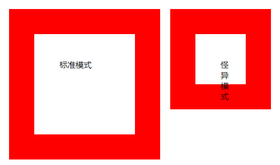
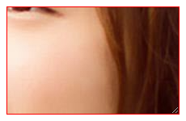
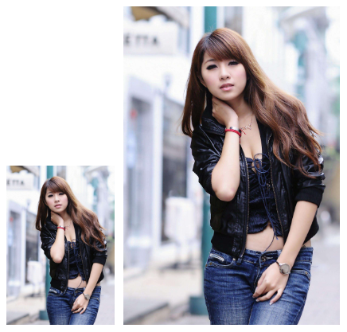

[toc]

### 1. 显示方式

一般浏览器都支持两种显示模式：怪异模式和标准模式。在怪异模式下，`border` 和 `padding` 包含在 `width` 或 `height` 之内；在标准模式下，`border` 、`padding`、`width` 或 `height` 是各自独立区域。

为了兼顾这两种解析模式，CSS3 定义了 `box-sizing` 属性，该属性能够定义对象尺寸的解析方式。`box-sizing` 属性的基本语法如下：

```css
box-sizing: content-box | border-box;
```

取值简单说明如下。　

+ `content-box`：为默认值，`padding` 和 `border` 不被包含在定义的 `width` 和 `height` 之内。对象的实际宽度等于设置的 `width` 值和 `border`、`padding` 之和，即元素的宽度 = width + border + padding。　

+ `border-box`：`padding` 和 `border` 被包含在定义的 `width` 和 `height` 之内。对象的实际宽度就等于设置的 `width` 值，即使定义有 `border` 和 `padding` 也不会改变对象的实际宽度，即元素的宽度 = width。

**示例代码：**

```html
<!DOCTYPE html>
<html>
    <head>
        <title>显示方式</title>
        <style type="text/css">
            div {
                float: left;	/* 浮动显示 */
                height: 100px;	/* 元素的高度 */
                width: 100px;	/* 元素的宽度 */
                border: 50px solid red;	/* 边框 */
                margin: 10px;	/* 外边距 */
                padding: 50px;	/* 内边距 */
            }
            .border-box {
                box-sizing: border-box;	/* 怪异模式解析 */
            }
        </style>
    </head>
    <body>
        <div>
            标准模式
        </div>
        <div class="border-box">
             怪异模式                 
        </div>
    </body>
</html>
```

运行效果如下：



### 2. 调整尺寸

`CSS3` 增加了 `resize` 属性，允许用户通过拖动的方式改变元素的尺寸。`resize` 属性的基本语法如下：

```css
resize: none | both | horizontal | vertical;
```

取值说明如下：

+ `none`：为默认值，不允许用户调整元素大小。
+ `both`：用户可以调节元素的宽度和高度。
+ `horizontal`：用户可以调节元素的宽度。
+ `vertical`：用户可以调节元素的高度。

**示例代码：**

```html
<!DOCTYPE html>
<html>
    <head>
        <title>调整尺寸</title>
        <style type="text/css">
            #resize {
                /* 以背景方式显示图像，这样可以更轻松地控制缩放操作 */
                background:url(images/1.jpg) no-repeat center;
                /* 设计背景图像仅在内容区域显示，留出补白区域 */
                background-clip: content;
                /* 设计元素最小和最大显示尺寸，用户也只能够在该范围内自由调整 */
                width: 200px;
                height: 120px;
                max-width: 800px;
                max-height: 600px;
                padding: 6px;
                border: 1px solid red;
                /* 必须同时定义 overflow 和 resize，否则 resize 属性声明无效，元素默认溢出显示为 visible */
                resize: both;
                overflow: auto;
            }
        </style>
    </head>
    <body>
        <div id="resize">
            
        </div>
    </body>
</html>
```

运行效果如下：



### 3. 缩放比例

`zoom` 是 IE 的专有属性，用于设置对象的缩放比例，另外它还可以触发 `IE` 的 `haslayout` 属性，具有清除浮动和 `margin` 重叠的作用。基本语法如下：

```css
zoom: normal | <number> | <percentage>
```

取值说明如下：

+ `normal`：使用对象的实际尺寸。
+ `<number>`：用浮点数来定义缩放比例，不允许为负值。
+ `<percentage>`：用百分比来定义缩放比例，不允许为负值。

当 `zoom` 属性值为 1.0 或 100% 时，相当于 `normal`，表示不缩放。小于 1 的正数，表示缩小，如 `zoom: 0.5;`，表示缩小为原来的二分之一。

**示例代码：**

```html
<!DOCTYPE html>
<html>
    <head>
        <title>缩放比例</title>
        <style type="text/css">
            img {
                height: 200px;
                margin-right: 6px;
            }
            img.zoom {
                zoom: 2;
            }
        </style>
    </head>
    <body>
        
        
    </body>
</html>
```

运行效果如下：


