[toc]

`CSS3` 的 `box-shadow` 类似于 `text-shadow`，不过 `text-shadow` 负责为文本设置阴影，而 `box-shadow` 负责给对象定义图层阴影效果。

> 权威参考：<https://www.w3.org/TR/css-backgrounds-3/#box-shadow>。

### 1. 定义盒子阴影

`box-shadow` 属性可以定义元素的阴影，基本语法如下：

```
box-shadow: none | inset? && <length>{2,4} && <color>?
```

取值说明如下：

+ `none`：无阴影。
+ `inset`：设置对象的阴影类型为内阴影。该值为空时，则对象的阴影类型为外阴影。
+ `<length>`①：第 1 个长度值用来设置对象的阴影对象的阴影水平偏移值。可以为负值。
+ `<length>`②：第 2 个长度值用来设置对象的阴影垂直偏移值。可以为负值。
+ `<length>`③：如果提供了第 3 个长度值，则用来设置对象的阴影模糊值。不允许为负值。
+ `<length>`④：如果提供了第 4 个长度值，则用来设置对象的阴影外延值。可以为负值。
+ `<color>`：设置对象阴影的颜色。

**【示例 1】** 下面示例定义一个简单的实影投影效果。

```html
<!DOCTYPE html>
<html>
	<head>
		<meta charset="utf-8">
		<title>实影投影效果</title>
		<style type="text/css">
			img {
				height: 300px;
				box-shadow: 5px 5px;
			}
		</style>
	</head>
	<body ondblclick="document.designMode='on';">
		
	</body>
</html>
```

运行效果如下：

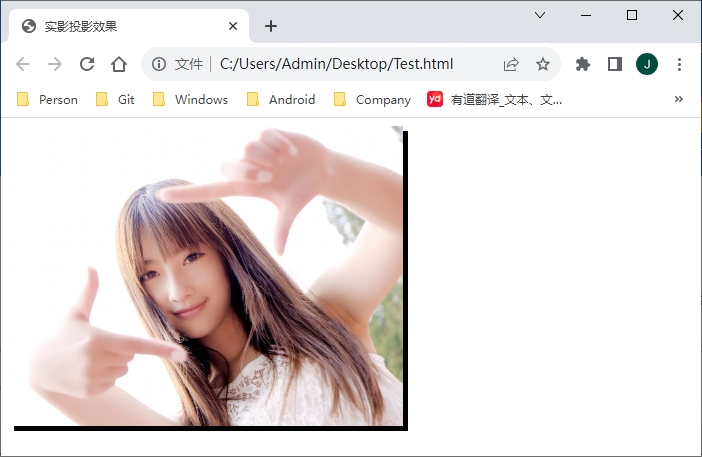

**【示例 2】**定义位移、阴影大小和阴影颜色。

```html
<!DOCTYPE html>
<html>
	<head>
		<meta charset="utf-8">
		<title>定义位移、阴影大小和阴影颜色</title>
		<style type="text/css">
			img {
				height: 300px;
				box-shadow: 2px 2px 10px #06C;
			}
		</style>
	</head>
	<body ondblclick="document.designMode='on';">
		
	</body>
</html>
```

运行效果如下：


**【示例 3】**定义内阴影，阴影大小为 10px，颜色为 `#06C`。

```html
<!DOCTYPE html>
<html>
	<head>
		<meta charset="utf-8">
		<title>定义内阴影</title>
		<style type="text/css">
			pre {  
				padding: 26px;
				font-size:24px;
				-moz-box-shadow: inset 2px 2px 10px #06C;
				-webkit-box-shadow: inset 2px 2px 10px #06C;
				box-shadow: inset 2px 2px 10px #06C;
			}
		</style>
	</head>
	<body>
<pre>
-moz-box-shadow: inset 2px 2px 10px #06C;
-webkit-box-shadow: inset 2px 2px 10px #06C;
box-shadow: inset 2px 2px 10px #06C;
</pre> 
	</body>
</html> 
```

运行效果如下：

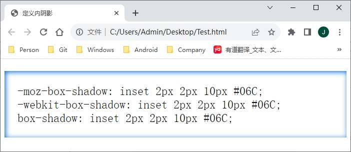

**【示例 4】**通过设置多组参数值定义多色阴影。

```html
<!DOCTYPE html>
<html>
	<head>
		<meta charset="utf-8">
		<title>多组阴影值</title>
		<style type="text/css">
			body { margin: 24px; }
			img {
				height: 300px;
				-moz-box-shadow: -10px 0 12px red,  10px 0 12px blue,  0 -10px 12px yellow,  0 10px 12px green;
				-webkit-box-shadow: -10px 0 12px red,  10px 0 12px blue,  0 -10px 12px yellow,  0 10px 12px green;
				box-shadow: -10px 0 12px red,  10px 0 12px blue,  0 -10px 12px yellow,  0 10px 12px green;
			}
		</style>
	</head>
	<body>
		
	</body>
</html> 
```

运行效果如下：

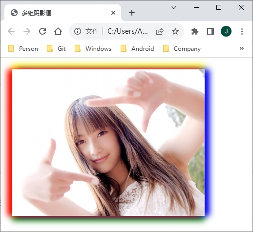

**【示例 5】**通过多组参数值定义渐变阴影。

```html
<!DOCTYPE html>
<html>
	<head>
		<meta charset="utf-8">
		<title>多组阴影值</title>
		<style type="text/css">
			body { margin: 24px; }
			img{
				height:300px;
				-moz-box-shadow:0 0 10px red, 
								2px 2px 10px 10px yellow,
								4px 4px 12px 12px green;
				-webkit-box-shadow:0 0 10px red, 
								2px 2px 10px 10px yellow,
								4px 4px 12px 12px green;
				box-shadow:0 0 10px red, 
								2px 2px 10px 10px yellow,
								4px 4px 12px 12px green; 
			}
		</style>
	</head>
	<body>
		
	</body>
</html> 
```

运行效果如下：

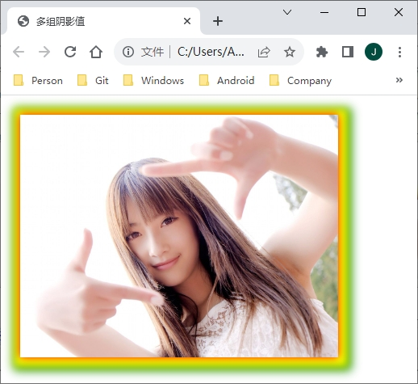

> 注意：当给同一个元素设计多个阴影时，最先写的阴影将显示在对顶层。

### 2. 案例：box-shadow 的应用

第 1 步：设计一个简单的盒子，并定义基本形状。

```html
<style type="text/css">
    .box {
        /* 固定大小 */
        width: 100px;
        height: 100px;
        /* 显示在中央 */
        text-align: center;
        line-height: 100px;
        /* 浅色背景 */
        background-color: rgba(255, 204, 0, .5);
        /* 适当圆角 */
        border-radius: 10px;
        /* 添加间距 */
        padding: 10px;
        margin: 10px;
    }
</style>
<div class="box bs1">box-shadow</div>
```

第 2 步：阴影就是对原对象的复制，包括内边距和边框都数据 `box` 的占位范围，阴影也包括对内边距和边框的复制，但是阴影本身不占据布局的空间。

```html
.bs1 {
	box-shadow: 120px 0px #CCC;
}
```

效果如下：

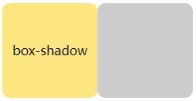

第 3 步：设计四周有一样模糊值的阴影。

```html
.bs1 {
	box-shadow: 0 0 20px #666;
}
```

效果如下：

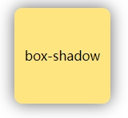

第 4 步，定义 5px 扩展阴影。

```html
.bs1 {
	box-shadow: 0 0 0 5px #333;
}
```

效果如下：

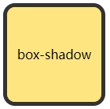

阴影不像 `border` 要占据布局的空间，因此要实现对象鼠标经过产生外围的边框，可以使用阴影的扩展来代替 `border`。或者使用 `border` 的 `transparent` 实现，不过不如 `box-shadow` 的 `spread` 扩展方便。如果使用 `border`，布局会产生影响。

第 5 步，扩展为负值的阴影。

```html
.bs1 {
	box-shadow: 0 15px 10px -15px #333;
	border: none;
}
```

效果如下：

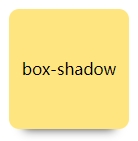

> 注意：要产生这样的效果，y 轴的值和 `spread` 的值刚好是一样且相反的。其他变设计同理。

第 6 步：定义内阴影。

```html
.bs1 {
	background-color: #1C8426;
	box-shadow: 0px 0px 20px #fff inset;
}
```

效果如下：

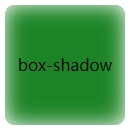

> 注意：可以直接为 `div` 这样的盒子设置 `box-shadow` 盒阴影，但是不能直接为 `img` 图片设置盒阴影。
>
> ```html
> /* 直接在图片上添加内阴影，无效 */
> .img-shadow img {
> 	box-shadow: inset 0 0 20px red;
> }
> ```
>
> 可以通过为 `img` 的容器 `div` 设置内阴影，然后让 `img` 的 `z-index` 为 -1，来解决这个问题。但是这种做法不可以为容器设置背景颜色，因为容器的级别比图片高，设置了背景颜色会挡住图片。
>
> ```html
> /* 在图片容器上添加内阴影，生效 */
> .box-shadow {
> 	box-shadow: inset 0 0 20px red;
> 	display: inline-block;
> }
> .box-shadow img {
> 	position: relative;
> 	z-index: -1;
> }
> img {
> 	height: 300px;
> }
> <div class="box-shadow"></div>
> ```
>
> 效果如下：
>
> 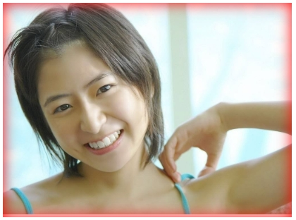
>
> 还有一个更好的方法，不用考虑图片的层级，利用 `:before` 伪元素可以实现，而且还可以为父容器添加背景颜色等。
>
> ```html
> /* 为图片容器添加伪元素或伪类，不用为 img 设置负的 z-index 值，有内阴影 */
> img {
> 	position: relative;
> 	background-color: #FC3;
> 	padding: 5px;
> }
> img:before {
> 	content: '';
> 	position: absolute;
> 	top: 0;
> 	right: 0;
> 	bottom: 0;
> 	left: 0;
> 	box-shadow: inset 0 0 40px #f00;
> }
> ```
>
> 效果如下：
>
> 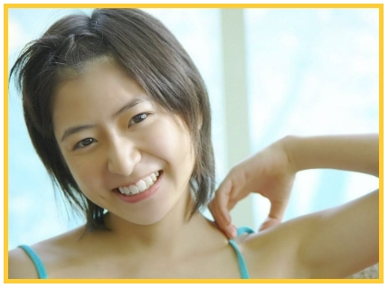

第 7 步：定义多个阴影。

```html
.bs1 {
	box-shadow: 40px 40px rgba(26, 202, 221, 0.5),
				80px 80px rgba(236, 43, 120, .5);
	border-radius: 0;
}
```

效果如下：

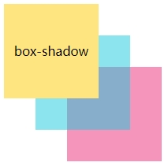

> 提示：阴影也是有层叠关系的，前面的阴影层级高，会压住后面的阴影。阴影和阴影之间的透明度可见，而主体对象的透明度对阴影不起作用。

### 3. 案例：设计翘边阴影

```html
<!doctype html>
<html>
	<head>
		<meta charset="utf-8">
		<title></title>
		<style type="text/css">
			* {
				margin: 0;
				padding: 0;
			}
			ul { list-style: none; }
			.box {
				width: 980px;
				clear: both;
				overflow: hidden;
				height: auto;
				margin: 20px auto;
			}
			.box li {
				background: #fff;
				float: left;
				position: relative;
				margin: 20px 10px;
				border: 2px solid #efefef;
				-webkit-box-shadow: 0 1px 4px rgba(0,0,0,0.27), 0 0 4px rgba(0,0,0,0.1) inset;
				-moz-box-shadow: 0 1px 4px rgba(0,0,0,0.27), 0 0 4px rgba(0,0,0,0.1) inset;
				-o-box-shadow: 0 1px 4px rgba(0,0,0,0.27), 0 0 4px rgba(0,0,0,0.1) inset;
				box-shadow: 0 1px 4px rgba(0,0,0,0.27), 0 0 4px rgba(0,0,0,0.1) inset;
			}
			.box li img {
				width: 290px;
				height: 200px;
				margin: 5px;
			}
			.box li:before {
				content: "";
				position: absolute;
				width: 90%;
				height: 80%;
				bottom: 13px;
				left: 21px;
				background: transparent;
				z-index: -2;
				box-shadow: 0 8px 20px rgba(0,0,0,0.8);
				-webkit-box-shadow: 0 8px 20px rgba(0,0,0,0.8);
				-o-box-shadow: 0 8px 20px rgba(0,0,0,0.8);
				-moz-box-shadow: 0 8px 20px rgba(0,0,0,0.8);
				transform: skew(-12deg) rotate(-6deg);
				-webkit-transform: skew(-12deg) rotate(-6deg);
				-moz-transform: skew(-12deg) rotate(-6deg);
				-os-transform: skew(-12deg) rotate(-6deg);
				-o-transform: skew(-12deg) rotate(-6deg);
			}
			.box li:after {
				content: "";
				position: absolute;
				width: 90%;
				height: 80%;
				bottom: 13px;
				right: 21px;
				z-index: -2;
				background: transparent;
				box-shadow: 0 8px 20px rgba(0,0,0,0.8);
				transform: skew(12deg) rotate(6deg);
				-webkit-transform: skew(12deg) rotate(6deg);
				-moz-transform: skew(12deg) rotate(6deg);
				-os-transform: skew(12deg) rotate(6deg);
				-o-transform: skew(12deg) rotate(6deg);
			}
		</style>
	</head>

	<body>
		<ul class="box">
			<li></li>
			<li></li>
			<li></li>
		</ul>
	</body>
</html>
```

效果如下：

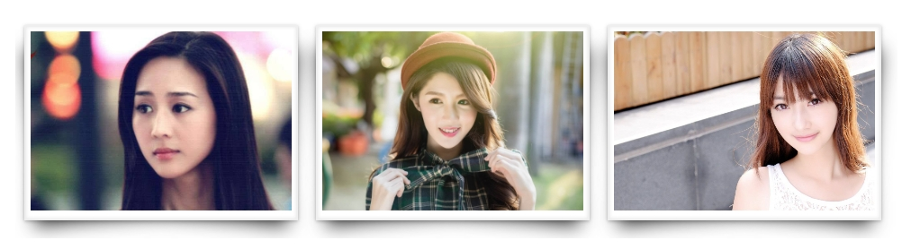

本例主要使用 `CSS3` 的伪类 `:before` 和 `:after`，分别在被插入盒子里面内容的签名和后面动态插入空内容。设置盒子时，每个盒子的大小都要算清楚，小盒子不要超过大盒子范围，而且也不要浪费。使用 `z-index` 属性设置元素的堆叠顺序，拥有更高堆叠顺序的元素总是会处于堆叠顺序较低的元素前面，它仅能在定位元素上奏效。

`skew()` 函数能够让元素倾斜显示，它可以将一个对象以其中心位置围绕着 x 轴和 y 轴按照一定的角度倾斜。`rotate()` 函数只是旋转，而不会改变元素的形状。`skew()` 函数不会旋转，而只是会改变元素的形状。