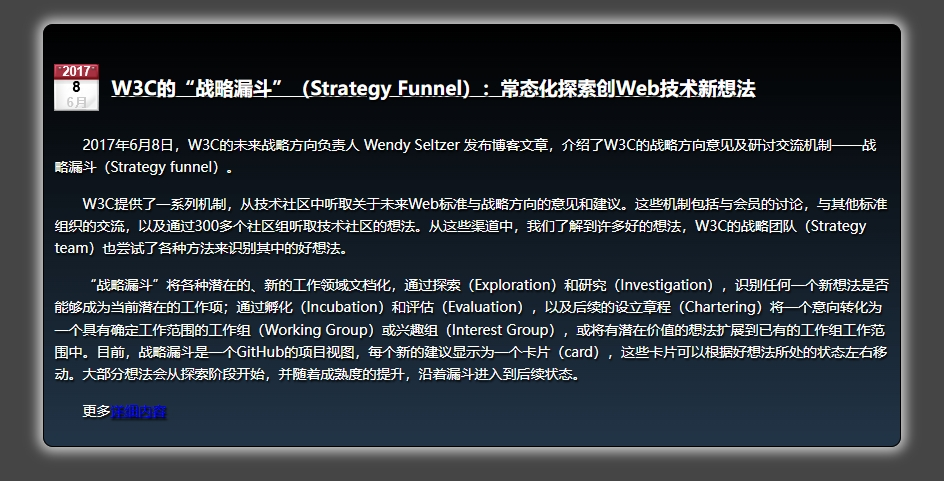

本例将应用 `box-shadow`、`text-shadow` 和 `border-radius` 的等属性，定义一个包含阴影和圆角的特效，同时利用 `CSS` 渐变、半透明特效设计精致的栏目效果，预览效果如下：



代码如下：

```html
<!doctype html>
<html>
<head>
<meta charset="utf-8">
<title></title>
<style type="text/css">
body {/*页面初始化*/ background-color: #454545; }
.box {/*设计包含框样式*/
    border-radius: 10px; /* 设计圆角 */
    box-shadow: 0 0 12px 1px rgba(205, 205, 205, 1); /* 设计栏目阴影*/
    border: 1px solid black;
    padding: 10px;
    margin: 24px auto;
    width: 90%;
    text-shadow: black 1px 2px 2px;  /* 设计包含文本阴影 */
    color: white;
    /* 设计直线渐变背景 */
    background-image: -moz-linear-gradient(bottom, black, rgba(0, 47, 94, 0.4));
    background-image: linear-gradient(to bottom, black, rgba(0, 47, 94, 0.4));
    background-color: rgba(43, 43, 43, 0.5);
}
/* 设计鼠标经过时，放大阴影亮度 */
.box:hover { box-shadow: 0 0 12px 5px rgba(205, 205, 205, 1); }
h1 {
    font-size: 120%;
    font-weight: bold;
    text-decoration: underline;
    margin-bottom:34px;
}
/* 在标题前面添加额外内容 */
h1:before { content: url(images/date.png); position:relative; top:16px; margin-right:12px; }
p {
    text-indent: 2em;
    line-height: 1.6em;
    font-size: 14px;
}
</style>
</head>
<body>
<div  class="box">
    <h1>W3C的“战略漏斗”（Strategy Funnel）：常态化探索创Web技术新想法</h1>
    <p>2017年6月8日，W3C的未来战略方向负责人 Wendy Seltzer 发布博客文章，介绍了W3C的战略方向意见及研讨交流机制——战略漏斗（Strategy funnel）。</p>
    <p>W3C提供了一系列机制，从技术社区中听取关于未来Web标准与战略方向的意见和建议。这些机制包括与会员的讨论，与其他标准组织的交流，以及通过300多个社区组听取技术社区的想法。从这些渠道中，我们了解到许多好的想法，W3C的战略团队（Strategy team）也尝试了各种方法来识别其中的好想法。</p>
    <p>“战略漏斗”将各种潜在的、新的工作领域文档化，通过探索（Exploration）和研究（Investigation），识别任何一个新想法是否能够成为当前潜在的工作项；通过孵化（Incubation）和评估（Evaluation），以及后续的设立章程（Chartering）将一个意向转化为一个具有确定工作范围的工作组（Working Group）或兴趣组（Interest Group），或将有潜在价值的想法扩展到已有的工作组工作范围中。目前，战略漏斗是一个GitHub的项目视图，每个新的建议显示为一个卡片（card），这些卡片可以根据好想法所处的状态左右移动。大部分想法会从探索阶段开始，并随着成熟度的提升，沿着漏斗进入到后续状态。</p>
    <p class="right">更多<a href="http://www.chinaw3c.org/archives/1844/" target="_blank">详细内容</a></p>
</div>
</body>
</html>
```

