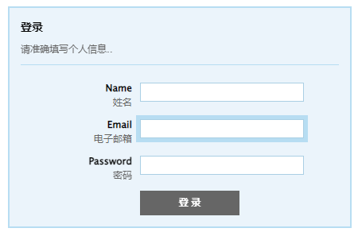
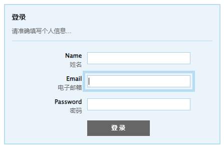

[toc]

轮廓与边框不同，它不占用空间，且不一定是矩形。轮廓属于动态样式，只有当对象获取焦点或者被激活时呈现，如按钮、活动窗体域、图形地图等周边添加一圈轮廓线，使对象突出显示。

### 1. 定义轮廓

`outline` 属性可以定义块元素的轮廓线，基本语法如下：

```css
outline: <'outline-width'> || <'outline-style'> || <'outline-color'> || <'outline-offset'>
```

取值说明如下：

+ `<'outline-width'>`：指定轮廓边框的宽度。
+ `<'outline-style'>`：指定轮廓边框的样式。
+ `<'outline-color'>`：指定轮廓边框的颜色。
+ `<'outline-offset'>`：指定轮廓边框的偏移值。

> 注意：`outline` 创建的轮廓线是画在一个框 "上面"，也就是说，轮廓线总是在顶上，不会影响该框或任何其他框的尺寸。轮廓线可能是非矩形的。例如，如果元素被分割在好几行，那么轮廓线就至少是能要包含该元素所有框的外廓。和边框不同的是，外廓在线框的起止都不是开放的，它总是完全闭合的。

**示例代码：**

```html
<!DOCTYPE html>
<html>
    <head>
        <title>定义轮廓</title>
        <style type="text/css">
        	/* 统一页面字体和大小 */
            body {
                font-family: "Lucida Grande", "Lucida Sans Unicode", Verdana, Arial, Helvetica, sans-serif;
                font-size: 12px;
            }
            /* 清除常用元素的边界、补白、边框默认样式 */
            p, h1, form, button {
                border: 0;
                margin: 0;
                padding: 0;
            }
            /* 定义一个强制换行显示的类 */
            .spancer {
                clear: both;
                height: 1px;
            }
            /* 定义表单外框样式 */
            .myform {
                margin: 0 auto;
                width: 400px;
                padding: 14px;
            }
            /* 定义当前表单样式 */
            #stylized {
                border: solid 2px #b7ddf2;
                background: #ebf4fb;
            }
            /* 设计表单内 div 和 p 通用样式效果 */
            #stylized h1 {
                font-size: 14px;
                font-weight: bold;
                margin-bottom: 8px;
            }
            #stylized p {
                font-size: 11px;
                color: #666666;
                margin-bottom: 20px; 
                padding-bottom: 10px;
                border-bottom: solid 1px #b7ddf2;
            }
            /* 定义表单标签样式 */
            #stylized label {
                display: block;
                width: 140px;
                font-weight: bold;
                text-align: right;
                float: left;
            }
            /* 定义小字体样式类 */
            #stylized .small {
                color: #666666;
                font-size: 11px;
                font-weight: normal;
                text-align: right;
                display: block;
                width: 140px;
            }
            /* 统一输入文本框样式 */
            #stylized input {
                float: left;
                font-size: 12px;
                padding: 4px 2px; 
                margin: 2px 0 20px 10px;
                border: solid 1px #aacfe4;
                width: 200px;
            }
            /* 定义图形化按钮样式 */
            #stylized button {
                clear: both;
                margin-left: 150px;
                width: 125px; height: 31px;
                background: #666666 url(images/button.png) no-repeat;
                text-align: center;
                line-height: 31px;
                color: #FFFFFF;
                font-size: 11px;
                font-weight: bold;
            }
            /* 设计表单内文本框和按钮在被激活和获取焦点状态下时，轮廓线的宽、样式和颜色 */
            input:focus, button:focus {
                outline: thick solid #b7ddf2
            }
            input:active, button:active {
                outline: thick solid #aaa
            }
        </style>
    </head>
    <body>
        <div id="stylized" class="myform">
            <form id="form1" name="form1" method="post" action="">
                <h1>登录</h1>
                <p>请准确填写个人信息..</p>
                <label>Name <span class="small">姓名</span> </label>
                <input type="text" name="textfield" id="textfield"/>
                <label>Email <span class="small">电子邮箱</span> </label>
                <input type="text" name="textfield" id="textfield" />
                <label>Password <span class="small">密码</span> </label>
                <input type="text" name="textfield" id="textfield" />
                <button type="submit">登 录</button>
                <div class="spacer"></div>
            </form>
        </div>
    </body>
</html>
```

运行效果如下：



### 2. 设计轮廓线

**1. 设置宽度**

`outline-width` 属性可以设置轮廓线的宽度。基本语法如下：

```css
outline-width: <length> | thin | medium | thick
```

取值简单说明如下：

+ `<length>`：定义轮廓粗细的值。
+ `thin`：定义细轮廓。
+ `medium`：定义中等的轮廓，为默认值。
+ `thick`：定义粗的轮廓。

> 注意：只有当轮廓样式不是 `none` 时，该属性才会起作用。如果样式为 `none`，宽度实际上会重置为 0。不允许设置为负值。

**2. 设置样式**

`outline-style` 属性可以设置轮廓线的样式。其基本语法如下：

```css
outline-style: none | dotted | dashed | solid | double | groove | ridge | inset | outset
```

取值说明如下：

+ `none`：无轮廓，为默认值。
+ `dotted`：点状轮廓。
+ `dashed`：虚线轮廓。
+ `solid`：实线轮廓。
+ `double`：双线轮廓。两条单线与其间隔的和等于指定 `outline-width` 值。
+ `groove`：3D 凹槽轮廓。
+ `ridge`：3D 凸槽轮廓。
+ `inset`：3D 凹边轮廓。
+ `outset`： 3D 凸边轮廓。

**3. 设置颜色**

`outline-color` 属性可以设置轮廓线的颜色。其基本语法如下：

```css
outline-color: <color> | invert
```

取值如下：

+ `<color>` ：指定颜色
+ `invert`：使用背景色的反色。该参数值目前仅在 IE 及 Opera 下有效。

**4. 设置偏移**

`outline-offset` 属性可以设置轮廓线的偏移位置。其语法如下：

```css
outline-offset: <length>
```

用长度值来定义轮廓偏移，允许为负值，默认值为 0。

**示例代码：**

```html
<!DOCTYPE html>
<html>
    <head>
        <title>设计轮廓线</title>
        <style type="text/css">
        	/* 统一页面字体和大小 */
            body {
                font-family: "Lucida Grande", "Lucida Sans Unicode", Verdana, Arial, Helvetica, sans-serif;
                font-size: 12px;
            }
            /* 清除常用元素的边界、补白、边框默认样式 */
            p, h1, form, button {
                border: 0;
                margin: 0;
                padding: 0;
            }
            /* 定义一个强制换行显示的类 */
            .spancer {
                clear: both;
                height: 1px;
            }
            /* 定义表单外框样式 */
            .myform {
                margin: 0 auto;
                width: 400px;
                padding: 14px;
            }
            /* 定义当前表单样式 */
            #stylized {
                border: solid 2px #b7ddf2;
                background: #ebf4fb;
            }
            /* 设计表单内 div 和 p 通用样式效果 */
            #stylized h1 {
                font-size: 14px;
                font-weight: bold;
                margin-bottom: 8px;
            }
            #stylized p {
                font-size: 11px;
                color: #666666;
                margin-bottom: 20px; 
                padding-bottom: 10px;
                border-bottom: solid 1px #b7ddf2;
            }
            /* 定义表单标签样式 */
            #stylized label {
                display: block;
                width: 140px;
                font-weight: bold;
                text-align: right;
                float: left;
            }
            /* 定义小字体样式类 */
            #stylized .small {
                color: #666666;
                font-size: 11px;
                font-weight: normal;
                text-align: right;
                display: block;
                width: 140px;
            }
            /* 统一输入文本框样式 */
            #stylized input {
                float: left;
                font-size: 12px;
                padding: 4px 2px; 
                margin: 2px 0 20px 10px;
                border: solid 1px #aacfe4;
                width: 200px;
            }
            /* 定义图形化按钮样式 */
            #stylized button {
                clear: both;
                margin-left: 150px;
                width: 125px; height: 31px;
                background: #666666 url(images/button.png) no-repeat;
                text-align: center;
                line-height: 31px;
                color: #FFFFFF;
                font-size: 11px;
                font-weight: bold;
            }
            /* 设计表单内文本框和按钮在被激活和获取焦点状态下时，轮廓线的宽、样式和颜色 */
            input:focus, button:focus {
                outline: thick solid #b7ddf2
            }
            input:active, button:active {
                outline: thick solid #aaa
            }
            /* 通过 outline-offset 属性放大轮廓线 */
            input:active, button:active {
                outline-offset: 4px;
            }
            input:focus, button:focus {
                outline-offset: 4px;
            }
        </style>
    </head>
    <body>
        <div id="stylized" class="myform">
            <form id="form1" name="form1" method="post" action="">
                <h1>登录</h1>
                <p>请准确填写个人信息..</p>
                <label>Name <span class="small">姓名</span> </label>
                <input type="text" name="textfield" id="textfield"/>
                <label>Email <span class="small">电子邮箱</span> </label>
                <input type="text" name="textfield" id="textfield" />
                <label>Password <span class="small">密码</span> </label>
                <input type="text" name="textfield" id="textfield" />
                <button type="submit">登 录</button>
                <div class="spacer"></div>
            </form>
        </div>
    </body>
</html>
```

运行效果如下：


