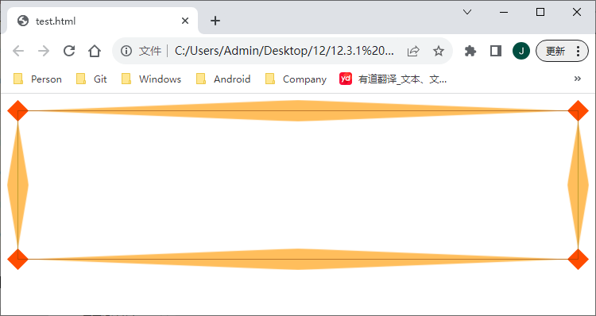
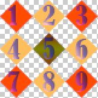
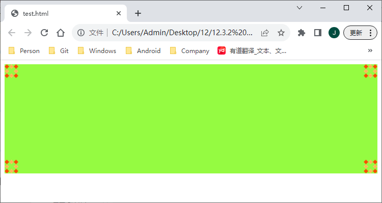
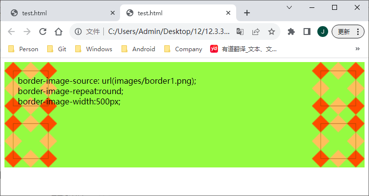
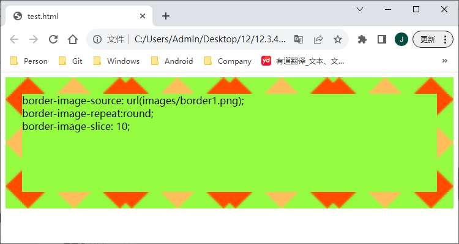
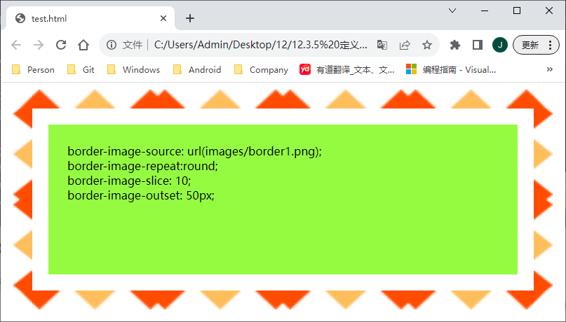
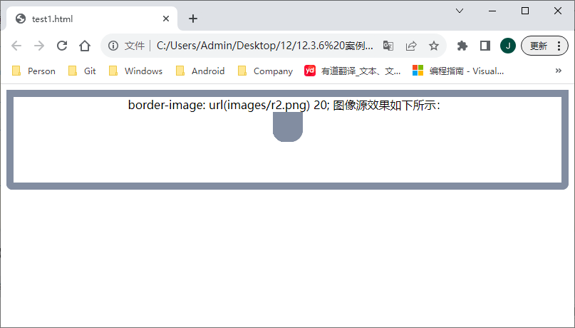
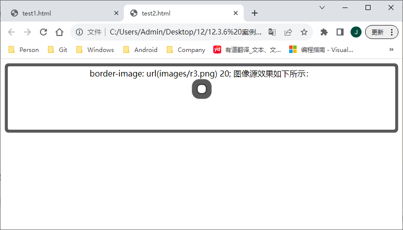
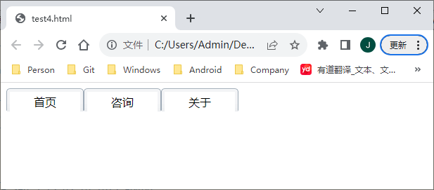

[toc]

> 提示：权威参考：<https://www.w3.org/TR/css-backgrounds-3/#borders>

### 1. 定义边框图像源

`CSS3` 新增的 `border-image` 属性能够模拟 `background-image` 属性功能，且功能更加强大，该属性的基本语法如下：

```
border-image:<'border-image-source'> || <'border-image-slice'> [/ <'border-image-width'> | / <'border-image-width'>? / <'border-image-outset'>]? || <'border-image-repeat'>
```

取值说明如下：

+ `<'border-image-source'>`：设置对象的边框是否用图像定义样式或图像来源路径。　

+ `<'border-image-slice'>`：设置边框图像的分割方式。　

+ `<'border-image-width'>`：设置对象的边框图像的宽度。　

+ `<'border-image-outset'>`：设置对象的边框图像的扩展。　

+ `<'border-image-repeat'>`：设置对象的边框图像的平铺方式。

**【示例】** 下面示例为元素 `div` 定义边框图像，使用 `border-image-source` 导入外部图像源 `images/border1.png` ，通过 `border-image-slice` 属性，值为 `(27 27 27 27)` ，把图像切分为 9 块，然后分别把这 9 块图像切片按顺序填充到边框四边、四角和内容区域。示例主要代码如下，页面浏览效果如图12.7所示。

```html
<!doctype html>
<html>
    <head>
        <meta charset="utf-8">
        <title></title>
        <style type="text/css">
            div {
                height: 160px;
                border: solid 27px;
                /*设置边框背景图像*/
                -webkit-border-image: url(images/border1.png) 27;
                /*兼容webkit引擎*/
                -moz-border-image: url(images/border1.png) 27;
                /*兼容gecko引擎*/
                -o-border-image: url(images/border1.png) 27;
                /*兼容presto引擎*/
                border-image: url(images/border1.png) 27;
                /*兼容标准用法*/
            }
        </style>
    </head>
    <body>
        <div></div>
    </body>
</html>
```

效果如下：



在上面示例中，使用了一个71px * 71px大小的图像，将这个正方形图像等分为 9 个方块，每个方块大小为 21px * 21px。当声明 `border-image-slice` 属性值为 `(27 27 27 27)` 时，则按下面说明进行解析：　

+ 第1个参数值表示从上向下裁切图像，显示在顶边。　

+ 第2个参数值表示从右向左裁切图像，显示在右边。　

+ 第3个参数值表示从下向上裁切图像，显示在底边。　

+ 第4个参数值表示从左向右裁切图像，显示在左边。

图像被 4 个参数值裁切为 9 块，再根据边框的大小进行自适应显示。例如，当分别设置边框为不同大小时，则显示效果除了粗细之外，其他是相同的。



### 2. 定义边框图像平铺方式

`border-image-repeat` 属性设置对象的边框图像的平铺方式。该属性的基本语法如下：

```
border-image-repeat: [stretch | repeat | round | space]{1,2}
```

取值简单说明如下：

+ `stretch`：用拉伸方式来填充边框图像，为默认值。　

+ `repeat`：用平铺方式来填充边框图像。当图片碰到边界时，如果超过则被截断。　

+ `round`：用平铺方式来填充边框图像。图像会根据边框的尺寸动态调整图像的大小，直至正好可以铺满整个边框。　

+ `space`：用平铺方式来填充边框图像。图像会根据边框的尺寸动态调整图像之间的间距，直至正好可以铺满整个边框。

**【示例】**下面示例设置边框图像平铺显示：`border-image-repeat:round;`，演示效果如下图12.8所示。

```html
<!DOCTYPE html>
<html>
    <head>
        <meta charset="utf-8">
        <title></title>
        <style type="text/css">
            div {
                height: 160px;
                background: hsla(93, 96%, 62%, 1.00);
                border: solid 27px red;
                /*设置边框背景图像*/
                -webkit-border-image-source: url(images/border1.png);
                /*兼容webkit引擎*/
                -moz-border-image-source: url(images/border1.png);
                /*兼容gecko引擎*/
                -o-border-image-source: url(images/border1.png);
                /*兼容presto引擎*/
                border-image-source: url(images/border1.png);
                /*兼容标准用法*/
                -webkit-border-image-repeat: round;
                -moz-border-image-repeat: round;
                -o-border-image-repeat: round;
                border-image-repeat: round;
            }
        </style>
    </head>
    <body>
        <div></div>
    </body>
</html>
```

效果如下所示：



### 3. 定义边框图像宽度

`border-image-width` 属性设置对象的边框图像的宽度。该属性的基本语法如下：

```
border-image-width: [<length> | <percentage> | <number> | auto]{1,4}
```

取值简单说明如下：

+ `<length>`：用长度值指定宽度。不允许为负值。　

+ `<percentage>`：用百分比指定宽度。参照其包含块进行计算，不允许为负值。　

+ `<number>`：用浮点数指定宽度。不允许为负值。　

+ `auto`：如果 `auto` 值被设置，则 `<'border-image-width'>` 采用与 `<'border-image-slice'>` 相同的值。

【示例】下面示例设置边框背景平铺显示：`border-image-repeat:round;`，图像宽度为 `500px`：

```html
<!DOCTYPE html>
<html>
    <head>
        <meta charset="utf-8">
        <title></title>
        <style type="text/css">
            div {
                height: 160px;
                background: hsla(93, 96%, 62%, 1.00);
                border: solid 27px red;
                /*设置边框图像*/
                -webkit-border-image-source: url(images/border1.png);
                /*兼容webkit引擎*/
                -moz-border-image-source: url(images/border1.png);
                /*兼容gecko引擎*/
                -o-border-image-source: url(images/border1.png);
                /*兼容presto引擎*/
                border-image-source: url(images/border1.png);
                /*兼容标准用法*/
                -webkit-border-image-repeat: round;
                -moz-border-image-repeat: round;
                -o-border-image-repeat: round;
                border-image-repeat: round;
                -webkit-border-image-width: 500px;
                -moz-border-image-width: 500px;
                -o-border-image-width: 500px;
                border-image-width: 500px;
            }
        </style>
    </head>
    <body>
        <div>border-image-source: url(images/border1.png);<br>
            border-image-repeat:round;<br>
            border-image-width:500px;</div>
    </body>
</html>
```

效果如下所示：



### 4. 定义边框图像分割方式

`border-image-slice` 属性设置对象的边框图像的分割方式。该属性的基本语法如下：

```
border-image-slice: [<number> | <percentage>]{1,4} && fill?
```

取值简单说明如下：

+ `<number>`：用浮点数指定宽度。不允许为负值。　

+ `<percentage>`：用百分比指定宽度。参照其包含块区域进行计算，不允许为负值。　

+ `fill`：保留裁剪后的中间区域，其铺排方式遵循 `<' border-image-repeat '>`的设定。

【示例】下面示例设置边框背景平铺显示：`border-image-repeat:round;`，设置裁切值为 10：`border-image-slice: 10;` ：

```html
<!DOCTYPE html>
<html>
    <head>
        <meta charset="utf-8">
        <title></title>
        <style type="text/css">
            div {
                height: 160px;
                background: hsla(93, 96%, 62%, 1.00);
                border: solid 27px red;
                /*设置边框图像*/
                -webkit-border-image-source: url(images/border1.png);
                /*兼容webkit引擎*/
                -moz-border-image-source: url(images/border1.png);
                /*兼容gecko引擎*/
                -o-border-image-source: url(images/border1.png);
                /*兼容presto引擎*/
                border-image-source: url(images/border1.png);
                /*兼容标准用法*/
                -webkit-border-image-repeat: round;
                -moz-border-image-repeat: round;
                -o-border-image-repeat: round;
                border-image-repeat: round;
                -webkit-border-image-slice: 10;
                -moz-border-image-slice: 10;
                -o-border-image-slice: 10;
                border-image-slice: 10;
            }
        </style>
    </head>
    <body>
        <div>border-image-source: url(images/border1.png);<br>
            border-image-repeat:round;<br>
            border-image-slice: 10;</div>
    </body>
</html>
```

运行效果如下：



### 5. 定义边框图像扩展

`border-image-outset` 属性设置对象的边框图像的扩展。该属性的基本语法如下：

```
border-image-outset: [<length> | <number>]{1,4}
```

取值简单说明如下：　

+ `<length>`：用长度值指定宽度。不允许为负值。　

+ `<number>`：用浮点数指定宽度。不允许为负值。

【示例】下面示例设置边框背景向外扩展 50px：

```html
<!DOCTYPE html>
<html>
    <head>
        <meta charset="utf-8">
        <title></title>
        <style type="text/css">
            div {
                height: 160px;
                margin: 60px;
                background: hsla(93, 96%, 62%, 1.00);
                border: solid 27px red;
                /*设置边框图像*/
                -webkit-border-image-source: url(images/border1.png);
                /*兼容webkit引擎*/
                -moz-border-image-source: url(images/border1.png);
                /*兼容gecko引擎*/
                -o-border-image-source: url(images/border1.png);
                /*兼容presto引擎*/
                border-image-source: url(images/border1.png);
                /*兼容标准用法*/
                -webkit-border-image-repeat: round;
                -moz-border-image-repeat: round;
                -o-border-image-repeat: round;
                border-image-repeat: round;
                -webkit-border-image-slice: 10;
                -moz-border-image-slice: 10;
                -o-border-image-slice: 10;
                border-image-slice: 10;
                -webkit-border-image-outset: 50px;
                -moz-border-image-outset: 50px;
                -o-border-image-outset: 50px;
                border-image-outset: 50px;
            }
        </style>
    </head>
    <body>
        <div>border-image-source: url(images/border1.png);<br>
            border-image-repeat:round;<br>
            border-image-slice: 10;<br>
            border-image-outset: 50px;</div>
    </body>
</html>
```

运行效果如下：



### 6. 案例：应用边框图像

#### 6.1  示例 1

下面示例演示如何设计左下和右下圆角显示：

```html
<!DOCTYPE html>
<html>
    <head>
        <meta charset="utf-8">
        <title></title>
        <style type="text/css">
            div {
                height: 120px;
                text-align: center;
                border-style: solid;
                border-width: 10px;
                -moz-border-image: url(images/r2.png) 20;
                -webkit-border-image: url(images/r2.png) 20;
                -o-border-image: url(images/r2.png) 20;
                border-image: url(images/r2.png) 20;
            }
        </style>
    </head>
    <body>
        <div>border-image: url(images/r2.png) 20; 图像源效果如下所示：<br>
            
        </div>
    </body>
</html>
```

运行效果如下：



#### 6.2 示例 2

设计完全圆角边框效果。设计圆角图像大小为 42px * 42px，裁切半径为 20px：

```html
<!DOCTYPE html>
<html>
    <head>
        <meta charset="utf-8">
        <title></title>
        <style type="text/css">
            div {
                height: 120px;
                text-align: center;
                border-style: solid;
                border-width: 10px;
                -moz-border-image: url(images/r3.png) 20;
                -webkit-border-image: url(images/r3.png) 20;
                -o-border-image: url(images/r3.png) 20;
                border-image: url(images/r3.png) 20;
            }
        </style>
    </head>
    <body>
        <div>border-image: url(images/r3.png) 20; 图像源效果如下所示：<br>
            
        </div>
    </body>
</html>
```

运行效果如下：



#### 3. 示例 3

设计阴影特效。设计边框图像大小为42px*42px：

```html
<!DOCTYPE html>
<html>
    <head>
        <meta charset="utf-8">
        <title></title>
        <style type="text/css">
            img {
                height: 400px;
                border-style: solid;
                border-width: 2px 5px 6px 2px;
                -moz-border-image: url(images/r4.png) 2 5 6 2;
                -webkit-border-image: url(images/r4.png) 2 5 6 2;
                -o-border-image: url(images/r4.png) 2 5 6 2;
                border-image: url(images/r4.png) 2 5 6 2;
            }
        </style>
    </head>
    <body>
        
    </body>
</html>
```

运行效果如下：


#### 6.4 示例  4

设计选项卡。设计边框图像大小为12px*27px，圆角半径为12px：

```html
<!DOCTYPE html>
<html>
    <head>
        <meta charset="utf-8">
        <title></title>
        <style type="text/css">
            ul {
                margin: 0;
                padding: 0;
                list-style-type: none;
            }

            li {
                width: 100px;
                height: 20px;
                border-style: solid;
                cursor: pointer;
                float: left;
                padding: 4px 0;
                text-align: center;
                border-width: 5px 5px 0px;
                -moz-border-image: url(images/r5.png) 5 5 0;
                -webkit-border-image: url(images/r5.png) 5 5 0;
                -o-border-image: url(images/r5.png) 5 5 0;
                border-image: url(images/r5.png) 5 5 0;
            }
        </style>
    </head>
    <body>
        <ul>
            <li>首页</li>
            <li>咨询</li>
            <li>关于</li>
        </ul>
    </body>
</html>
```

运行效果如下：



### 7. 定义圆角边框

`CSS3` 新增 `border-radius` 属性，使用它可以设计元素的边框以圆角样式显示。`border-radius` 属性的基本语法如下：

```
border-radius: [<length> | <percentage>]{1,4} [/ [<length> | <percentage>]{1,4}]?
```

取值简单说明如下：

+ `<length>`：用长度值设置对象的圆角半径长度。不允许为负值。　

+ `<percentage>`：用百分比设置对象的圆角半径长度。不允许为负值。

为了方便定义 4 个顶角的圆角，`border-radius` 属性派生了 4 个子属性：

+ `border-top-right-radius`：定义右上角的圆角。　

+ `border-bottom-right-radius`：定义右下角的圆角。　

+ `border-bottom-left-radius`：定义左下角的圆角。　

+ `border-top-left-radius`：定义左上角的圆角。

> 提示：`border-radius` 属性可包含两个参数值：第一个值表示圆角的水平半径，第二个值表示圆角的垂直半径，两个参数值通过斜线分隔。如果仅包含一个参数值，则第二个值与第一个值相同，它表示这个角是一个四分之一圆角。如果参数值中包含 0，则这个角就是矩形，不会显示为圆角。

针对 `border-radius` 属性参数值，各种浏览器的处理方式并不一致。在 `Chrome` 和 `Safari` 浏览器中，会绘制出一个椭圆形边框，第一个半径为椭圆的水平方向半径，第二个半径为椭圆的垂直方向半径。在 `Firefox` 和 `Opera` 浏览器中，将第一个半径作为边框左上角与右下角的圆半径来绘制，将第二个半径作为边框右上角与左下角的圆半径来绘制。

如果是4个值，则这4个值将按照 `top-left`、`top-right`、`bottom-right`、`bottom-left` 顺序来设置。

如果 `bottom-left`值省略，那么它等于 `top-right`。

如果 `bottom-right` 值省略，那么它等于 `top-left`。

如果 `top-right` 值省略，那么它等于 `top-left`。

如果为 `border-radius` 属性设置 4 个值的集合参数，则每个值表示每个角的圆角半径。

如果为 `border-radius` 属性设置 3 个值的集合参数，则第 1 个值表示左上角的圆角半径，第 2 个值表示右上和左下两个角的圆角半径，第 3 个值表示右下角的圆角半径。

如果为 `border-radius` 属性设置 2 个值的集合参数，则第 1 个值表示左上角和右下角的圆角半径，第 2 个值表示右上和左下两个角的圆角半径。

#### 7.1 示例 1

下面给 `border-radius` 属性设置一个值：10px：

```html
<!DOCTYPE html>
<html>
    <head>
        <meta charset="utf-8">
        <title></title>
        <style type="text/css">
            img {
                height: 300px;
                border: 1px solid red;
                -moz-border-radius: 10px;
                /*兼容Gecko引擎*/
                -webkit-border-radius: 10px;
                /*兼容Webkit引擎*/
                border-radius: 10px;
                /*标准用法*/
            }
        </style>
    </head>
    <body>
        
    </body>
</html>
```


#### 7.2 示例 2

如果为border-radius属性设置两个参数值：

```html
<!DOCTYPE html>
<html>
    <head>
        <meta charset="utf-8">
        <title></title>
        <style type="text/css">
            img {
                height: 300px;
                border: 1px solid red;
                -moz-border-radius: 20px/40px;
                -webkit-border-radius: 20px/40px;
                border-radius: 20px/40px;
            }
        </style>
    </head>
    <body>
        
    </body>
</html>
```

运行效果如下：


#### 7.3 示例 3

下面示例为图像的4个顶角定义不同圆角半径：

```html
<!DOCTYPE html>
<html>
    <head>
        <meta charset="utf-8">
        <title></title>
        <style type="text/css">
            img {
                height: 300px;
                border: 1px solid red;
                -moz-border-radius: 10px 30px 50px 70px;
                -webkit-border-radius: 10px 30px 50px 70px;
                border-radius: 10px 30px 50px 70px;
            }
        </style>
    </head>
    <body>
        
    </body>
</html>
```

运行效果如下：


#### 7.4 示例 4

下面代码定义div元素右上角为50px的圆角：

```html
<!DOCTYPE html>
<html>
    <head>
        <meta charset="utf-8">
        <title></title>
        <style type="text/css">
            img {
                height: 300px;
                border: 1px solid red;
                -moz-border-radius-topright: 50px;
                -webkit-border-top-right-radius: 50px;
                border-top-right-radius: 50px;
            }
        </style>
    </head>
    <body>
        
    </body>
</html>
```

运行效果如下：


### 8. 案例：设计椭圆图形

使用 `border-radius` 属性设计圆角时，可能会存在下面几种情况：

+ 如果受影响的角的两个相邻边宽度不同，那么这个圆角将会从宽的一边圆滑过渡到窄的一边，即偏向宽边的圆弧略大，而偏向窄边的圆弧略小。

+ 如果两条边宽度相同，那么圆角两个相邻边呈对称圆弧显示，即相交45°的对称线上。

+ 如果一条边宽度是相邻另一条边宽度的两倍，那么两边圆弧线交于靠近窄边的30°角线上。

`border-radius` 不允许圆角彼此重叠，当相邻两个圆角的半径之和大于元素的宽或高时，在浏览器中会呈现为椭圆或正圆效果。

```html
<!DOCTYPE html>
<html>
    <head>
        <meta charset="utf-8">
        <title></title>
        <style type="text/css">
            img {
                border: solid 1px red;
                -moz-border-radius: 50%;
                /*兼容Gecko引擎*/
                -webkit-border-radius: 50%;
                /*兼容Webkit引擎*/
                border-radius: 50%;
                /*标准用法*/
            }

            .r1 {
                width: 300px;
                height: 300px;
            }

            .r2 {
                width: 300px;
                height: 200px;
            }

            .r3 {
                width: 300px;
                height: 100px;
                border-radius: 20px;

            }
        </style>
    </head>
    <body>
        
        
        
    </body>
</html>
```

运行效果如下：

