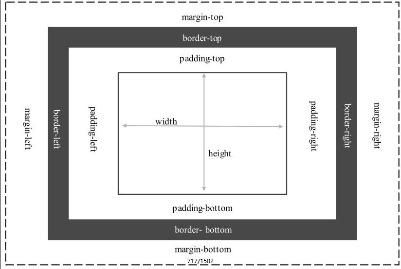
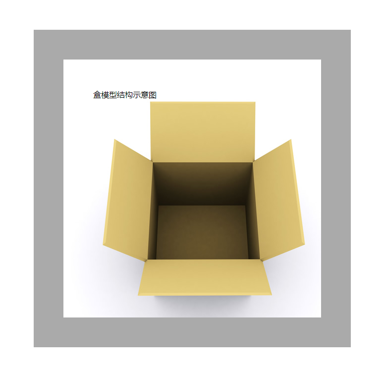

[toc]

盒模型具有如下特点:　

+ 每个盒子都有边界、边框、补白、内容4个属性。　

+ 每个属性都包括4个部分：上、右、下、左。　

+ 每个属性可同时设置，也可分别设置。　

+ 边界和补白只能够定义大小，而边框可以定义样式、大小和颜色。　

+ 内容可以定义宽度和高度。



### 1. 示例代码

```html
<!doctype html>
<html>
<head>
<meta charset="utf-8">
<title></title>
<style type="text/css">
#box {
    height:400px;/*定义元素的高*/
    width:400px; /*定义元素的宽*/
    margin:60px; /*定义元素的边界*/
    padding:60px; /*定义元素的补白*/
    border:solid 60px #aaa; /*定义元素的边框*/
    background-image:url(images/box1.jpg); /*定义元素的背景图像*/
    background-repeat:no-repeat;
    background-color:#CC99CC; /*定义元素的背景颜色*/
}
</style>
</head>

<body>
<div id="box">盒模型结构示意图</div>
</body>
</html>
```

### 2. 运行效果

