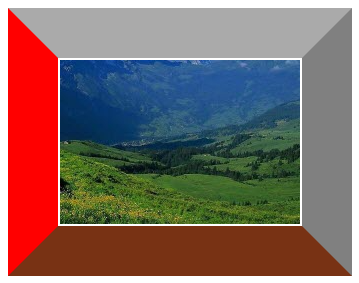
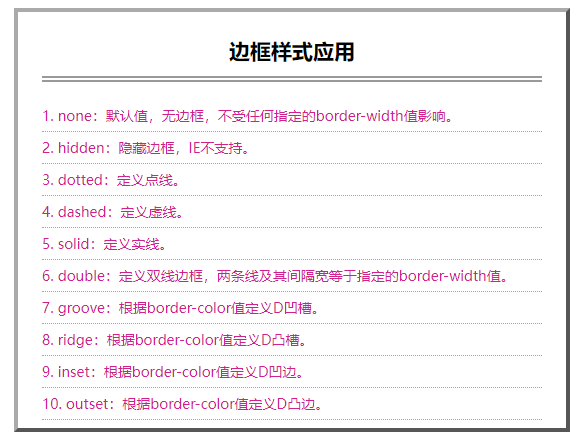

[toc]

元素的边框具有下面4个特点：　

+ 每个元素都包含4个方位的边框，如 border-top（顶边）、border-right（右边）、border-bottom（底边）和 border-left（左边），可以单独定义，也可以使用 border 属性统一定义边框样式。　

+ 独立定义边框的宽度，如 border-width、border-top-width、border-right-width、border-bottom-width 和 border-left-width。也可以使用 border-width 属性统一定义边框的宽度。　

+ 独立定义边框的颜色，如 border-color、border-top-color、border-right-color、border-bottom-color 和 border-left-color。也可以使用 border-color 属性统一定义边框的颜色。　

+ 独立定义边框的样式，如 border-style、border-top-style、border-right-style、border-bottom-style 和 border-left-style。也可以使用 border-style 属性统一定义边框的样式。

### 1. 定义宽度

定义边框的宽度有多种方法，简单说明如下。
**方法1：**

直接在属性后面指定宽度值。

```html
<style type="text/css">
	border-bottom-width: 12px;	/* 定义元素的底边框宽度为 12px */
	border-top-width: 0.2em;	/* 定义顶部边框宽度为元素内字体大小的 0.2 倍 */
</style>
```

**方法2：**

使用关键字，如 thin、medium 和 thick。thick 比 medium 宽，而 medium 比 thin 宽。不同浏览器对此解析的宽度值也不同，有的解析为 5px、3px、2px，有的解析为 3px、2px、1px。

**方法3：**

单独为元素的某条边设置宽度，可以使用 border-top-width（顶边框宽度）、border-right-width（右边框宽度）、border-bottom-width（底边框宽度）和 border-left-width（左边框宽度）。

**方法4：**

使用 border-width 属性快速定义边框宽度，例如：

```html
<style type="text/css">
	border-width: 2px;	/* 定义四边都为 2px */
    border-width: 2px 4px;	/* 定义上下边为 2px，左右边为 4px */
    border-width: 2px 4px 6px;	/* 定义上边为 2px，左右边为 4px，底边为 6px */
    border-width: 2px 4px 6px 8px;	/* 定义上边为 2px，右边为 4px，底边为 6px，左边为 8px */
</style>
```

> 提示：当定义边框宽度时，必须要定义边框的显示样式。由于边框默认样式为 none，即不显示，所以仅设置边框的宽度，由于样式不存在，边框宽度也自动被清除为 0。

### 2. 定义颜色

定义边框颜色可以使用颜色名、RGB 颜色值或十六进制颜色值。

```html
<!doctype html>
<html>
<head>
<meta charset="utf-8">
<title></title>
<style type="text/css">
#box {/*定义边框的颜色 */
    height: 164px; /* 定义盒的高度 */
    width: 240px; /* 定义盒的宽度 */
    padding: 2px; /* 定义内补白 */
    font-size: 16px; /* 定义字体大小 */
    color: #FF0000; /* 定义字体显示颜色 */
    border-style: solid; /* 定义边框为实线显示 */
    border-width: 50px; /* 定义边框的宽度 */
    border-top-color: #aaa;/* 定义顶边框颜色为十六进制值*/
    border-right-color: gray;/*定义右边框颜色为名称值*/
    border-bottom-color: rgb(120,50,20);/*定义底边框颜色为RGB值*/
	border-left-color:auto; /*定义左边框颜色将继承字体颜色*/
}
</style>
</head>

<body>
<div id="box"></div>
</body>
</html>
```

**运行效果如下：**



### 3. 定义样式

边框样式是边框显示的基础，CSS3 提供了下面几种边框样式。　

+ `none`：默认值，无边框，不受任何指定的border-width值影响。　

+ `hidden`：隐藏边框，IE不支持。　

+ `dotted`：定义边框为点线。　

+ `dashed`：定义边框为虚线。　

+ `solid`：定义边框为实线。　

+ `double`：定义边框为双线边框，两条线及其间隔宽度之和等于指定的 border-width 值。　

+ `groove`：根据 border-color 值定义 3D 凹槽。　

+ `ridge`：根据 border-color 值定义 3D 凸槽。　

+ `inset`：根据`border-color`值定义`3D`凹边。　

+ `outset`：根据 border-color 值定义 3D 凸边。

> 提示示：当同时定义边框样式、宽度和颜色时，分别输入代码有点烦琐，这时可以合并样式，且属性值顺序可以任意排列：
>
> ```html
> /* [边框样式代码简写] */
> #box { 
> 	border: outset 4px #aaa;	/* 定义信纸边框样式 */
> }
> # box h2 {
> 	border-bottom: 6px #999 double;	/* 定义标题底边框样式 */
> }
> #box li {
> 	border-bottom: #66CC66 dotted 1px;	/* 定义列表项底边框样式 */
> }
> ```

> 拓展：元素的背景与边框有着某种特殊的关系。根据 CSS 规则，元素的背景不会超出边框的外边缘，由于平时定义边框宽度多为 1px 或 2px，且多为实线，所以察觉不到背景深入到边框的外边缘。

> 提示：在默认状态下，边框的宽度为 medium（中型），这是一个相对宽度，一般为2～3px。边框默认样式为 none，即隐藏边框显示。边框默认颜色为前景色，即元素中包含文本的颜色，如果没有文字，则将继承上级元素所包含的文本颜色。

```html
<!doctype html>
<html>
<head>
<meta charset="utf-8">
<title></title>
<style type="text/css">
#box {/*<定义信纸的外框>*/
    width: 500px;
    height: 400px;
    padding: 8px 24px;
    margin: 6px;
    border-style: outset;/* 定义信纸边框为3D凸边效果 */
    border-width: 4px;/* 定义信纸边框宽度 */
    border-color: #aaa;/* 定义信纸边框颜色 */
    font-size: 14px;
    color: #D02090;
    list-style-position: inside; /* 定义列表符号在内部显示 */
}
#box h2 {/*<定义标题格式>*/
    padding-bottom: 12px;
    border-bottom-style: double; /* 定义标题底边框为双线显示 */
    border-bottom-width: 6px; /* 定义标题底边框宽度 */
    border-bottom-color: #999; /* 定义标题底边框颜色 */
    text-align: center;
    color: #000000;
}
#box li {
    padding: 6px 0; /* 增加列表项之间的间距 */
    border-bottom-style: dotted;/* 定义列表项底边框为点线显示 */
    border-bottom-width: 1px;/* 定义列表项底边框宽度 */
    border-bottom-color: #66CC66;/* 定义列表项底边框颜色 */
}
</style>
</head>

<body>
<ol id="box">
    <h2>边框样式应用</h2>
    <!--标题-->
    <li>none：默认值，无边框，不受任何指定的border-width值影响。</li>
    <!--列表项-->
    <li>hidden：隐藏边框，IE不支持。</li>
    <li>dotted：定义点线。</li>
    <li>dashed：定义虚线。</li>
    <li>solid：定义实线。</li>
    <li>double：定义双线边框，两条线及其间隔宽等于指定的border-width值。</li>
    <li>groove：根据border-color值定义D凹槽。</li>
    <li>ridge：根据border-color值定义D凸槽。</li>
    <li>inset：根据border-color值定义D凹边。</li>
    <li>outset：根据border-color值定义D凸边。</li>
</ol>
</body>
</html>
```

**运行效果如下：**


