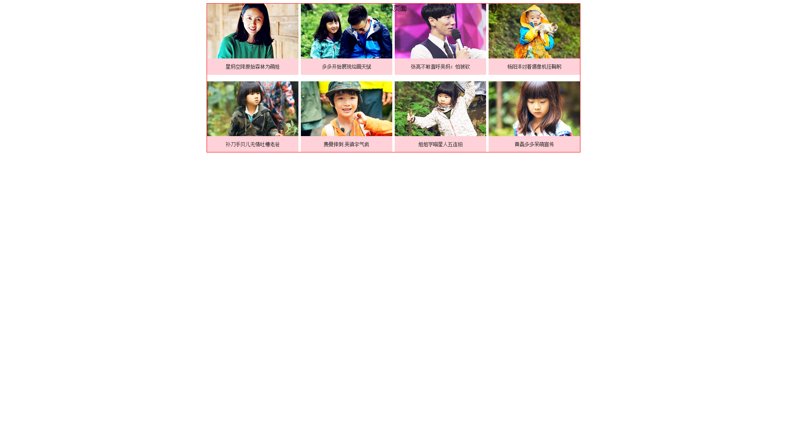
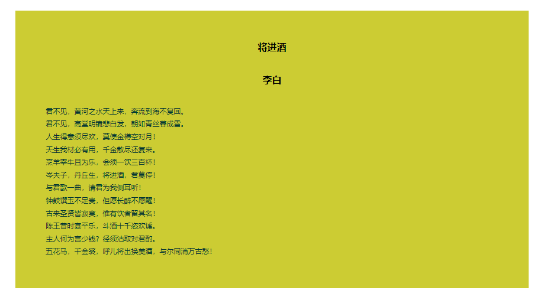
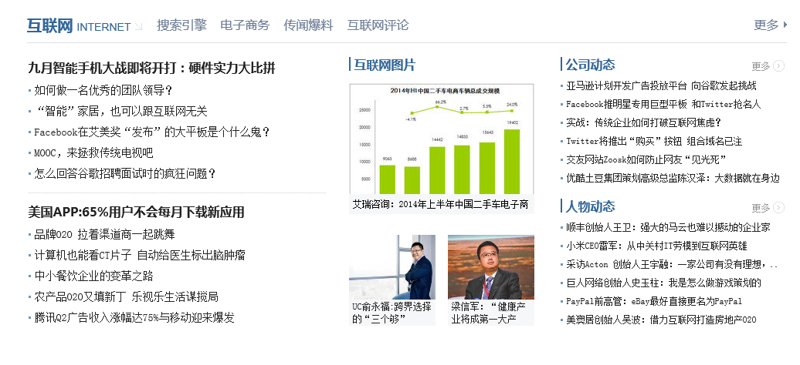

[toc]

元素的外部空隙被称为盒模型的边界，也就是元素与元素之间的间距。

### 1. 定义边界

设置边界可以使用 margin 属性，例如：

```css
margin: 2px;	/* 定义元素四边边界为 2px */
margin: 2px 4px;	/* 定义上下边界为 2px，左右边界为 4px */
margin: 2px 4px 6px;	/* 定义上边界为 2px，左右边界为 4px， 下边界为 6px */
margin: 2px 4px 6px 8px;	/* 定义上边界为 2px，右边界为 4px，下边界为 6px，左边界为 8px */
```

也可以使用 margin-top、margin-right、margin-bottom、margin-left 属性独立设置上、右、下和左边界的大小，例如：

```css
margin-top: 2px;	/* 定义元素上边界为 2px */
margin-right: 2em;	/* 定义右边界为元素字体的 2 倍 */
margin-bottom: 2%; /* 定义下边界为父元素宽度的 2% */
margin-left: auto;	/* 定义左边界为自动 */
```

margin 可以使用任何长度单位，如像素、磅、英寸、厘米、em、百分比等。margin 默认值为 0，如果没有定义 margin 的值，则意味着元素没有边界。

### 2. 边界的应用

#### 2.1 网页居中

`auto` 是一个自动计算的值，该值一般为 0，也可以为其他值，这主要由具体浏览器来确定。

```html
<!doctype html>
<html>
<head>
<meta charset="utf-8">
<title></title>
<style type="text/css">
body {
    text-align:center;/*在IE浏览器下实现居中显示*/
}
div#page {
    margin:5px auto; /*在非IE浏览器下实现居中显示*/
    width:910px;
    height:363px;
    background-image:url(images/1.png);
    border:solid red 1px;
}
</style>
</head>
<body>
<div id="page">模拟页面</div>
</body>
</html>
```

运行效果如下：



#### 2.2 设计弹性页面

边界可以设置为百分比，百分比的取值是根据父元素宽度来计算的。使用百分比能够使页面自适应窗口大小，并能够及时调整边界宽度。从这点考虑，选用百分比具有更大灵活性和更多使用技巧。但是，如果父元素的宽度发生变化，则边界宽度也会随之变化，整个版面可能会混乱，因此在综合布局时要慎重选择。不过在结构单纯、内容单一的布局中，适当使用百分比会使页面更具人性化和多变效果。

```html
<!doctype html>
<html>
<head>
<meta charset="utf-8">
<title></title>
<style type="text/css">
#box {/*定义文本框属性*/
    margin:2%;/*边界为body宽度的2%*/
    padding:2%;/*补白为body宽度的2%*/
    background:#CCCC33;
}
#box #content {/* 定义文本框内文本段的属性 */
    margin:4%;/* 边界为文本框宽度的4% */
    line-height:1.8em; /* 定义行高为字体高度的18倍 */
    font-size:12px; /* 定义字体大小 */
    color:#003333; /* 定义字体颜色 */
}
#box .center {/* 居中加粗文本 */
    margin:4%;/* 边界为文本框宽度的4% */
    text-align:center; /* 文本居中显示 */
    font-weight:bold; /* 定义标题为粗体 */
}

</style>
</head>
<body>
<div id="box">
    <p class="center">将进酒</p>
    <p class="center">李白</p>
    <p id="content"> 君不见，黄河之水天上来，奔流到海不复回。<br />
        君不见，高堂明镜悲白发，朝如青丝暮成雪。<br />
        人生得意须尽欢，莫使金樽空对月！<br />
        天生我材必有用，千金散尽还复来。<br />
        烹羊宰牛且为乐，会须一饮三百杯！<br />
        岑夫子，丹丘生，将进酒，君莫停！<br />
        与君歌一曲，请君为我侧耳听！<br />
        钟鼓馔玉不足贵，但愿长醉不愿醒！<br />
        古来圣贤皆寂寞，惟有饮者留其名！<br />
        陈王昔时宴平乐，斗酒十千恣欢谑。<br />
        主人何为言少钱？径须沽取对君酌。<br />
        五花马，千金裘，呼儿将出换美酒，与尔同消万古愁！ </p>
</div>
</body>
</html>
```

运行效果如下：



#### 2.3 调整栏目显示顺序

边界可以取负值，负值边界会给设计带来更多创意，在网页布局中经常应用该技巧。

```html
<!doctype html>
<html>
<head>
<meta charset="utf-8">
<title></title>
<style type="text/css">
#wrap {
    width: 997px;
    margin: 12px auto;
}
#box1, #box2 {/* 设置左右模块共同属性 */
    float: left; /* 向左浮动 */
    height: 376px; /* 固定高度 */
    background-position: center center;
    background-repeat: no-repeat;
}
#box1 {/* 定义左侧模块 */
    width: 408px; /* 固定宽度 */
    background-image: url(images/22.png);
}
#box2 {/* 定义右侧模块*/
    width: 589px; /* 固定宽度 */
    background-image: url(images/23.png);
}
</style>
</head>
<body>
<div id="wrap">
    <div id="top"></div>
    <div id="box1"></div>
    <div id="box2"></div>
</div>
</body>
</html>
```

运行效果如下：

