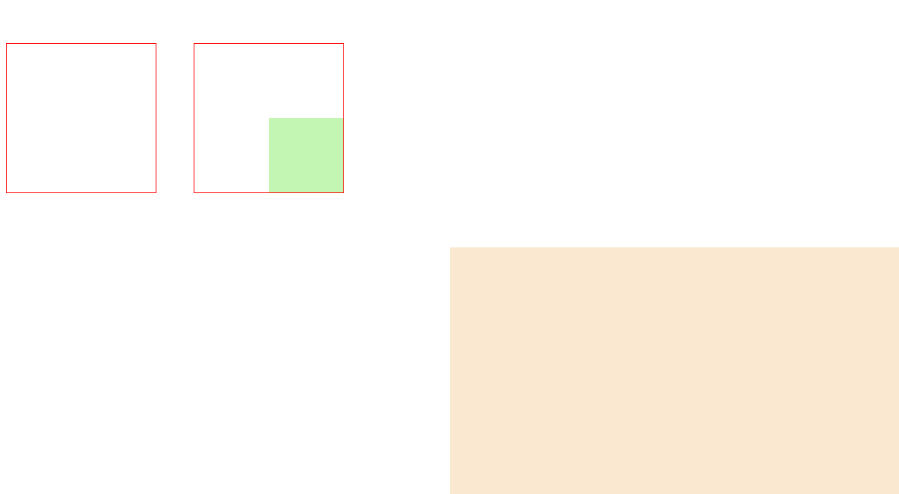

[toc]

定位布局的设计思路比较简单，它允许用户精确定义网页元素的显示位置，可以是绝对位置，也可以是相对位置，这里的相对可以是相对元素原来显示的位置，也可以是相对最近的定位包含框元素，或者相对浏览器窗口。

### 1. 定义定位显示

#### 1.1 语法

在 CSS 中可以通过 `position` 属性定义元素定位显示，其语法如下：

```css
position: static | relative | absolute | fixed
```

取值说明如下：

+ `static`：表示不定位，元素遵循 HTML 默认的流动模型，如果未显式声明元素的定位类型，则默认为该值。
+ `relative`：表示相对定位，它通过 `left`、`right`、`top`、`bottom` 属性确定元素在正常文档流中偏移位置。相对定位完成的过程是首先按 `static` 方式生成一个元素，然后移动这个元素移动方向和幅度由 `left`、`right`、`top`、`bottom` 属性确定，元素的形状和偏移前的位置保留不动。
+ `absolute`：表示绝对定位，将元素从文档流中拖出来，然后使用 `left`、`right`、`top`、`bottom` 属性相对于其最接近的一个具有定位属性的父定位包含框进行绝对定位。如果不存在这样的定位包含框，则相对于浏览器窗口，而其层叠顺序则通过 `z-index` 属性类定义。
+ `fixed`：表示固定定位，与 `absolute` 定位类型类似，但它的定位包含框是视图本身，由于视图本身是固定的，它不会随浏览器窗口的滚动条滚动而变化，除非在屏幕中移动浏览器窗口的屏幕位置或改变浏览器窗口的显示大小，因此固定定位的元素会始终位于浏览器窗口内视图的某个位置，不会受文档流动影响，这与 `background-attachment: fixed;` 属性功能相同。

与浮动元素一样，绝对定位元素以块状显示，它会为所有子元素建立一个定位框，所有被包含元素都以定位包含框作为参照物进行定位，或在其内部浮动和流动。

#### 1.2 示例代码

```html
<!DOCTYPE html>
<html>
    <head>
        <title>定位布局</title>
        <style type="text/css">
            #contain1, #contain2, #contain3 {
                /* 定义 3 个一级 div 元素对象的共同属性 */
                width: 380px;
                height: 120px;
                border: solid 1px #666;
            }
            #contain2 {
                /* 定义第 2 个一级 div 元素对象为绝对定位，并设置其距离窗口左边和上边的距离 */
                position: absolute;
                left: 120px;
                top: 60px;
                background: #F08080;
            }
            #contain3 {
                /* 定义第 3 个一级 div 元素对象为浮动布局 */
                float: left;
                background: #D2B48C;
            }
            #contain2 div {
                /* 定义绝对定位对象内所有子元素对象的共同属性 */
                color: #993399;
                border: solid 1px #FF0000;
            }
            #sub_div1 {
                /* 定义绝对定位包含框内第 1 个对象为绝对定位 */
                width: 80px;
                height: 80px;
                position: absolute;
                right: 10px;	/* 定义该绝对元素右边距离父级定位包含框的右边距离 */
                bottom: 10px;	/* 定义该绝对元素底边距离父级定位包含框的底边距离 */
                background: #FEF68F;
            }
            #sub_div2 {
                /* 定义绝对定位包含框内第 2 哥元素为浮动布局 */
                width: 80px;
                height: 80px;
                float: left;
                background: #DDA0DD;
            }
            #sub_div3 {
                /* 定义绝对定位包含框内第 3 个元素的背景色、宽和高 */
                width: 100px;
                height: 90px;
                background: #CCFF66;
            }
        </style>
    </head>
    <body>
        <div id="contain1">
            元素一流动
        </div>
        <div id="contain2">
            <div id="sub_div1">
                子元素 1 - 绝对定位
            </div>
            <div id="sub_div2">
                子元素 2 - 浮动
            </div>
            <div id="sub_div3">
                子元素 3 - 流动
            </div>
        </div>
        <div id="contain3">
            元素三 - 浮动
        </div>
    </body>
</html>
```

### 2. 相对定位

与绝对定位不同的是，相对定位元素的偏移量是根据它在正常文档流里的原始位置计算的，而绝对定位元素的偏移量是根据定位包含的位置计算的。一个绝对定位元素的位置取决于它的偏移量：`top`、`right`、`bottom` 和 `left` 属性值，相对定位元素的偏移量与绝对定位一样。

> 提示：相对定位元素遵循的是流动布局模型，存在于正常的文档流中，但是它的位置可以根据原位置进行偏移。由于相对定位元素占有自己的空间，即原始位置保留不变，因此它不会挤占其他元素的位置，但可以覆盖在其他元素之上进行显示。与相对定位元素不同，绝对定位元素完全被拖离正常文档流中原来的空间，且原来空间将不再被保留，而被相邻元素挤占。把绝对定位元素设置在可视区域之外导致浏览器窗口的滚动条出现。而设置相对定位元素在可视区域之外，滚动条不会出现。

#### 2.1 示例代码

```html
<!DOCTYPE html>
<html>
    <head>
        <title>相对定位</title>
        <style type="text/css">
            p {
                margin: 60px;
                font-size: 14px;
            }
            p span {
                position: relative;
            }
            p strong {
                /* 相对定位 */
                position: relative;
                left: 40px;
                top: -40px;
                font-size: 18px;
            }
        </style>
    </head>
    <body>
        <p>
            <span><strong>虞美人</strong>南唐\宋 李煜</span><br/>春花秋月何时了？<br/>往事知多少。<br/>小楼昨夜又东风，<br/>故国不堪回首月明中。<br/>雕栏玉砌应犹在，<br/>只是朱颜改。<br/>问君能有几多愁？<br/>恰似一江春水向东流。</p>
        </p>
    </body>
</html>
```

### 3. 定位框

定位包含框就是为绝对定位元素提供坐标偏移和显示范围的参照物，即确定绝对定位的偏移起点和百分比长度的参考。在默认状态下，`body` 元素就是一个根定位包含框，所有绝对定位的元素就是根据窗口来确定自己所处的位置和百分比大小显示的。但是如果定义了包含元素为定位包含框，对于被包含的绝对定位元素来说，就会根据最接近的具有定位功能的上级包含元素来决定自己的显示位置。

#### 3.1 示例代码

```html
<!DOCTYPE html>
<html>
    <head>
        <title>定位框</title>
        <style type="text/css">
            #a, #b {
                /* 定义包含元素的共同属性 */
                width: 200px;
                height: 200px;
                float: left;
                margin-top: 50px;	/* 拉开与窗口顶部的距离 */
                border: solid 1px red;	/* 定义红色边框线，便于识别 */
            }
            #b {
                /* 定义包含元素 b 为相对定位，确定它为定位包含框 */
                position: relative;
                margin-left: 50px;	/* 拉开与 b 包含元素的距离 */
            }
            #c, #d {
                /* 定义被包含元素为绝对定位，并进行偏移 */
                width: 50%;
                height: 50%;
                position: absolute;
                left: 50%;	/* 与定位包含框左侧边框距离为 50% */
                top: 50%;	/* 与定位包含框顶部边框距离为 50% */
            }
        </style>
    </head>
    <body>
        <div id="a">
            <div id="c"></div>
        </div>
        <div id="b">
            <div id="d"></div>
        </div>
    </body>
</html>
```

运行效果如下：



在上图中，被 a 包含元素包含的 c 子元素，以窗口 `body` 元素的左上点为坐标原点进行绝对定位偏移，百分比大小取值也根据窗口的大小来确定，即为窗口宽度和高度的一半。

而 b 包含元素被定义为相对定位，它就成了一个定位包含框，因此，被它包含的 d 元素就会以 b 元素的左上角为坐标原点进行绝对定位偏移，其百分比大小取值也会根据 b 元素的大小来确定，而不是以窗口为参照物。

一般情况下可以用 `position` 属性来定义任意定位包含框，`position` 属性有效取值包括 `absolute`、`fixed`、`relative`。
