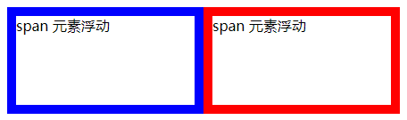

[toc]

浮动布局不同于流动模式，元素能够脱离左右相邻元素，在包含框内向左或右侧浮动显示，但是浮动元素不能脱离文档流，依然受文档流的影响。

### 1. 定义浮动显示

在默认情况下任何元素不具有浮动特性，可以使用 CSS 的 `float` 属性定义元素向左或向右浮动，基本用法如下：

```css
float: none | left | right
```


其中 `none` 表示消除浮动，`left1` 表示元素向左浮动，`right` 表示元素向右浮动，默认值为 `none`。

下面介绍浮动布局模型的几个特征：

第一，浮动元素以块状显示，可以定义 `width` 和 `height` 属性。浮动元素应该明确定义大小。如果浮动元素没有定义宽度和高度，它会自动收缩到仅能包住内容为止。

```html
<!DOCTYPE html>
<html>
    <head>
        <title>浮动布局</title>
        <style text="text/css">
            span {
                /* 定义行内元素 span 的显示属性 */
                width: 400px;	/* 定义宽为 400px */
                height: 200px;	/* 定义高为 200px */
                border: solid red 1px;
            }
            #inline img {
                /* 定义行内元素内的图片宽为 100px */
                width: 100px;
            }
            #float {
                /* 为第 2 个行内元素 span 定义浮动显示 */
                float: right;
            }
        </style>
    </head>
    <body>
        <span id="inline">行内元素流动显示
        	
        </span>
        <span id="float">行内元素浮动显示</span>
    </body>
</html>
```

第二，浮动元素与流动元素可以混合使用，不会重叠，都遵循先上后下显示规则，都受到文档流影响。但浮动元素能够改变相邻元素的显示位置，可以向左或向右并列显示。

与普通元素一样，浮动元素始终位于包含元素内，不会脱离包含框，这与定位元素不同。

第三，浮动元素仅能改变水平显示方式，不能改变垂直显示方式，依然受文档流影响。流动元素总会以流动的形式环绕浮动元素左右显示。

浮动元素不会强迫前面的流动元素环绕其周围流动，而总是在上邻流动元素的下一行浮动显示。浮动元素不会覆盖其他元素，也不会挤占其他元素的位置。

第四，浮动元素可以并列显示，如果包含框宽度不够，则会错行显示。

**通过 `float` 定义左、中、右 3 栏并列显示**

```html
<!DOCTYPE html>
<html>
    <head>
        <title>左中右三栏并列显示</title>
        <style type="text/css">
            #main {
                /* 定义网页包含框样式 */
                width: 400px;
                margin: auto;
                padding: 4px;
                line-height: 160px;
                color: #fff;
                font-size: 20px;
                border: solid 2px red;
            }
            #main div {
                /* 定义 3 个并列栏目向左浮动显示 */
                float: left;
                height: 160px;
            }
            #left {
                /* 定义左侧栏目样式 */
                width: 100px;
                background: red;
            }
            #middle {
                /* 定义中间栏目样式 */
                width: 200px;
                background: blue;
            }
            #right {
                /* 定义右侧栏目样式 */
                width: 100px;
                background: green;
            }
            .clear {
                clear: both;
            }
        </style>
    </head>
    <body>
        <div id="main">
            <div id="left">
                左侧栏目
            </div>
            <div id="middle">
                中间栏目
            </div>
            <div id="right">
                右侧栏目
            </div>
            <br class="clear" />
        </div>
    </body>
</html>
```

### 2. 清除浮动

使用 CSS 的 `clear` 属性可以清除浮动，定义与浮动相邻的元素在必要的情况下换行显示，这样可以控制浮动元素挤在一行内显示。`clear` 属性取值包括 4 个：

+ `left`：清除左边的浮动元素，如果左边存在浮动元素，则当前元素会换行显示。
+ `right`：清除右边的浮动元素，如果右边存在浮动元素，则当前元素会换行显示。
+ `both`：清除左右两边浮动元素，不管哪边存在浮动对象，则当前元素都会换行显示。
+ `none`：默认值，允许两边都可以在浮动元素，当前元素不会主动换行显示。

> 提示：`clear` 属性是专门针对 `float` 属性而设计的，因此，仅能够对左右两侧浮动元素有效，对于非浮动元素是无效的。
>
> 清除不是清除浮动元素，而是清除自身，也即不允许当前与浮动元素并列显示。如果左右两侧存在浮动元素，则当前元素把自己清除到下一行显示，而不是把前面的浮动元素清除到下一行或者上一行显示。

#### 2.1 示例代码

```html
<!DOCTYPE html>
<html>
    <head>
        <title>清除浮动</title>
        <style type="text/css">
            div {
                border: solid 1px red;	/* 增加边框，以方便观察 */
                height: 50px;
            }
            #left, #middle, #right {
                float: left;	/* 定义中间 3 栏向左浮动 */
                width: 33%;		/* 定义中间 3 栏等宽 */
            }
            #footer {
				clear: left;	/* 为脚部栏目元素定义清除属性 */
			}
        </style>
    </head>
    <body>
        <div id="header">
            头部信息
        </div>
        <div id="left">
            左栏信息
        </div>
        <div id="middle">
            中栏信息
        </div>
        <div id="right">
            右栏信息
        </div>
        <div id="footer">
            脚部信息
        </div>
    </body>
</html>
```

### 3. 浮动嵌套

浮动元素可以相互嵌套，嵌套规律与流动元素嵌套相同。浮动的包含元素总会自动调整自身高度和宽度以实现对浮动子元素的包含。

> 提示：如果包含元素定义了高度和宽度，则它就不会随子元素的大小而自动调整自身显示区域来适应子元素的显示。

#### 3.1 示例代码

```html
<!DOCTYPE html>
<html>
    <head>
        <title>浮动嵌套</title>
        <style type="text/css">
            .wrap {
                border: solid 2px red;
                float: left;
                margin: 4px;
            }
            .sub {
                width: 200px;
                height: 200px;
                float: left;
                background: blue;
            }
        </style>
    </head>
    <body>
        <div class="wrap">
            <div class="sub">
                
            </div>
        </div>
        <span class="wrap">
        	<span class="sub"></span>
        </span>
    </body>
</html>
```

如果把浮动元素嵌入流动元素之内，则父元素不能够自适应子浮动元素的高度。

```html
<!DOCTYPE html>
<html>
    <head>
        <title>浮动嵌套</title>
        <style type="text/css">
            #contain {
                /* 包含元素 */
                background: #FF99FF;
            }
            span {
                /* 定义共同属性 */
                float: left;
                width: 200px;
                height: 100px;
            }
            /* 内嵌浮动对象样式 */
            #span1 {
                border: solid blue 10px;
            }
            #span2 {
                border: solid red 10px;
            }
        </style>
    </head>
    <body>
        <div id="contain">
            <span id="span1">span 元素浮动</span>
            <span id="span2">span 元素浮动</span>
        </div>
    </body>
</html>
```

运行效果如下：



从运行效果可以看到包含元素 `div` 并没有显示。原因就是包含元素没有适应子元素的高度，而是根据自身定义的属性以独立的形式显示。所以，在应用混合嵌套时，要预测到浮动与流动混合布局时会出现的各种现象，并积极做好兼容处理。

解决方法：可以在包含元素内的最后一行添加一个清除元素，强制撑开包含元素，使其包含浮动元素：

```html
<!DOCTYPE html>
<html>
    <head>
        <title>浮动嵌套</title>
        <style type="text/css">
            #contain {
                /* 包含元素 */
                background: #FF99FF;
            }
            span {
                /* 定义共同属性 */
                float: left;
                width: 200px;
                height: 100px;
            }
            /* 内嵌浮动对象样式 */
            #span1 {
                border: solid blue 10px;
            }
            #span2 {
                border: solid red 10px;
            }
            .clear {
             	clear: both;   
            }
        </style>
    </head>
    <body>
        <div id="contain">
            <span id="span1">span 元素浮动</span>
            <span id="span2">span 元素浮动</span>
            <div class="clear"></div><!-- 增加一个清除元素 -->
        </div>
    </body>
</html>
```

