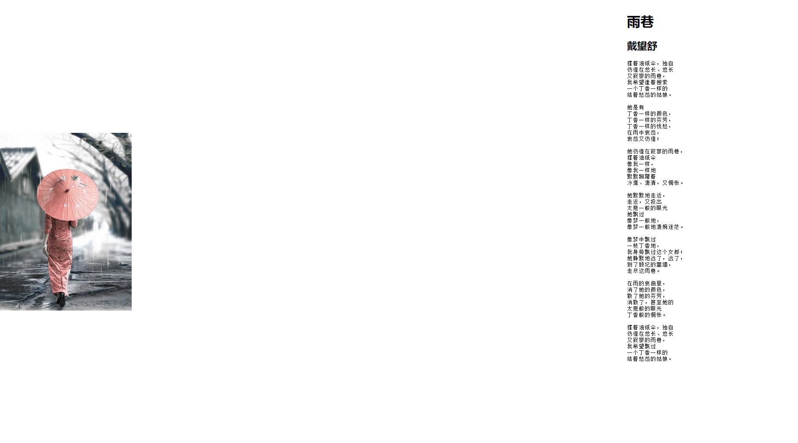

在默认情况下，背景图像能够跟随网页内容上下滚动。可以使用 `background-attachment` 属性定义背景图像在窗口内固定显示，具体用法如下：

```xml
background-attachment: fixed | local | scroll
```

默认值为scroll，具体取值说明如下：

+ `fixed`：背景图像相对于浏览器窗体固定。　

+ `scroll`：背景图像相对于元素固定，也就是说当元素内容滚动时背景图像不会跟着滚动，因为背景图像总是要跟着元素本身。

+ `local`：背景图像相对于元素内容固定，也就是说当元素内容滚动时背景图像也会跟着滚动，此时不管元素本身是否滚动，当元素显示滚动条时才会看到效果。该属性值仅 CSS3 支持。

```html
<!doctype html>
<html>
    <head>
        <meta charset="utf-8">
        <title>固定背景图片</title>
        <style type="text/css">
            body {
                background-image: url(images/bg.jpg);	/* 设置背景图片 */
                background-repeat: no-repeat;	/* 背景图片不平铺 */
                background-position: left center;	/* 背景图片的位置 */
                background-attachment: fixed;	/* 背景图片固定，不随滚动条滚动而滚动 */
                height: 1200px;	/* 高度，出现浏览器的滚动条 */
            }
            #box { 
                float:right;
                width:400px;
            }
        </style>
    </head>
    <body>
        <div id="box">
            <h1> 雨巷</h1>
            <h2>戴望舒</h2>
            <pre>
        撑着油纸伞，独自
        彷徨在悠长、悠长
        又寂寥的雨巷，
        我希望逢着搜索
        一个丁香一样的
        结着愁怨的姑娘。

        她是有
        丁香一样的颜色，
        丁香一样的芬芳，
        丁香一样的忧愁，
        在雨中哀怨，
        哀怨又彷徨；

        她彷徨在寂寥的雨巷，
        撑着油纸伞
        像我一样，
        像我一样地
        默默踟躇着
        冷漠、凄清，又惆怅。

        她默默地走近，
        走近，又投出
        太息一般的眼光
        她飘过
        像梦一般地，
        像梦一般地凄婉迷茫。

        像梦中飘过
        一枝丁香地，
        我身旁飘过这个女郎；
        她静默地远了，远了，
        到了颓圮的篱墙，
        走尽这雨巷。

        在雨的哀曲里，
        消了她的颜色，
        散了她的芬芳，
        消散了，甚至她的
        太息般的眼光
        丁香般的惆怅。

        撑着油纸伞，独自
        彷徨在悠长、悠长
        又寂寥的雨巷，
        我希望飘过
        一个丁香一样的
        结着愁怨的姑娘。    
            </pre>
        </div>
    </body>
</html>
```

运行效果如下：

