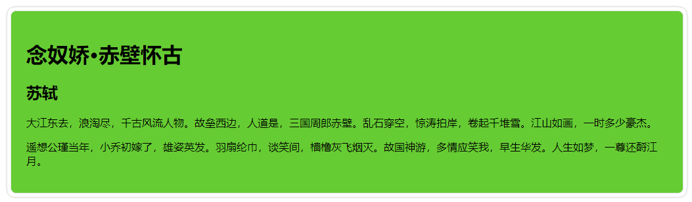

CSS3 支持在同一个元素内定义多个背景图像，还可以将多个背景图像进行叠加显示，从而使得设计多图背景栏目变得更加容易。

```html
<!DOCTYPE HTML>
<html lang="en-US">
    <head>
        <meta charset="UTF-8">
        <title></title>
        <style type="text/css">
        .demo {
            width: 400px;
            border: 20px solid rgba(104, 104, 142,0.5);
            border-radius: 10px;
            padding: 30px 30px;
            color: #f36;
            font-size: 80px;
            font-family:"隶书";
            line-height: 1.5;
            text-align: center;
        }
        .multipleBg {
            background: url("images/bg-tl.png") no-repeat left top, url("images/bg-tr.png") no-repeat right top, url("images/bg-bl.png") no-repeat left bottom, url("images/bg-br.png") no-repeat right bottom, url("images/bg-repeat.png") repeat left top;
            /*改变背景图片的position起始点，四朵花都是border边缘处起，而平铺背景是在paddin内边缘起*/
            -webkit-background-origin: border-box, border-box, border-box, border-box, padding-box;
            -moz-background-origin: border-box, border-box, border-box, border-box, padding-box;
            -o-background-origin: border-box, border-box, border-box, border-box, padding-box;
            background-origin: border-box, border-box, border-box, border-box, padding-box;
            /*控制背景图片的显示区域，所有背景图片超边border外边缘都将被剪切掉*/
            -moz-background-clip: border-box;
            -webkit-background-clip: border-box;
            -o-background-clip: border-box;
            background-clip: border-box;
        }
        </style>
    </head>
    <body>
    	<div class="demo multipleBg">恭喜发财</div>
    </body>
</html> 
```

运行效果如下：


利用 CSS3 多背景图功能设计圆角栏目：

> 注意：每幅背景图像的源、定位坐标以及平铺方式的先后顺序要一一对应。

```html
<!doctype html>
<html>
    <head>
        <meta charset="utf-8">
        <title></title>
        <style type="text/css" media="screen">
            .roundbox {
                padding: 2em;
                background-image: url(images/roundbox/tl.gif),  
                                url(images/roundbox/tr.gif),  
                                url(images/roundbox/bl.gif),  
                                url(images/roundbox/br.gif),  
                                url(images/roundbox/right.gif),  
                                url(images/roundbox/left.gif),  
                                url(images/roundbox/top.gif),  
                                url(images/roundbox/bottom.gif);
                background-repeat: no-repeat,  
                                no-repeat,  
                                no-repeat,  
                                no-repeat,  
                                repeat-y,  
                                repeat-y,  
                                repeat-x,  
                                repeat-x;
                background-position: left 0px,  
                                  right 0px,  
                                  left bottom,  
                                  right bottom,  
                                  right 0px,  
                                  0px 0px,  
                                  left 0px,  
                                  left bottom;
                background-color: #66CC33;
            }
        </style>
    </head>
    <body>
        <div class="roundbox">
            <h1>念奴娇&#8226;赤壁怀古</h1>
            <h2>苏轼</h2>
            <p>大江东去，浪淘尽，千古风流人物。故垒西边，人道是，三国周郎赤壁。乱石穿空，惊涛拍岸，卷起千堆雪。江山如画，一时多少豪杰。</p>
            <p>遥想公瑾当年，小乔初嫁了，雄姿英发。羽扇纶巾，谈笑间，樯橹灰飞烟灭。故国神游，多情应笑我，早生华发。人生如梦，一尊还酹江月。</p>
        </div>
    </body>
</html>
```

运行效果如下：


