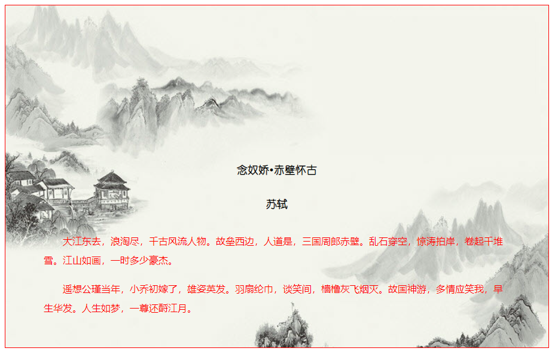

`background-origin` 属性定义 `background-position` 属性的定位原点。在默认情况下，`background-position` 属性总是以元素左上角为坐标原点定位背景图像，使用 `background-origin` 属性可以改变这种定位方式。该属性的基本语法如下：

```xml
background-origin: border-box | padding-box | content-box;
```

取值简单说明如下：

+ `border-box`：从边框区域开始显示背景。

+ `padding-box`：从补白区域开始显示背景，为默认值。

+ `content-box`：仅在内容区域显示背景。

```html
<!doctype html>
<html>
    <head>
        <meta charset="utf-8">
        <title></title>
        <style type="text/css">
            div {
                height: 322px;
                width: 780px;
                border: solid 1px red;
                padding: 250px 4em 0;
                background: url(images/bg.jpg) no-repeat;
                -moz-background-origin: border-box;
                -webkit-background-origin: border-box;
                background-origin: border-box;
                -moz-background-size: cover;
                -webkit-background-size: cover;
                background-size: cover;
                overflow: hidden;
            }
            div h1, div h2 {
                font-size: 18px;
                font-family: "幼圆";
                text-align: center;
                margin-bottom:2em;
            }
            div p {
                text-indent: 2em;
                line-height: 2em;
                color:red;
                margin-bottom: 1em;
            }
        </style>
    </head>
    <body>
        <div>
            <h1>念奴娇&#8226;赤壁怀古</h1>
            <h2>苏轼</h2>
            <p>大江东去，浪淘尽，千古风流人物。故垒西边，人道是，三国周郎赤壁。乱石穿空，惊涛拍岸，卷起千堆雪。江山如画，一时多少豪杰。</p>
            <p>遥想公瑾当年，小乔初嫁了，雄姿英发。羽扇纶巾，谈笑间，樯橹灰飞烟灭。故国神游，多情应笑我，早生华发。人生如梦，一尊还酹江月。</p>
        </div>
    </body>
</html>
```

运行效果如下：

