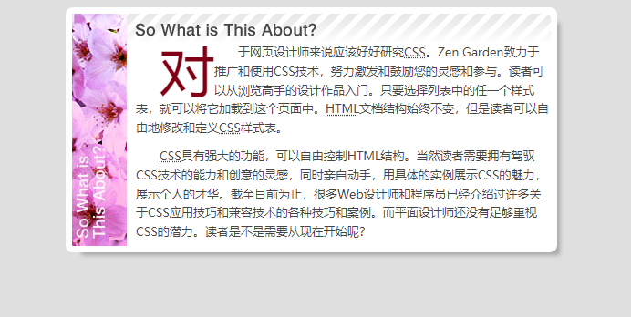
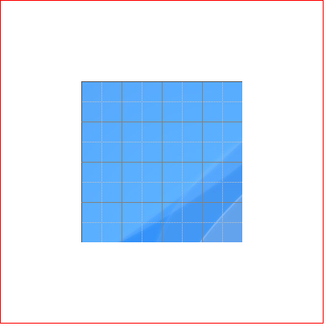

在默认情况下，背景图像显示在元素的左上角，并根据不同方式执行不同显示效果。为了更好地控制背景图像的显示位置，CSS 定义了 `background-position` 属性来精确定位背景图像。

`background-position` 属性取值包括两个值，分别用来定位背景图像的 x 轴、y 轴坐标，取值单位没有限制。具体用法如下：

```xml
background-position: [left | center | right | top | bottom | <percentage> | <length>] | [left | center | right | <percentage> | <length>] [top | center | bottom | <percentage> | <length>] | [center | [left | right][<percentage> | <length>]?] && [center | [top | bottom][<percentage> | <length>]?] 
```

默认值为 `0% 0%`，等效于 `left top`。

```html
<!doctype html>
<html>
    <head> 
        <meta charset="utf-8">
        <title></title>
        <style type="text/css" media="all">
            body {
                background:#DFDFDF;
                text-align:center;
                color:#454545;
            }
            p, h3 {
                margin:0;
                padding:0;
            }
            #explanation {
                background-color:#ffffff;
                background-repeat:repeat-y;
                background-image:url(images/img_explanation.jpg);
                background-position:left bottom;
                width:546px;
                margin:0 auto;
                font-size:13px;
                line-height:1.6em;
                text-indent:2em;
            }
            #explanation h3 {
                background:url(images/title_explanation.gif) no-repeat;
                height:39px;
            }
            #explanation h3 span {
                display:none;
            }
            #explanation p {
                background:url(images/right_bg.gif) right repeat-y;
            }
            #explanation .p2 span {
                padding-bottom:20px;
                background:url(images/right_bottom.gif) bottom no-repeat;
            }
            #explanation p span {
                padding:0 15px 10px 77px;
                display:block;
                text-align:left;
            }
            #explanation p .first {
                font-size:60px;
                float:left;
                line-height:1em;
                padding:0;
                color:#820015;
            }
        </style>
    </head>
    <body>
        <div id="explanation">
            <h3><span>这是什么？</span></h3>
            <p class="p1"><span><span class="first">对</span>于网页设计师来说应该好好研究<acronym 
        title="cascading style sheets">CSS</acronym>。Zen Garden致力于推广和使用CSS技术，努力激发和鼓励您的灵感和参与。读者可以从浏览高手的设计作品入门。只要选择列表中的任一个样式表，就可以将它加载到这个页面中。<acronym 
        title="hypertext markup language">HTML</acronym>文档结构始终不变，但是读者可以自由地修改和定义<acronym 
        title="cascading style sheets">CSS</acronym>样式表。</span></p>
            <p class="p2"><span><acronym 
        title="cascading style sheets">CSS</acronym>具有强大的功能，可以自由控制HTML结构。当然读者需要拥有驾驭CSS技术的能力和创意的灵感，同时亲自动手，用具体的实例展示CSS的魅力，展示个人的才华。截至目前为止，很多Web设计师和程序员已经介绍过许多关于CSS应用技巧和兼容技术的各种技巧和案例。而平面设计师还没有足够重视CSS的潜力。读者是不是需要从现在开始呢？</span></p>
        </div>
    </body>
</html>
```

运行效果如下：



使用百分比进行定位：

```html
<!doctype html>
<html>
    <head> 
        <meta charset="utf-8">
        <title>背景图像定位试验演示</title>
        <style>
            body {/* 清除页边距 */
                margin: 0; 									/* 边界为0 */
                padding: 0; 									/* 补白为0 */
            }
            div {/* 盒子的样式 */
                background-image: url(images/grid.gif); 				/* 背景图像 */
                background-repeat: no-repeat; 						/* 禁止背景图像平铺 */
                width: 400px; 									/* 盒子宽度 */
                height: 400px; 									/* 盒子高度 */
                border: solid 1px red; 							/* 盒子边框 */
            }
            #box {/* 定位背景图像的位置 */
                background-position:50% 50%;
            }
        </style>
    </head>
    <body>
    	<div id="box"></div>
    </body>
</html>
```

运行效果如下：



> 注意：百分比是最灵活的定位方式，同时也是最难把握的定位单位。
>
> 在默认状态下，定位的位置为（0% 0%），定位点是背景图像的左上顶点，定位距离是该点到包含框左上角顶点的距离，即两点重合。
>
> 如果定位背景图像位置为（100% 100%），则定位点是背景图像的右下顶点，定位距离是该点到包含框左上角顶点的距离，这个距离等于包含框的宽度和高度。
> 百分比也可以取负值，负值的定位点是包含框的左上顶点，而定位距离则由图像自身的宽和高来决定。
