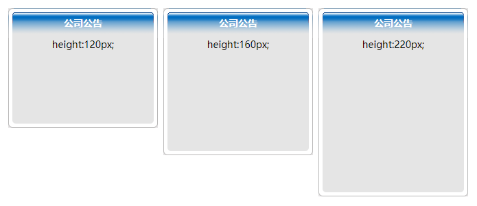

CSS 使用 `background-repeat` 属性控制背景图像的显示方式。具体用法如下：

```xml
background-repeat: repeat-x | repeat-y | [repeat | space | round | no-repeat]{1,2}
```

取值说明如下：

+ `repeat-x`：背景图像在横向上平铺。

+ `repeat-y`：背景图像在纵向上平铺。

+ `repeat`：背景图像在横向和纵向平铺。

+ `space`：背景图像以相同的间距平铺且填充满整个容器或某个方向，仅 CSS3 支持。

+ `round`：背景图像自动缩放直到适应且填充满整个容器，仅 CSS3 支持。

+ `no-repeat`：背景图像不平铺。

```html
<!doctype html>
<html>
    <head> 
        <meta charset="utf-8">
        <title></title>
        <style type="text/css">
            #call {
                width: 218px;
                font-size: 14px;
                float: left;
                margin: 4px;
                text-align: center;
            }
            #call_tit {
                background: url(images/call_top.gif);
                background-repeat: no-repeat;
                height: 43px;
                color: #fff;
                font-weight: bold;
                line-height: 43px;
            }
            #call_mid {
                background-image: url(images/call_mid.gif);
                background-repeat: repeat-y;
                height: 160px;
            }
            #call_btm {
                background-image: url(images/call_btm.gif);
                background-repeat: no-repeat;
                height: 11px;
            }
            #call .a { height: 120px; }
            #call .b { height: 160px; }
            #call .c { height: 220px; }
        </style>
    </head>
    <body>
        <div id="call">
            <div id="call_tit">公司公告</div >
            <div id="call_mid" class="a">height:120px;</div >
            <div id="call_btm"></div >
        </div>
        <div id="call">
            <div id="call_tit">公司公告</div >
            <div id="call_mid" class="b">height:160px;</div >
            <div id="call_btm"></div >
        </div>
        <div id="call">
            <div id="call_tit">公司公告</div >
            <div id="call_mid" class="c">height:220px;</div >
            <div id="call_btm"></div >
        </div>
    </body>
</html>
```

运行效果如下：

