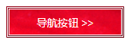

`background-clip` 属性定义背景图像的裁剪区域。该属性的基本语法如下：

```xml
background-clip:border-box | padding-box | content-box | text;
```

取值简单说明如下：

+ `border-box`：从边框区域向外裁剪背景，为默认值。

+ `padding-box`：从补白区域向外裁剪背景。

+ `content-box`：从内容区域向外裁剪背景。

+ `text`：从前景内容（如文字）区域向外裁剪背景。

> 提示：如果取值为 `padding-box`，则 `background-image` 将忽略补白边缘，此时边框区域显示为透明。
>
> 如果取值为 `border-box`，则 `background-image` 将包括边框区域。
>
> 如果取值为 `content-box`，则 `background-image` 将只包含内容区域。
>
> 如果 `background-image` 属性定义了多重背景，则 `background-clip` 属性值可以设置多个值，并用逗号分隔。
>
> 如果 `background-clip` 属性值为 `padding-box`，`background-origin` 属性值为 `border-box`，且 `background-position` 属性值为`top left`（默认初始值），则背景图左上角将会被截取掉部分。

```html
<!doctype html>
<html>
<head>
<meta charset="utf-8">
<title></title>
<style type="text/css">
button {
    height:40px;
    width:150px;
    padding:1px;
    cursor:pointer;
    color:#fff;
    border:3px double #95071b;
    border-right-color:#650513;
    border-bottom-color:#650513;
    background:url(images/img5.jpg) no-repeat;
    -moz-background-origin:content-box;
    -webkit-background-origin:content-box;
    background-origin:content-box;
    -moz-background-clip:content-box;
    -webkit-background-clip:content-box;
    background-clip:content-box;
}
</style>
</head>

<body>
<button>导航按钮 >></button>
</body>
</html> 

```

运行效果如下：

