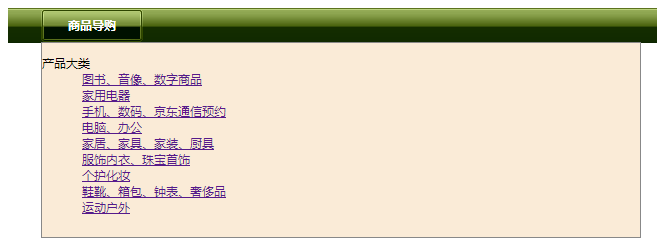

下拉式面板比较特殊，当鼠标移到菜单项目上时将自动弹出一个下拉的大面板，在该面板中显示各种分类信息。这种版式在电商类型网站中应用比较多。

设计思路：在超链接（ `<a>` 标签）内包含面板结构，当鼠标移过超链接时，自动显示这个面板，而在默认状态隐藏其显示。由于早期IE浏览器对 `<a>` 标签包含其他结构的解析存在问题，设计时应适当考虑兼容问题。

**【操作步骤】**

第1步，启动 Dreamweaver，新建网页，保存为 test.html，在 `<body>` 标签内编写如下结构，构建 HTML 文档。

```html
<ul id="lists">
    <li><a href="#" class="tl">商品导购
        <!--[if IE 7]><!--></a><!--<![endif]-->
        <!--[if lte IE 6]><table><tr><td><![endif]-->
        <div class="pos1">
            <dl id="menu">
            	<dt>产品大类</dt>
                <dd><a href="#" title="">图书、音像、数字商品</a></dd>
                <dd><a href="#" title="">家用电器</a></dd>
                <dd><a href="#" title="">手机、数码、京东通信预约</a></dd>
                <dd><a href="#" title="">电脑、办公</a></dd>
                <dd><a href="#" title="">家居、家具、家装、厨具</a></dd>
                <dd><a href="#" title="">服饰内衣、珠宝首饰</a></dd>
                <dd><a href="#" title="">个护化妆</a></dd>
                <dd><a href="#" title="">鞋靴、箱包、钟表、奢侈品</a></dd>
                <dd><a href="#" title="">运动户外</a></dd>                
            </dl>
        </div>
        <!--[if lte IE 6]></td></tr></table></a><![endif]-->
    </li>
</ul>
```

> 提示：在超链接中包含一个面板结构，为了让超链接在 IE 浏览器中能够正常响应，代码中使用 IE 条件语句。IE 条件语句是一个条件结构，用来判断当前 IE 浏览器的版本号，以便执行不同的 CSS 样式或解析不同的 HTML 结构。

第2步，在 `<head>` 标签内添加 `<style type="text/css">` 标签，定义内部样式表，准备编写样式。

第3步，编写下拉式导航面板的 CSS 样式如下：

```css
#lists { 
    background: url(images/bg1.gif) #fff;
    padding-left: 32px;
    margin: 0px;
    height:35px;
    font-size:12px;
}
#lists li {
    display:inline;
    float:left;
    height:35px;
    background:url(images/menu5.gif) no-repeat left center;
    padding-left:12px;
    position:relative;
}
#lists li a.tl {
    display:block;
    width:80px;
    height:35px;
    text-decoration:none;
    text-align:center;
    line-height:35px;
    font-weight:bold;
    color:#fff;
    background:url(images/menu5.gif) no-repeat right center;
    padding-right:12px;
}
#lists div {
    display:none;
}
#lists :hover div {
    display:block;
    width:598px;
    background:#faebd7;
    position:absolute;
    left:1px;
    top:34px;
    border:1px solid #888;
    padding-bottom:10px;
}
```

**完整代码如下：**

```html
<!doctype html>
<html>
<head>
<meta charset="utf-8">
<title>下拉式面板</title>
<style type="text/css">
#lists { 
    background: url(images/bg1.gif) #fff;
    padding-left: 32px;
    margin: 0px;
    height:35px;
    font-size:12px;
}
#lists li {
    display:inline;
    float:left;
    height:35px;
    background:url(images/menu5.gif) no-repeat left center;
    padding-left:12px;
    position:relative;
}
#lists li a.tl {
    display:block;
    width:80px;
    height:35px;
    text-decoration:none;
    text-align:center;
    line-height:35px;
    font-weight:bold;
    color:#fff;
    background:url(images/menu5.gif) no-repeat right center;
    padding-right:12px;
}
#lists div {
    display:none;
}
#lists :hover div {
    display:block;
    width:598px;
    background:#faebd7;
    position:absolute;
    left:1px;
    top:34px;
    border:1px solid #888;
    padding-bottom:10px;
}
</style>
</head>
<body>
<ul id="lists">
    <li><a href="#" class="tl">商品导购
        <!--[if IE 7]><!--></a><!--<![endif]-->
        <!--[if lte IE 6]><table><tr><td><![endif]-->
        <div class="pos1">
            <dl id="menu">
            	<dt>产品大类</dt>
                <dd><a href="#" title="">图书、音像、数字商品</a></dd>
                <dd><a href="#" title="">家用电器</a></dd>
                <dd><a href="#" title="">手机、数码、京东通信预约</a></dd>
                <dd><a href="#" title="">电脑、办公</a></dd>
                <dd><a href="#" title="">家居、家具、家装、厨具</a></dd>
                <dd><a href="#" title="">服饰内衣、珠宝首饰</a></dd>
                <dd><a href="#" title="">个护化妆</a></dd>
                <dd><a href="#" title="">鞋靴、箱包、钟表、奢侈品</a></dd>
                <dd><a href="#" title="">运动户外</a></dd>                
            </dl>
        </div>
        <!--[if lte IE 6]></td></tr></table></a><![endif]-->
    </li>
</ul>
</body>
</html>
```

**运行效果如下：**

