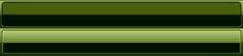

**【操作步骤】**
第1步，设计“门”。这个门实际上就是背景图，滑动门一般至少需要两幅背景图，以实现闭合成门的设计效果，本例则完全采用一幅背景图像，一样能够设计出滑动门效果，如下图所示。考虑到门能够适应不同尺寸的菜单，所以背景图像的宽度和高度应该尽量大，这样就可以保证比较大的灵活性。



<center>设计滑动门背景图</center>

第2步，设计“门轴”。至少需要两个元素配合使用才能使门自由推拉。背景图需要安装在对应的门轴之上才能够自由推拉，从而呈现滑动效果。一般在列表结构中，可以将 `<li>` 和 `<a>` 标签配合使用。

第3步，启动 Dreamweaver，新建网页，保存为 test.html，在 `<body>` 标签内编写如下列表结构，由于每个菜单项字数不尽相同，使用滑动门来设计效果会更好。

```html
<ul id="menu">
    <li><a href="#" title="">首页</a></li>
    <li><a href="#" title="">微博圈</a></li>
    <li><a href="#" title="">移动开发</a></li>
    <li><a href="#" title="">编程与设计</a></li>
    <li><a href="#" title="">程序员与语言</a></li>
    <li><a href="#" title="">编程语言排行榜</a></li>   
</ul>
```

第4步，在 `<head>` 标签内添加 `<style type="text/css">` 标签，定义一个内部样式表，然后准备编写样式。

第5步，整理设计思路：　

+ 在下面叠放的标签（`<li>`）中定义如下图所示的背景图，并定位左对齐，使其左侧与 `<li>` 标签左侧对齐。　

+ 在上面叠放的标签（ `<a>` ）中设置相同的背景图，使其右侧与 `<a>` 标签的右侧对齐，这样两个背景图像就可以重叠在一起。

第6步，为了避免上下重叠元素的背景图相互挤压，导致菜单项两端的圆角背景图被覆盖，可以为 `<li>` 标签左侧和 `<a>` 标签右侧增加补白（padding），以此限制两个元素不能覆盖两端圆角背景图。

第7步，根据第5步和第6步的设计思路，动手编写如下CSS样式代码：

```html
<style type="text/css">
#menu {/* 定义列表样式 */
    background: url(images/bg1.gif) #fff; 			/* 定义导航菜单的背景图像 */
    padding-left: 32px; 							/* 定义左侧的补白 */
    margin: 0px; 								/* 清除边界 */
    list-style-type: none; 						/* 清除项目符号 */
    height:35px; 								/* 固定高度，否则会自动收缩为0 */
}
#menu li {/* 定义列表项样式 */
    float: left; 								/* 向左浮动 */
    margin:0 4px; 								/* 增加菜单项之间的距离 */
    padding-left:18px; 							/* 定义左侧补白，避免左侧圆角被覆盖 */
    background:url(images/menu4.gif) left center repeat-x; 	/* 定义背景图像，并左中对齐 */
}
#menu li a {/* 定义超链接默认样式 */
    padding-right: 18px; 						/* 定义右侧补白，与左侧形成对称空白区域 */
    float: left; 								/* 向左浮动 */
    height: 35px; 								/* 固定高度 */
    color: #bbb; 								/* 定义百分比 宽度，实现与li同宽 */
    line-height: 35px; 							/* 定义行高，间接实现垂直对齐 */
    text-align: center; 							/* 定义文本水平居中 */
    text-decoration: none; 						/* 清除下划线效果 */
    background:url(images/menu4.gif) right center repeat-x; /* 定义背景图像 */
}
#menu li a:hover {/* 定义鼠标经过超链接的样式 */
    text-decoration:underline; 					/* 定义下划线 */
    color: #fff									/* 白色字体 */
}
</style>
```

**完整代码如下：**

```html
<!doctype html>
<html>
    <head>
        <meta charset="utf-8">
        <title></title>
        <style type="text/css">
        #menu {/* 定义列表样式 */
            background: url(images/bg1.gif) #fff; 			/* 定义导航菜单的背景图像 */
            padding-left: 32px; 							/* 定义左侧的补白 */
            margin: 0px; 								/* 清除边界 */
            list-style-type: none; 						/* 清除项目符号 */
            height:35px; 								/* 固定高度，否则会自动收缩为0 */
        }
        #menu li {/* 定义列表项样式 */
            float: left; 								/* 向左浮动 */
            margin:0 4px; 								/* 增加菜单项之间的距离 */
            padding-left:18px; 							/* 定义左侧补白，避免左侧圆角被覆盖 */
            background:url(images/menu4.gif) left center repeat-x; 	/* 定义背景图像，并左中对齐 */
        }
        #menu li a {/* 定义超链接默认样式 */
            padding-right: 18px; 						/* 定义右侧补白，与左侧形成对称空白区域 */
            float: left; 								/* 向左浮动 */
            height: 35px; 								/* 固定高度 */
            color: #bbb; 								/* 定义百分比 宽度，实现与li同宽 */
            line-height: 35px; 							/* 定义行高，间接实现垂直对齐 */
            text-align: center; 							/* 定义文本水平居中 */
            text-decoration: none; 						/* 清除下划线效果 */
            background:url(images/menu4.gif) right center repeat-x; /* 定义背景图像 */
        }
        #menu li a:hover {/* 定义鼠标经过超链接的样式 */
            text-decoration:underline; 					/* 定义下划线 */
            color: #fff									/* 白色字体 */
        }
        </style>
    </head>
    <body>
        <h1>滑动门</h1>
        <ul id="menu">
            <li><a href="#" title="">首页</a></li>
            <li><a href="#" title="">微博圈</a></li>
            <li><a href="#" title="">移动开发</a></li>
            <li><a href="#" title="">编程与设计</a></li>
            <li><a href="#" title="">程序员与语言</a></li>
            <li><a href="#" title="">编程语言排行榜</a></li>   
        </ul>
    </body>
</html>
```

