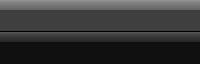

设计两幅大小相同、效果不同的背景图像，然后使用CSS进行轮换显示，设计一种简单的鼠标动画效果。

**【操作步骤】**

第1步，使用Photoshop设计两幅大小相同，但效果略不同的图像，如下图所示。



<center>设计背景图像</center>

第2步，启动 Dreamweaver，新建网页，保存为 test1.html，在 `<body>` 标签内输入以下代码，构建一个列表结构。

```html
<li><a href="#">首页</a></li>
<li><a href="#">新闻</a></li>
<li><a href="#">微博</a></li>
```

第3步，在 `<head>` 标签内添加 `<style type="text/css">` 标签，定义一个内部样式表，然后输入下面样式。

```css
<style type="text/css"> 
a {/* 超链接的默认样式 */
    text-decoration:none; 								/* 清除默认的下划线 */
    display:inline-block; 								/* 行内块状显示 */
    padding:2px 1em; 									/* 为文本添加补白效果 */
    height:28px; 										/* 固定高度 */
    line-height:32px; 									/* 行高等于高度，设计垂直居中 */
    text-align:center; 									/* 文本水平居中 */
    background:url(images/b3.gif) no-repeat center top;	/* 定义背景图像1，禁止平铺，居中 */
    color:#ccc; 										/* 浅灰色字体 */
}
a:hover {/* 鼠标经过时样式 */
    background-position:center bottom;					/* 定位背景图像，显示下半部分 */
    color:#fff; 										/* 白色字体 */
}
</style>
```

在上面样式代码中，先定义超链接以行内块状显示，这样便于控制它的宽和高，然后根据背景图像大小定义 `a` 元素的大小，并分别为默认状态和鼠标经过状态定义背景图像。

超链接的宽度可以不必等于背景图像的宽度，只要小于背景图的宽度即可。但是高度必须保持与背景图像的一致。在设计中可以结合背景图像的效果定义字体颜色。

**完整代码如下：**

```html
<!doctype html>
<html>
    <head>
        <meta charset="utf-8">
        <title></title>
        <style type="text/css"> 
        a {/* 超链接的默认样式 */
            text-decoration:none; 								/* 清除默认的下划线 */
            display:inline-block; 								/* 行内块状显示 */
            padding:2px 1em; 									/* 为文本添加补白效果 */
            height:28px; 										/* 固定高度 */
            line-height:32px; 									/* 行高等于高度，设计垂直居中 */
            text-align:center; 									/* 文本水平居中 */
            background:url(images/b3.gif) no-repeat center top;	/* 定义背景图像1，禁止平铺，居中 */
            color:#ccc; 										/* 浅灰色字体 */
        }
        a:hover {/* 鼠标经过时样式 */
            background-position:center bottom;					/* 定位背景图像，显示下半部分 */
            color:#fff; 										/* 白色字体 */
        }
        </style>
    </head>
    <body>
        <ul>
            <li><a href="#">首页</a></li>
            <li><a href="#">新闻</a></li>
            <li><a href="#">微博</a></li>
        </ul>
    </body>
</html> 
```

> 提示：为了减少两幅背景图像的 HTTP 请求次数，避免占用不必要的带宽，可以把用于交换的两幅图像合并为一幅图像，然后利用 CSS 定位技术控制背景图像的显示区域。