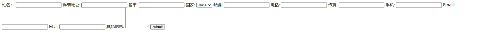
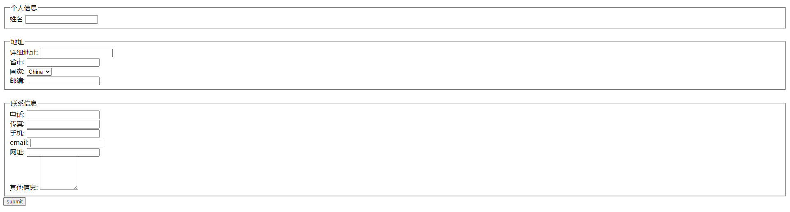
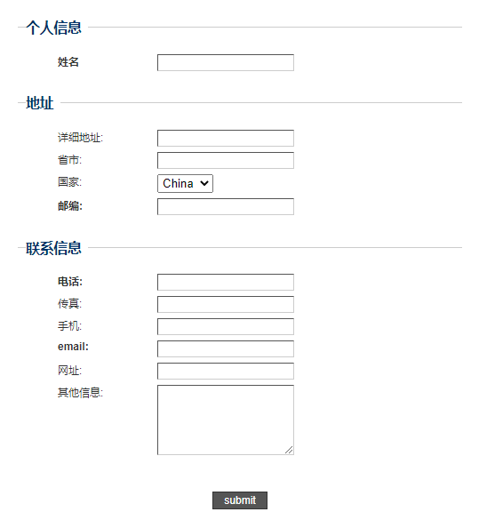
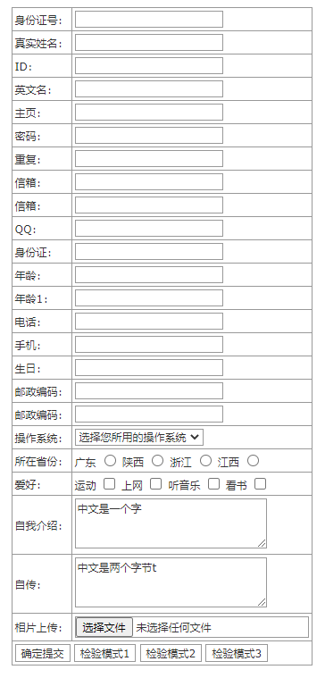
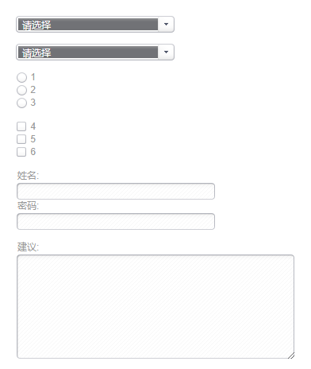

[toc]

### 1. 排列方式

根据习惯，表单控件一般使用垂直排列方式进行分布，这样能够加快视觉的移动和操作。水平排列容易使视觉移动起来很累，即使多列有规律的布局也是不可取的，人眼左右晃动操作很容易出错。

#### 1.1 示例代码

```html
<!doctype html>
<html>
    <head>
        <meta charset="utf-8">
        <title>水平分布</title>
        <style type="text/css"></style>
    </head>
    <body>
        <form id="fm-form" action="" method="post">
            姓名：
            <input id="fm-firstname" name="fm-firstname">
            详细地址:
            <input id="fm-addr" name="fm-addr">
            省市:
            <input id="fm-city" name="fm-city">
            国家:
            <select id="fm-state" name="fm-state">
                <option value="al">China</option>
                <option value="ak">Japan</option>
            </select>
            邮编:
            <input id="fm-zipcode" name="fm-zipcode">
            电话:
            <input id="fm-telephone" title="电话格式：xxx-xxx" name="fm-telephone">
            传真:
            <input id="fm-fax" title="传真格式：xxx-xxx" name="fm-fax">
            手机:
            <input id="fm-mobile" name="fm-mobile">
            Email:
            <input id="fm-email" name="fm-email">
            网址:
            <input id="fm-url" name="fm-url">
            其他信息:
            <textarea id="fm-comments" name="fm-comments" rows="5" cols="10"></textarea>
            <input type="submit" value="submit" name="submit">
        </form>
    </body>
</html>
```

运行效果如下：



### 2. 控件分组

给控件分组也是表单布局中一个重要技巧，特别是表单控件很多时，分组就显得很有必要，实际上分组是帮助用户进行逻辑梳理，避免混乱。

#### 2.1 示例代码

```html
<!doctype html>
<html>
    <head>
        <meta charset="utf-8">
        <title>控件分组</title>
    </head>
    <body>
        <form id="fm-form" action="" method="post">
            <fieldset>
                <legend>个人信息</legend>
                <div class="fm-req">
                    <label for="fm-firstname">姓名</label>
                    <input id="fm-firstname" name="fm-firstname">
                </div>
            </fieldset>
            <br>
            <fieldset>
                <legend>地址</legend>
                <div class="fm-opt">
                    <label for="fm-addr">详细地址:</label>
                    <input id="fm-addr" name="fm-addr">
                </div>
                <div class="fm-opt">
                    <label for="fm-city">省市:</label>
                    <input id="fm-city" name="fm-city">
                </div>
                <div class="fm-opt">
                    <label for="fm-state">国家:</label>
                    <select id="fm-state" name="fm-state">
                        <option value="al">China</option>
                        <option value="ak">Japan</option>
                    </select>
                </div>
                <div class="fm-req">
                    <label for="fm-zipcode">邮编:</label>
                    <input id="fm-zipcode" name="fm-zipcode">
                </div>
            </fieldset>
            <br>
            <fieldset>
                <legend>联系信息</legend>
                <div class="fm-req">
                    <label for="fm-telephone">电话:</label>
                    <input id="fm-telephone" title="电话格式：xxx-xxx" name="fm-telephone">
                </div>
                <div class="fm-opt">
                    <label for="fm-fax">传真:</label>
                    <input id="fm-fax" title="传真格式：xxx-xxx" name="fm-fax">
                </div>
                <div class="fm-opt">
                    <label for="fm-mobile">手机:</label>
                    <input id="fm-mobile" name="fm-mobile">
                </div>
                <div class="fm-req">
                    <label for="fm-email">email:</label>
                    <input id="fm-email" name="fm-email">
                </div>
                <div class="fm-opt">
                    <label for="fm-url">网址:</label>
                    <input id="fm-url" name="fm-url">
                </div>
                <div class="fm-opt">
                    <label for="fm-comments">其他信息:</label>
                    <textarea id="fm-comments" name="fm-comments" rows="5" cols="10"></textarea>
                </div>
            </fieldset>
            <div class="fm-req" id="fm-submit">
                <input type="submit" value="submit" name="submit">
            </div>
            <br>
        </form>
    </body>
</html>
```

运行效果如下：



### 3. 缩进分布

当分组标题、控件和提示信息都并列排在一起时，很容易出现主次不分的情况。用户需要分辨哪些是操作的行，哪些是说明性文字，这样会影响操作速度。对此，可以采用缩进的方式，实现多层次叠进，帮助用户快速进行阅读。

#### 3.1 示例代码

```html
<!doctype html>
<html>
    <head>
        <meta charset="utf-8">
        <title>标签突出</title>
        <style type="text/css">
        body {
            padding-right: 0px;
            padding-left: 0px;
            background: #fff;
            padding-bottom: 0px;
            margin: 20px;
            font: 12px arial, verdana, sans-serif;
            color: #333;
            padding-top: 0px;
            text-align: center;
        }
        form {
            width: 500px;
            padding-right: 0px;
            padding-left: 0px;
            padding-bottom: 0px;
            margin: 0px;
            padding-top: 0px;
            text-align: left;
        }
        fieldset {
            border-top: #ccc 1px solid;
            margin: 1em 0px;
            border-right-style: none;
            border-left-style: none;
            border-bottom-style: none;
        }
        legend {
            padding-right: 0.5em;
            padding-left: 0em;
            font-weight: bold;
            font-size: 1.3em;
            background: none transparent scroll repeat 0% 0%;
            padding-bottom: 0px;
            margin: 1em 0px;
            color: #036;
            padding-top: 0px;
        }
        label {
            padding-right: 1em;
            padding-left: 1em;
            float: left;
            padding-bottom: 0px;
            width: 100px;
            padding-top: 0px;
            text-align: left;
        }
        fieldset div {
            padding-right: 0px;
            display: block;
            padding-left: 2em;
            margin-bottom: 0.5em;
            padding-bottom: 0px;
            padding-top: 0px;
        }
        fieldset div input {
            border-right: #ccc 1px solid;
            padding-right: 1px;
            border-top: #555 1px solid;
            padding-left: 1px;
            padding-bottom: 1px;
            border-left: #555 1px solid;
            width: 150px;
            color: #333;
            padding-top: 1px;
            border-bottom: #ccc 1px solid;
        }
        fieldset div textarea {
            border-right: #ccc 1px solid;
            padding-right: 1px;
            border-top: #555 1px solid;
            padding-left: 1px;
            padding-bottom: 1px;
            border-left: #555 1px solid;
            width: 150px;
            color: #333;
            padding-top: 1px;
            border-bottom: #ccc 1px solid;
        }
        fieldset div select {
            padding-right: 1px;
            padding-left: 1px;
            padding-bottom: 1px;
            padding-top: 1px;
        }
        #fm-submit {
            clear: both;
            padding-top: 1em;
            text-align: center;
        }
        #fm-submit input {
            border-right: #333 1px solid;
            padding-right: 1em;
            border-top: #333 1px solid;
            padding-left: 1em;
            font-size: 100%;
            background: #555;
            padding-bottom: 2px;
            border-left: #333 1px solid;
            color: #fff;
            padding-top: 2px;
            border-bottom: #333 1px solid;
        }
        fieldset div.fm-req { font-weight: bold; }
        #container {
            padding-right: 1em;
            padding-left: 1em;
            padding-bottom: 1em;
            margin: 0px auto;
            width: 350px;
            padding-top: 1em;
            text-align: left;
        }
        p#fm-intro { margin: 0px; }
        </style>
    </head>
    <body>
        <form id="fm-form" action="" method="post">
            <fieldset>
                <legend>个人信息</legend>
                <div class="fm-req">
                    <label for="fm-firstname">姓名</label>
                    <input id="fm-firstname" name="fm-firstname">
                </div>
            </fieldset>
            <fieldset>
                <legend>地址</legend>
                <div class="fm-opt">
                    <label for="fm-addr">详细地址:</label>
                    <input id="fm-addr" name="fm-addr">
                </div>
                <div class="fm-opt">
                    <label for="fm-city">省市:</label>
                    <input id="fm-city" name="fm-city">
                </div>
                <div class="fm-opt">
                    <label for="fm-state">国家:</label>
                    <select id="fm-state" name="fm-state">
                        <option value="al">China</option>
                        <option value="ak">Japan</option>
                    </select>
                </div>
                <div class="fm-req">
                    <label for="fm-zipcode">邮编:</label>
                    <input id="fm-zipcode" name="fm-zipcode">
                </div>
            </fieldset>
            <fieldset>
                <legend>联系信息</legend>
                <div class="fm-req">
                    <label for="fm-telephone">电话:</label>
                    <input id="fm-telephone" title="电话格式：xxx-xxx" name="fm-telephone">
                </div>
                <div class="fm-opt">
                    <label for="fm-fax">传真:</label>
                    <input id="fm-fax" title="传真格式：xxx-xxx" name="fm-fax">
                </div>
                <div class="fm-opt">
                    <label for="fm-mobile">手机:</label>
                    <input id="fm-mobile" name="fm-mobile">
                </div>
                <div class="fm-req">
                    <label for="fm-email">email:</label>
                    <input id="fm-email" name="fm-email">
                </div>
                <div class="fm-opt">
                    <label for="fm-url">网址:</label>
                    <input id="fm-url" name="fm-url">
                </div>
                <div class="fm-opt">
                    <label for="fm-comments">其他信息:</label>
                    <textarea id="fm-comments" name="fm-comments" rows="5" cols="10"></textarea>
                </div>
            </fieldset>
            <div class="fm-req" id="fm-submit">
                <input type="submit" value="submit" name="submit">
            </div>
            <br>
        </form>
    </body>
</html>
```

**运行效果如下：**



### 4. 标签突出

一般标签与控件水平并列分布是最佳分布方式。部分用户喜欢使用垂直分布方式，即标签在上一行，控件在下一行，这种方式对于内容较少的表单域来说可行，但如果是一个大型表单，这种方式会消耗用户的视力，降低操作速度。

在表单布局中，推荐使用加粗的标签，这可以增加它们的视觉比重，提高其显著性。否则，从用户的角度分析，标签与输入框的文字类似，可能会产生混淆的现象。

### 5. 标签对齐

关于标签是左对齐还是右对齐问题，一般来说，一致的左对齐可以减少眼睛移动和处理时间。左对齐的标签还容易通览表单信息，用户只需要上下看看左侧标签即可，而不会被控件打断思路。但这样也容易使标签与其对应的控件之间的距离被更长的标签拉大，从而影响操作表单的时间，用户必须左右来回移动视线找到两个对应的标签和控件。

#### 5.1 示例代码

```html
<!doctype html>
<html>
     <head>
         <meta charset="utf-8">
         <title></title>
         <style>
        body, td {
            font: normal 12px Verdana;
            color: #333333
        }
        input, textarea, select, td {
            font: normal 12px Verdana;
            color: #333333;
            border: 1px solid #999999;
            background: #ffffff
        }
        table { border-collapse: collapse; }
        td { padding: 3px }
        input { height: 20; }
        textarea {
            width: 80%;
            height: 50px;
            overflow: auto;
        }
        form { display: inline }
        </style>
     </head>
     <body>
        <table align="center">
             <form name="theForm" id="demo" method="get" onsubmit="return Validator.Validate(this,2)">
                <tr>
                     <td>身份证号：</td>
                     <td><input name="Card" datatype="IdCard" msg="身份证号错误"></td>
                 </tr>
                <tr>
                     <td>真实姓名：</td>
                     <td><input name="Name" datatype="Chinese" msg="真实姓名只允许中文"></td>
                 </tr>
                <tr>
                     <td>ID：</td>
                     <td><input name="username" datatype="Username" msg="ID名不符合规定"></td>
                 </tr>
                <tr>
                     <td>英文名：</td>
                     <td><input name="Nick" datatype="English" require="false" msg="英文名只允许英文字母"></td>
                 </tr>
                <tr>
                     <td>主页：</td>
                     <td><input name="Homepage" require="false" datatype="Url"   msg="非法的Url"></td>
                 </tr>
                <tr>
                     <td>密码：</td>
                     <td><input name="Password" datatype="SafeString"   msg="密码不符合安全规则" type="password"></td>
                 </tr>
                <tr>
                     <td>重复：</td>
                     <td><input name="Repeat" datatype="Repeat" to="Password" msg="两次输入的密码不一致" type="password"></td>
                 </tr>
                <tr>
                     <td>信箱：</td>
                     <td><input name="Email" datatype="Email" msg="信箱格式不正确"></td>
                 </tr>
                <tr>
                     <td>信箱：</td>
                     <td><input name="Email" datatype="Repeat" to="Email" msg="两次输入的信箱不一致"></td>
                 </tr>
                <tr>
                     <td>QQ：</td>
                     <td><input name="QQ" require="false" datatype="QQ" msg="QQ号码不存在"></td>
                 </tr>
                <tr>
                     <td>身份证：</td>
                     <td><input name="Card" datatype="IdCard" msg="身份证号码不正确"></td>
                 </tr>
                <tr>
                     <td>年龄：</td>
                     <td><input name="Year" datatype="Range" msg="年龄必须在18~28之间" min="18" max="28"></td>
                 </tr>
                <tr>
                     <td>年龄1：</td>
                     <td><input name="Year1" require="false" datatype="Compare" msg="年龄必须在18以上" to="18" operator="GreaterThanEqual"></td>
                 </tr>
                <tr>
                     <td>电话：</td>
                     <td><input name="Phone" require="false" datatype="Phone" msg="电话号码不正确"></td>
                 </tr>
                <tr>
                     <td>手机：</td>
                     <td><input name="Mobile" require="false" datatype="Mobile" msg="手机号码不正确"></td>
                 </tr>
                <tr>
                     <td>生日：</td>
                     <td><input name="Birthday" datatype="Date" format="ymd" msg="生日日期不存在"></td>
                 </tr>
                <tr>
                     <td>邮政编码：</td>
                     <td><input name="Zip" datatype="Custom" regexp="^[1-9]\d{5}$" msg="邮政编码不存在"></td>
                 </tr>
                <tr>
                     <td>邮政编码：</td>
                     <td><input name="Zip1" datatype="Zip" msg="邮政编码不存在"></td>
                 </tr>
                <tr>
                     <td>操作系统：</td>
                     <td><select name="Operation" datatype="Require"  msg="未选择所用操作系统" >
                             <option value="">选择您所用的操作系统</option>
                             <option value="Win98">Win98</option>
                             <option value="Win2k">Win2k</option>
                             <option value="WinXP">WinXP</option>
                         </select></td>
                 </tr>
                <tr>
                     <td>所在省份：</td>
                     <td>广东
                        <input name="Province" value="1" type="radio">
                        陕西
                        <input name="Province" value="2" type="radio">
                        浙江
                        <input name="Province" value="3" type="radio">
                        江西
                        <input name="Province" value="4" type="radio" datatype="Group"  msg="必须选定一个省份" ></td>
                 </tr>
                <tr>
                     <td>爱好：</td>
                     <td>运动
                        <input name="Favorite" value="1" type="checkbox">
                        上网
                        <input name="Favorite" value="2" type="checkbox">
                        听音乐
                        <input name="Favorite" value="3" type="checkbox">
                        看书
                        <input name="Favorite" value="4" type="checkbox"" dataType="Group" min="2" max="3"  msg="必须选择2~3种爱好"></td>
                 </tr>
                <td>自我介绍：</td>
                <td><textarea name="Description" datatype="Limit" max="10"  msg="自我介绍内容必须在10个字之内">中文是一个字</textarea></td>
                    </tr>

                <td>自传：</td>
                <td><textarea name="History" datatype="LimitB" min="3" max="10"  msg="自传内容必须在[3,10]个字节之内">中文是两个字节t</textarea></td>
                    </tr>

                <tr>
                     <td>相片上传：</td>
                     <td><input name="up" datatype="Filter" msg="非法的文件格式" type="file" accept="jpg, gif, png"></td>
                 </tr>
                <tr>
                     <td colspan="2"><input name="Submit" type="submit" value="确定提交">
                        <input onclick="Validator.Validate(document.getElementById('demo'))" value="检验模式1" type="button">
                        <input onclick="Validator.Validate(document.getElementById('demo'),2)" value="检验模式2" type="button">
                        <input onclick="Validator.Validate(document.getElementById('demo'),3)" value="检验模式3" type="button"></td>
                 </tr>
            </form>
         </table>
        <script>
         Validator = {
            Require : /.+/,
            Email : /^\w+([-+.]\w+)*@\w+([-.]\w+)*\.\w+([-.]\w+)*$/,
            Phone : /^((\(\d{2,3}\))|(\d{3}\-))?(\(0\d{2,3}\)|0\d{2,3}-)?[1-9]\d{6,7}(\-\d{1,4})?$/,
            Mobile : /^((\(\d{2,3}\))|(\d{3}\-))?13\d{9}$/,
            Url : /^http:\/\/[A-Za-z0-9]+\.[A-Za-z0-9]+[\/=\?%\-&_~`@[\]\':+!]*([^<>\"\"])*$/,
            IdCard : "this.IsIdCard(value)",
            Currency : /^\d+(\.\d+)?$/,
            Number : /^\d+$/,
            Zip : /^[1-9]\d{5}$/,
            QQ : /^[1-9]\d{4,8}$/,
            Integer : /^[-\+]?\d+$/,
            Double : /^[-\+]?\d+(\.\d+)?$/,
            English : /^[A-Za-z]+$/,
            Chinese :  /^[\u0391-\uFFE5]+$/,
            Username : /^[a-z]\w{3,}$/i,
            UnSafe : /^(([A-Z]*|[a-z]*|\d*|[-_\~!@#\$%\^&\*\.\(\)\[\]\{\}<>\?\\\/\'\"]*)|.{0,5})$|\s/,
            IsSafe : function(str){return !this.UnSafe.test(str);},
            SafeString : "this.IsSafe(value)",
            Filter : "this.DoFilter(value, getAttribute('accept'))",
            Limit : "this.limit(value.length,getAttribute('min'),  getAttribute('max'))",
            LimitB : "this.limit(this.LenB(value), getAttribute('min'), getAttribute('max'))",
            Date : "this.IsDate(value, getAttribute('min'), getAttribute('format'))",
            Repeat : "value == document.getElementsByName(getAttribute('to'))[0].value",
            Range : "getAttribute('min') < (value|0) && (value|0) < getAttribute('max')",
            Compare : "this.compare(value,getAttribute('operator'),getAttribute('to'))",
            Custom : "this.Exec(value, getAttribute('regexp'))",
            Group : "this.MustChecked(getAttribute('name'), getAttribute('min'), getAttribute('max'))",
            ErrorItem : [document.forms[0]],
            ErrorMessage : ["以下原因导致提交失败：\t\t\t\t"],
            Validate : function(theForm, mode){
                var obj = theForm || event.srcElement;
                var count = obj.elements.length;
                this.ErrorMessage.length = 1;
                this.ErrorItem.length = 1;
                this.ErrorItem[0] = obj;
                for(var i=0;i<count;i++){
                    with(obj.elements[i]){
                        var _dataType = getAttribute("dataType");
                        if(typeof(_dataType) == "object" || typeof(this[_dataType]) == "undefined")  continue;
                        this.ClearState(obj.elements[i]);
                        if(getAttribute("require") == "false" && value == "") continue;
                        switch(_dataType){
                            case "IdCard" :
                            case "Date" :
                            case "Repeat" :
                            case "Range" :
                            case "Compare" :
                            case "Custom" :
                            case "Group" : 
                            case "Limit" :
                            case "LimitB" :
                            case "SafeString" :
                            case "Filter" :
                                if(!eval(this[_dataType]))	{
                                    this.AddError(i, getAttribute("msg"));
                                }
                                break;
                            default :
                                if(!this[_dataType].test(value)){
                                    this.AddError(i, getAttribute("msg"));
                                }
                                break;
                        }
                    }
                }
                if(this.ErrorMessage.length > 1){
                    mode = mode || 1;
                    var errCount = this.ErrorItem.length;
                    switch(mode){
                    case 2 :
                        for(var i=1;i<errCount;i++)
                            this.ErrorItem[i].style.color = "red";
                    case 1 :
                        alert(this.ErrorMessage.join("\n"));
                        this.ErrorItem[1].focus();
                        break;
                    case 3 :
                        for(var i=1;i<errCount;i++){
                        try{
                            var span = document.createElement("SPAN");
                            span.id = "__ErrorMessagePanel";
                            span.style.color = "red";
                            this.ErrorItem[i].parentNode.appendChild(span);
                            span.innerHTML = this.ErrorMessage[i].replace(/\d+:/,"*");
                            }
                            catch(e){alert(e.description);}
                        }
                        this.ErrorItem[1].focus();
                        break;
                    default :
                        alert(this.ErrorMessage.join("\n"));
                        break;
                    }
                    return false;
                }
                return true;
            },
            limit : function(len,min, max){
                min = min || 0;
                max = max || Number.MAX_VALUE;
                return min <= len && len <= max;
            },
            LenB : function(str){
                return str.replace(/[^\x00-\xff]/g,"**").length;
            },
            ClearState : function(elem){
                with(elem){
                    if(style.color == "red")
                        style.color = "";
                    var lastNode = parentNode.childNodes[parentNode.childNodes.length-1];
                    if(lastNode.id == "__ErrorMessagePanel")
                        parentNode.removeChild(lastNode);
                }
            },
            AddError : function(index, str){
                this.ErrorItem[this.ErrorItem.length] = this.ErrorItem[0].elements[index];
                this.ErrorMessage[this.ErrorMessage.length] = this.ErrorMessage.length + ":" + str;
            },
            Exec : function(op, reg){
                return new RegExp(reg,"g").test(op);
            },
            compare : function(op1,operator,op2){
                switch (operator) {
                    case "NotEqual":
                        return (op1 != op2);
                    case "GreaterThan":
                        return (op1 > op2);
                    case "GreaterThanEqual":
                        return (op1 >= op2);
                    case "LessThan":
                        return (op1 < op2);
                    case "LessThanEqual":
                        return (op1 <= op2);
                    default:
                        return (op1 == op2);            
                }
            },
            MustChecked : function(name, min, max){
                var groups = document.getElementsByName(name);
                var hasChecked = 0;
                min = min || 1;
                max = max || groups.length;
                for(var i=groups.length-1;i>=0;i--)
                    if(groups[i].checked) hasChecked++;
                return min <= hasChecked && hasChecked <= max;
            },
            DoFilter : function(input, filter){
        return new RegExp("^.+\.(?=EXT)(EXT)$".replace(/EXT/g, filter.split(/\s*,\s*/).join("|")), "gi").test(input);
            },
            IsIdCard : function(number){
                var date, Ai;
                var verify = "10x98765432";
                var Wi = [7, 9, 10, 5, 8, 4, 2, 1, 6, 3, 7, 9, 10, 5, 8, 4, 2];
                var area = ['','','','','','','','','','','','北京','天津','河北','山西','内蒙古','','','','','','辽宁','吉林','黑龙江','','','','','','','','上海','江苏','浙江','安微','福建','江西','山东','','','','河南','湖北','湖南','广东','广西','海南','','','','重庆','四川','贵州','云南','西藏','','','','','','','陕西','甘肃','青海','宁夏','新疆','','','','','','台湾','','','','','','','','','','香港','澳门','','','','','','','','','国外'];
                var re = number.match(/^(\d{2})\d{4}(((\d{2})(\d{2})(\d{2})(\d{3}))|((\d{4})(\d{2})(\d{2})(\d{3}[x\d])))$/i);
                if(re == null) return false;
                if(re[1] >= area.length || area[re[1]] == "") return false;
                if(re[2].length == 12){
                    Ai = number.substr(0, 17);
                    date = [re[9], re[10], re[11]].join("-");
                }
                else{
                    Ai = number.substr(0, 6) + "19" + number.substr(6);
                    date = ["19" + re[4], re[5], re[6]].join("-");
                }
                if(!this.IsDate(date, "ymd")) return false;
                var sum = 0;
                for(var i = 0;i<=16;i++){
                    sum += Ai.charAt(i) * Wi[i];
                }
                Ai +=  verify.charAt(sum%11);
                return (number.length ==15 || number.length == 18 && number == Ai);
            },
            IsDate : function(op, formatString){
                formatString = formatString || "ymd";
                var m, year, month, day;
                switch(formatString){
                    case "ymd" :
                        m = op.match(new RegExp("^((\\d{4})|(\\d{2}))([-./])(\\d{1,2})\\4(\\d{1,2})$"));
                        if(m == null ) return false;
                        day = m[6];
                        month = m[5]*1;
                        year =  (m[2].length == 4) ? m[2] : GetFullYear(parseInt(m[3], 10));
                        break;
                    case "dmy" :
                        m = op.match(new RegExp("^(\\d{1,2})([-./])(\\d{1,2})\\2((\\d{4})|(\\d{2}))$"));
                        if(m == null ) return false;
                        day = m[1];
                        month = m[3]*1;
                        year = (m[5].length == 4) ? m[5] : GetFullYear(parseInt(m[6], 10));
                        break;
                    default :
                        break;
                }
                if(!parseInt(month)) return false;
                month = month==0 ?12:month;
                var date = new Date(year, month-1, day);
                return (typeof(date) == "object" && year == date.getFullYear() && month == (date.getMonth()+1) && day == date.getDate());
                function GetFullYear(y){return ((y<30 ? "20" : "19") + y)|0;}
            }
         }
        </script>
    </body>
</html>
```

**运行效果如下：**



### 6. 背景和辅助线

尝试为表单控件适当添加背景色和分隔线，通过背景色和辅助线的视觉区分，也能加快用户操作速度，这对于划分操作区信息是很有效的。

背景色和线条对于区分表单的主要操作按钮尤其有效。但在使用这些辅助元素时，要避免它们影响用户的操作，因为色彩过浓的线条和背景色都能够分散用户的视线，过多的分隔线给用户阅读带来障碍。

### 7. 动态效果

当用户选中或操作某个表单控件时，当前表单对象会显示为另一种样式，以区别于其他控件。这个技巧对于用户的操作具有提示作用，避免出现用户有时不知当前操作的是哪个表单控件的情况。

当表单控件很多时，通过添加类样式，就可以让表单更具提示性，也使用户有更好的体验。即为某个控件定义伪类，如 `:hover`、`:focus` 及 `:focus :hover` 属性样式，让输入框被鼠标激活时更加突出，利于用户集中精神填写。当然这对于老版本的IE浏览器没有作用，此时用户需要使用 JavaScript 脚本来控制。

#### 7.1 示例代码

```html
<!doctype html>
<html>
    <head>
    <meta charset="utf-8">
    <title></title>
    <script language="javascript" type="text/javascript" >

    var selects;
    var inputs;
    var radios = new Array();
    var checkboxes = new Array();
    var hovers = new Array();
    var buttons = new Array();
    var selectText = "请选择";

    //this function runs when the page is loaded so put all your other onload stuff in here too.
    function init() {

        //check if styles are enabled and only then start replacing elements
        if(findPosX(document.getElementById('stylesheetTest')) == -999) {
            replaceSelects();
            replaceRadios();
            replaceCheckboxes();
        }
        hoverEffects();
        buttonHovers();
    }

    function replaceRadios() {
        //get all the radio buttons on the page
        var inputs = document.getElementsByTagName('input');
        var j = 0;
        for(var i=0; i < inputs.length; i++) {
            if(inputs[i].type=='radio') {
                radios[j] = inputs[i];
                ++j;
            }
        }

        //cycle through the radio inputs
        for(var i=0; i <radios.length; i++) {

            //make them transparent
            radios[i].className = "transparent";

            //get their position
            var x = findPosX(radios[i]);
            var y = findPosY(radios[i]);

            //build new div
            var radioArea = document.createElement('div');
            if(radios[i].checked) {radios[i].nextSibling.className = "chosen"; radioArea.className = "radioAreaChecked";}
            else if(!radios[i].checked) {radioArea.className = "radioAreaUnchecked";}
            radioArea.style.left = x + 'px';
            radioArea.style.top = y + 'px';
            radioArea.id = 'myRadio'+i;
            radios[i].onclick = new Function('checkRadio('+i+')');

            //insert div
            document.getElementsByTagName("body")[0].appendChild(radioArea);
        }
    }

    function replaceCheckboxes() {
        //get all the checkboxes on the page
        var inputs = document.getElementsByTagName('input');
        var j = 0;
        for (var i2=0; i2 < inputs.length; i2++) {
            if(inputs[i2].type=='checkbox') {
                checkboxes[j] = inputs[i2];
                ++j;
            }
        }

        //cycle through the checkboxes
        for(var i2=0; i2 < checkboxes.length; i2++) {

            //make them transparent
            checkboxes[i2].className = "transparent";

            //get their position
            var x = findPosX(checkboxes[i2]);
            var y = findPosY(checkboxes[i2]);

            //build new div
            var checkboxArea = document.createElement('div');
            if(checkboxes[i2].checked) {checkboxes[i2].nextSibling.className = "chosen"; checkboxArea.className = "checkboxAreaChecked";}
            else if(!checkboxes[i2].checked) {checkboxArea.className = "checkboxAreaUnchecked";}
            checkboxArea.style.left = x + 'px';
            checkboxArea.style.top = y + 'px';
            checkboxArea.id = 'myCheck'+i2;
            checkboxes[i2].onclick = new Function('checkCheck('+i2+')');

            //insert div
            document.getElementsByTagName("body")[0].appendChild(checkboxArea);
        }
    }

    function replaceSelects() {
        //get all the select fields on the page
        selects = document.getElementsByTagName('select');

        //cycle trough the select fields
        for(var i=0; i < selects.length; i++) {

            //create and build div structure
            var selectArea = document.createElement('div');
            var left = document.createElement('div');
            var right = document.createElement('div');
            var center = document.createElement('div');
            var button = document.createElement('a');
            var text = document.createTextNode(selectText);
            center.id = "mySelectText"+i;
            button.href="javascript:showOptions("+i+")";
            selectArea.className = "selectArea";
            left.className = "left";
            right.className = "right";
            center.className = "center";
            right.appendChild(button);
            center.appendChild(text);
            selectArea.appendChild(left);
            selectArea.appendChild(right);
            selectArea.appendChild(center);

            //hide the select field
            selects[i].style.display='none'; 

            //insert select div
            selects[i].parentNode.insertBefore(selectArea, selects[i]);

            //build & place options div
            var optionsDiv = document.createElement('div');
            optionsDiv.className = "optionsDivInvisible";
            optionsDiv.id = "optionsDiv"+i;
            optionsDiv.style.left = findPosX(selectArea) + 'px';
            optionsDiv.style.top = findPosY(selectArea) + 19 + 'px';

            //get select's options and add to options div
            for(var j=0; j < selects[i].options.length; j++) {
                var optionHolder = document.createElement('p');
                var optionLink = document.createElement('a');
                var optionTxt = document.createTextNode(selects[i].options[j].text);
                optionLink.href = "javascript:showOptions("+i+"); selectMe('"+selects[i].id+"',"+j+","+i+");";
                optionLink.appendChild(optionTxt);
                optionHolder.appendChild(optionLink);
                optionsDiv.appendChild(optionHolder);
            }

            //insert options div
            document.getElementsByTagName("body")[0].appendChild(optionsDiv);
        }
    }

    function showOptions(g) {
            elem = document.getElementById("optionsDiv"+g);
            if(elem.className=="optionsDivInvisible") {elem.className = "optionsDivVisible";}
            else if(elem.className=="optionsDivVisible") {elem.className = "optionsDivInvisible";}
    }

    function selectMe(selectFieldId,linkNo,selectNo) {
        //feed selected option to the actual select field
        selectField = document.getElementById(selectFieldId);
        for(var k = 0; k < selectField.options.length; k++) {
            if(k==linkNo) {
                selectField.options[k].selected = "selected";
            }
            else {
                selectField.options[k].selected = "";
            }
        }
        //show selected option
        textVar = document.getElementById("mySelectText"+selectNo);
        var newText = document.createTextNode(selectField.options[linkNo].value);
        textVar.replaceChild(newText, textVar.childNodes[0]);
    }

    function findPosY(obj) {
        var posTop = 0;
        while (obj.offsetParent) {
            posTop += obj.offsetTop;
            obj = obj.offsetParent;
        }
        return posTop;
    }
    function findPosX(obj) {
        var posLeft = 0;
        while (obj.offsetParent) {
            posLeft += obj.offsetLeft;
            obj = obj.offsetParent;
        }
        return posLeft;
    }

    function checkRadio(g) {
        if(radios[g].checked) {
            for (var k = 0; k < radios.length; k++)
            {
                if(k != g) {
                    document.getElementById('myRadio'+k).className = "radioAreaUnchecked";
                    radios[k].nextSibling.className = "";
                }
                else if(k == g) {
                    document.getElementById('myRadio'+k).className = "radioAreaChecked";
                    radios[g].nextSibling.className = "chosen";
                }
            }
        }
        else if(!radios[g].checked) {document.getElementById('myRadio'+g).className = "radioAreaUnchecked"; radios[g].nextSibling.className = "";}
    }

    function checkCheck(g) {
        if(checkboxes[g].checked) {
            for(var k = 0; k < checkboxes.length; k++) {
                if(k == g) {
                    document.getElementById('myCheck'+k).className = "checkboxAreaChecked";
                    checkboxes[g].nextSibling.className = "chosen";
                }
            }
        }
        else if(!checkboxes[g].checked) {
            document.getElementById('myCheck'+g).className = "checkboxAreaUnchecked";
            checkboxes[g].nextSibling.className = "";
        }
    }

    function hoverEffects() {
        //get all elements (text inputs, passwords inputs, textareas)
        var elements = document.getElementsByTagName('input');
        var j = 0;
        for (var i4 = 0; i4 < elements.length; i4++) {
            if((elements[i4].type=='text')||(elements[i4].type=='password')) {
                hovers[j] = elements[i4];
                ++j;
            }
        }
        elements = document.getElementsByTagName('textarea');
        for (var i4 = 0; i4 < elements.length; i4++) {
            hovers[j] = elements[i4];
            ++j;
        }

        //add focus effects
        for (var i4 = 0; i4 < hovers.length; i4++) {
            hovers[i4].onfocus = function() {this.className += "Hovered";}
            hovers[i4].onblur = function() {this.className = this.className.replace(/Hovered/g, "");}
        }
    }

    function buttonHovers() {
        //get all buttons
        var elements = document.getElementsByTagName('input');
        var j = 0;
        for (var i5 = 0; i5 < elements.length; i5++) {
            if(elements[i5].type=='submit') {
                buttons[j] = elements[i5];
                ++j;
            }
        }

        //add hover effects
        for (var i5 = 0; i5 < buttons.length; i5++) {
            buttons[i5].onmouseover = function() {this.className += "Hovered";}
            buttons[i5].onmouseout = function() {this.className = this.className.replace(/Hovered/g, "");}
        }
    }
    window.onload = init;
    </script>
    <style type="text/css" media="screen">
    * {
        margin: 0;
        padding: 0;
    }
    body {
        font-family: Arial, Helvetica, sans-serif;
        font-size: 12px;
        color: #404040;
        background: #FFF;
    }
    img { border: 0; }
    #container { padding: 20px; }
    /*Forms defaults*/
    input, textarea {
        font-family: Arial, Helvetica, sans-serif;
        font-size: 12px;
        color: #404040;
    }
    label {
        color: #999;
        cursor: pointer;
        padding-left: 2px;
        line-height: 15px;
        vertical-align: top;
    }
    label.chosen { color: #333; }
    /*Transparent items*/
    .transparent {
        filter: alpha(opacity=0);
        -moz-opacity: 0;
        opacity: 0;
        border: 0px solid #FFF;
        background: #FFF;
        z-index: 10;
        cursor: pointer;
    }
    .transparentFake {
        background: none;
        border: none;
    }
    .transparent2 { z-index: 10; }
    /*Radio buttons*/
    .radioAreaUnchecked, .radioAreaChecked {
        z-index: 5;
        position: absolute;
        width: 15px;
        height: 15px;
        cursor: pointer;
    }
    .radioAreaUnchecked { background: url(images/radio.gif) no-repeat left top; }
    .radioAreaChecked { background: url(images/radio.gif) no-repeat left bottom; }
    /*Checkboxes*/
    .checkboxAreaUnchecked, .checkboxAreaChecked {
        z-index: 5;
        position: absolute;
        width: 14px;
        height: 14px;
        cursor: pointer;
    }
    .checkboxAreaUnchecked { background: url(images/checkbox.gif) no-repeat left top; }
    .checkboxAreaChecked { background: url(images/checkbox.gif) no-repeat left bottom; }
    /*Text inputs*/
    .textinput, .textinputHovered {
        width: 236px;
        height: 15px;
        background: url(images/input.gif) no-repeat left top;
        border: none;
        padding: 4px 8px;
    }
    .textinputHovered { background-position: left bottom; }
    /*Text areas*/
    .textarea, .textareaHovered {
        width: 336px;
        height: 125px;
        background: url(images/textarea.gif) no-repeat left top;
        border: none;
        padding: 4px 8px;
    }
    .textareaHovered { background-position: left bottom; }
    /*Selects*/
    .selectArea {
        width: 200px;
        height: 21px;
        background: url(images/select_bg.gif) repeat-x left top;
    }
    .selectArea .left {
        width: 8px;
        height: 21px;
        float: left;
        background: url(images/select_left.gif) no-repeat left top;
    }
    .selectArea .right {
        width: 21px;
        height: 21px;
        float: right;
        background: url(images/select_right.gif) no-repeat left top;
    }
    .selectArea .right a {
        display: block;
        width: 21px;
        height: 21px;
    }
    .selectArea .right i { display: none; }
    .selectArea .center {
        width: 160px;
        margin-left: 5px;
        margin-right: 20px;
        color: #FFF;
        padding-top: 3px;
    }
    /*Selects drop-down*/
    .optionsDivInvisible, .optionsDivVisible {
        position: absolute;
        margin-top: -1px;
        margin-left: 3px;
        width: 172px;
        background: #6f7074;
        padding: 2px;
        font-size: 11px;
        z-index: 20;
    }
    .optionsDivInvisible { display: none; }
    .optionsDivVisible { display: block; }
    .optionsDivVisible p {
        margin: 0;
        padding: 0;
    }
    .optionsDivVisible a {
        color: #F2F2F2;
        text-decoration: none;
        display: block;
        padding: 1px 4px;
        border: 1px solid #6f7074;
    }
    .optionsDivVisible a:hover {
        color: #FFF;
        background: #5F6062;
        border-color: #cfd0d6;
    }
    /*Button*/
    .buttonSubmit, .buttonSubmitHovered {
        width: 69px;
        height: 26px;
        color: #FFF;
        font-weight: bold;
        padding: 2px 5px;
        background: url(images/button.gif) no-repeat left top;
        cursor: pointer;
        border: none;
    }
    .buttonSubmitHovered { background-position: left bottom; }
    /*Test div - testing if stylesheets are enabled*/
    #stylesheetTest {
        position: absolute;
        left: -999px;
        width: 10px;
        height: 10px;
    }
    </style>
    </head>
    <body>
    <div id="container">
        <form action="vars.php" method="post">
            <select size="1" id="mySelect1" name="mySelect1">
                <option selected="selected" value="1">no.1-1</option>
                <option value="2">no.1-2</option>
                <option value="3">no.1-3</option>
                <option value="4">no.1-4</option>
            </select>
            <br>
            <select size="1" id="mySelect2" name="mySelect2">
                <option selected="selected" value="1">no.2-1</option>
                <option value="2">no.2-2</option>
                <option value="3">no.2-3</option>
                <option value="4">no.2-4</option>
                <option value="5">no.2-5</option>
            </select>
            <br>
            <input type="radio" name="radioSet" id="option1" value="foo">
            <label for="option1">1</label>
            <br>
            <input type="radio" name="radioSet" id="option2" value="bar">
            <label for="option2">2</label>
            <br>
            <input type="radio" name="radioSet" id="option3" value="another option">
            <label for="option3">3</label>
            <br>
            <br>
            <input type="checkbox" name="checkSet1" id="check1" value="foo">
            <label for="check1">4</label>
            <br>
            <input type="checkbox" name="checkSet2" id="check2" value="bar">
            <label for="check2">5</label>
            <br>
            <input type="checkbox" name="checkSet3" id="check3" value="another option">
            <label for="check3">6</label>
            <br>
            <br>
            <label for="textinput">姓名:</label>
            <br>
            <input type="text" id="textinput" name="textinput" class="textinput" maxlength="25">
            <br>
            <label for="passwordinput">密码:</label>
            <br>
            <input type="password" id="passwordinput" name="passwordinput" class="textinput" maxlength="25">
            <br>
            <br>
            <label for="textareainput">建议:</label>
            <br>
            <textarea id="textareainput" name="textareainput" class="textarea"></textarea>
            <br>
            <br>
            <input type="submit" value="提交" class="buttonSubmit">
            <div id="stylesheetTest"></div>
        </form>
    </div>
    </body>
</html>
```

#### 7.2 运行效果如下：

