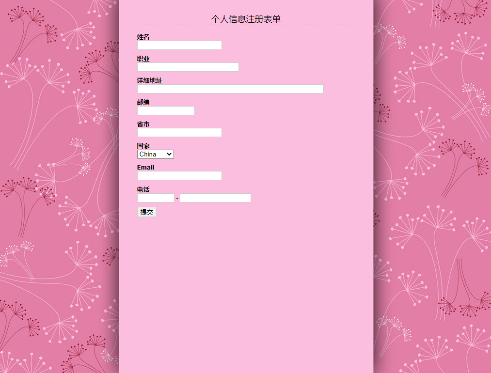

<center>运行效果图</center>

**完整示例代码：**

```html
<!doctype html>
<html>
<head>
<meta charset="utf-8">
<title></title>
<style type="text/css">
body {
    margin: 0;
    padding: 0;
    font-family: "lucida grande", tahoma, arial, verdana, sans-serif;
}
#box{
    background:url(images/bg1.jpg);
    width:1015px;
    height:770px;
}
#form1 {
    width: 450px;
    text-align: left;
    padding: 12px 32px;
    margin: 0 auto;
    font-size: 12px;
}
#form1 h2 {
    border-bottom: dotted 1px #E37EA6;
    text-align: center;
    font-weight: normal;
}
ul {
    padding: 0;
    margin: 0;
    list-style-type: none;
}
input { border: groove #ccc 1px; }
.field6 {
    color: #666;
    width: 32px;
}
.label {
    font-size: 13px;
    font-weight: bold;
    margin-top: 0.7em;
}
</style>
</head>
<body>
<div id="box">
<form  id="form1" action="#public" method="post" enctype="multipart/form-data">
    <h2>个人信息注册表单</h2>
    <ul>
        <li class="label">姓名
        <li>
            <input id="field1" size="20" name="field1">
        <li class="label">职业
        <li>
            <input name="field2" id="field2" size="25">
        <li class="label">详细地址
        <li>
            <input name="field3" id="field3" size="50">
        <li class="label">邮编
        <li>
            <input name="field4" id="field4" size="12" maxlength="12">
        <li class="label">省市
        <li>
            <input id="field5" name="field5">
        <li class="label">国家
        <li>
            <select id="field6" name="field6">
                <option value="china">China</option>
                <option value="armenia">Armenia</option>
                <option value="australia">Australia</option>
                <option value="italy">Italy</option>
                <option value="japan">Japan</option>
            </select>
        <li class="label">Email
        <li>
            <input id="field7" maxlength="255" name="field11">
        <li class="label">电话
        <li>
            <input maxlength="3" size="6" name="field8">
            -
            <input maxlength="8" size="16" name="field8-1">
        <li class="label">
            <input id="saveform" type="submit" value="提交">
        </li>
    </ul>
</form>
</div>
</body>
</html>
```

