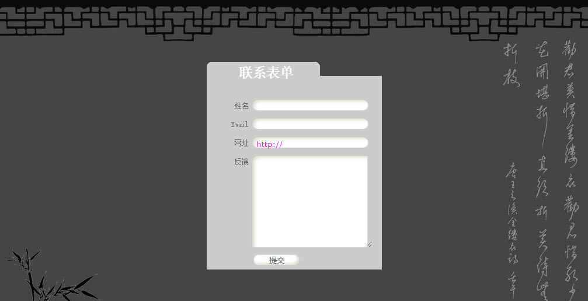

<center>运行效果图</center>

**完整示例代码：**

```html
<!doctype html>
<html>
<head>
<meta charset="utf-8">
<title></title>
<STYLE type="text/css">
body {
    background:url(images/bg.jpg) ;
}
form{
    margin:130px auto;
}

body {
    font-size: 12px;
    margin: 50px;
    color: #666;
    font-family: 宋体, verdana, arial, helvetica, sans-serif;
}
#fieldset {
    border: #fff 0px solid;
    width: 300px;
    background-color: #ccc;
}
#fieldset h2 {
    padding: 0.2em;
    margin: 0;
    position: relative;
    top: -1em;
    background: url(images/h2_bg.gif) no-repeat;
    width: 194px;
    font-size: 2em;
    color: #fff;
    white-space: pre;
    letter-spacing: -1px;
    text-align: center;
}
#fieldset label {
    padding: 0.2em;
    margin: 0.4em 0px 0px;
    float: left;
    width: 70px;
    /*text-transform: uppercase;*/
    text-align: right;
}
.br { display: none; }
.textfield {
    border: #fff 0px solid;
    padding: 3px 8px;
    margin: 3px;
    width: 187px;
    height: 20px;
    background: url(images/textfield_bg.gif) no-repeat;
    color: #FF00FF;
    font: 1.1em verdana, arial, helvetica, sans-serif;
}
textarea {
    border: #fff 0px solid;
    padding: 4px 8px;
    margin: 3px;
    height: 150px;
    width: 190px;
    background: url(images/textarea_bg.gif) no-repeat;
    color: #FF00FF;
    font: 1.1em verdana, arial, helvetica, sans-serif;
}
.submit {
    border: #fff 0px solid;
    margin: 6px;
    width: 80px;
    height: 20px;
    background: url(images/submit.gif) no-repeat;
    text-transform: uppercase;
    font: 1.1em verdana, arial, helvetica, sans-serif;
    color: #666;
}
</STYLE>
</head>
<body>
<form id="fieldset" action="default.asp" method="post">
    <h2>联系表单</h2>
    <label for="name">姓名</label>
    <input class="textfield" id="name" name="name">
    <br>
    <label for="email">Email</label>
    <input class="textfield" id="email" name="email">
    <br>
    <label for="website">网址</label>
    <input class="textfield" id="website" value="http://" name="website">
    <br>
    <label for="comment">反馈</label>
    <textarea class="textarea" id="comment" name="comment" rows="15" cols="30"></textarea>
    <br>
    <label for="submit">&nbsp;</label>
    <input class="submit" id="submit" type="submit" value="提交" name="submit">
</form>
</body>
</html>
```

